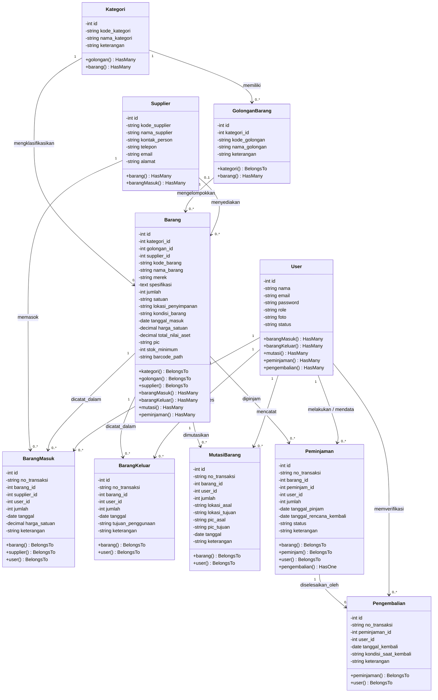
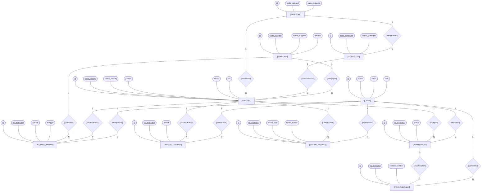

# DOKUMENTASI CLASS DIAGRAM & ERD NOTASI CHEN
## SISTEM INFORMASI INVENTORI & ASET PT YINTONG

Dokumen ini memuat perancangan sistem berbasis UML dan Pemodelan Data Relasional:
1. **Class Diagram (Domain Model & Class Architecture)**: Menampilkan atribut dengan visibility (+/-), tipe data, method relasi, serta relasi asosiasi/agregasi antar kelas.
2. **Entity Relationship Diagram (ERD) Notasi Simbol (Chen Notation)**: Menggunakan notasi standar akademik (Entitas = Persegi Panjang, Relasi = Belah Ketupat/Diamond, Atribut = Oval/Elips, Primary Key = Oval Bergaris Bawah, serta Garis Kardinalitas 1:N / 1:1).

---

# 1. CLASS DIAGRAM (SISTEM INVENTORI & ASET)

## Diagram Visual (Mermaid)



## Kode XML Draw.io (Class Diagram)

Salin kode XML di bawah dan tempelkan langsung ke draw.io (*Menu Arrange > Insert > Advanced > From Text*):

```xml
<mxGraphModel dx="1600" dy="1100" grid="1" gridSize="10" guides="1" tooltips="1" connect="1" arrows="1" fold="1" page="1" pageScale="1" pageWidth="1654" pageHeight="1169" math="0" shadow="0">
  <root>
    <mxCell id="0" />
    <mxCell id="1" parent="0" />

    <!-- TITLE HEADER -->
    <mxCell id="title_cls" value="CLASS DIAGRAM - SISTEM INVENTORI &amp; ASET PT YINTONG" style="text;html=1;align=center;verticalAlign=middle;fontSize=18;fontStyle=1;strokeColor=#333333;fillColor=#F8F9FA;rounded=1;" vertex="1" parent="1">
      <mxGeometry x="450" y="20" width="700" height="40" as="geometry" />
    </mxCell>

    <!-- 1. KATEGORI -->
    <mxCell id="cls_kategori" value="Kategori" style="swimlane;fontStyle=1;align=center;verticalAlign=top;childLayout=stackLayout;horizontal=1;startSize=26;horizontalStack=0;resizeParent=1;resizeParentMax=0;resizeLast=0;collapsible=1;marginBottom=0;html=1;fontSize=12;" vertex="1" parent="1">
      <mxGeometry x="50" y="90" width="220" height="150" as="geometry" />
    </mxCell>
    <mxCell id="cls_kat_attr" value="- id: int&#xa;- kode_kategori: string&#xa;- nama_kategori: string&#xa;- keterangan: string" style="text;strokeColor=none;fillColor=none;align=left;verticalAlign=top;spacingLeft=6;spacingRight=4;overflow=hidden;rotatable=0;points=[[0,0.5],[1,0.5]];portConstraint=eastwest;" vertex="1" parent="cls_kategori">
      <mxGeometry y="26" width="220" height="64" as="geometry" />
    </mxCell>
    <mxCell id="cls_kat_sep" value="" style="line;strokeWidth=1;fillColor=none;align=left;verticalAlign=middle;spacingTop=-1;spacingLeft=3;spacingRight=3;rotatable=0;labelBackgroundColor=none;portConstraint=eastwest;" vertex="1" parent="cls_kategori">
      <mxGeometry y="90" width="220" height="8" as="geometry" />
    </mxCell>
    <mxCell id="cls_kat_mth" value="+ golongan(): HasMany&#xa;+ barang(): HasMany" style="text;strokeColor=none;fillColor=none;align=left;verticalAlign=top;spacingLeft=6;spacingRight=4;overflow=hidden;rotatable=0;points=[[0,0.5],[1,0.5]];portConstraint=eastwest;" vertex="1" parent="cls_kategori">
      <mxGeometry y="98" width="220" height="42" as="geometry" />
    </mxCell>

    <!-- 2. GOLONGAN BARANG -->
    <mxCell id="cls_golongan" value="GolonganBarang" style="swimlane;fontStyle=1;align=center;verticalAlign=top;childLayout=stackLayout;horizontal=1;startSize=26;horizontalStack=0;resizeParent=1;resizeParentMax=0;resizeLast=0;collapsible=1;marginBottom=0;html=1;fontSize=12;" vertex="1" parent="1">
      <mxGeometry x="50" y="300" width="220" height="160" as="geometry" />
    </mxCell>
    <mxCell id="cls_gol_attr" value="- id: int&#xa;- kategori_id: int&#xa;- kode_golongan: string&#xa;- nama_golongan: string&#xa;- keterangan: string" style="text;strokeColor=none;fillColor=none;align=left;verticalAlign=top;spacingLeft=6;spacingRight=4;overflow=hidden;rotatable=0;points=[[0,0.5],[1,0.5]];portConstraint=eastwest;" vertex="1" parent="cls_golongan">
      <mxGeometry y="26" width="220" height="74" as="geometry" />
    </mxCell>
    <mxCell id="cls_gol_sep" value="" style="line;strokeWidth=1;fillColor=none;align=left;verticalAlign=middle;spacingTop=-1;spacingLeft=3;spacingRight=3;rotatable=0;labelBackgroundColor=none;portConstraint=eastwest;" vertex="1" parent="cls_golongan">
      <mxGeometry y="100" width="220" height="8" as="geometry" />
    </mxCell>
    <mxCell id="cls_gol_mth" value="+ kategori(): BelongsTo&#xa;+ barang(): HasMany" style="text;strokeColor=none;fillColor=none;align=left;verticalAlign=top;spacingLeft=6;spacingRight=4;overflow=hidden;rotatable=0;points=[[0,0.5],[1,0.5]];portConstraint=eastwest;" vertex="1" parent="cls_golongan">
      <mxGeometry y="108" width="220" height="42" as="geometry" />
    </mxCell>

    <!-- 3. SUPPLIER -->
    <mxCell id="cls_supplier" value="Supplier" style="swimlane;fontStyle=1;align=center;verticalAlign=top;childLayout=stackLayout;horizontal=1;startSize=26;horizontalStack=0;resizeParent=1;resizeParentMax=0;resizeLast=0;collapsible=1;marginBottom=0;html=1;fontSize=12;" vertex="1" parent="1">
      <mxGeometry x="50" y="520" width="220" height="190" as="geometry" />
    </mxCell>
    <mxCell id="cls_sup_attr" value="- id: int&#xa;- kode_supplier: string&#xa;- nama_supplier: string&#xa;- kontak_person: string&#xa;- telepon: string&#xa;- email: string&#xa;- alamat: text" style="text;strokeColor=none;fillColor=none;align=left;verticalAlign=top;spacingLeft=6;spacingRight=4;overflow=hidden;rotatable=0;points=[[0,0.5],[1,0.5]];portConstraint=eastwest;" vertex="1" parent="cls_supplier">
      <mxGeometry y="26" width="220" height="104" as="geometry" />
    </mxCell>
    <mxCell id="cls_sup_sep" value="" style="line;strokeWidth=1;fillColor=none;align=left;verticalAlign=middle;spacingTop=-1;spacingLeft=3;spacingRight=3;rotatable=0;labelBackgroundColor=none;portConstraint=eastwest;" vertex="1" parent="cls_supplier">
      <mxGeometry y="130" width="220" height="8" as="geometry" />
    </mxCell>
    <mxCell id="cls_sup_mth" value="+ barang(): HasMany&#xa;+ barangMasuk(): HasMany" style="text;strokeColor=none;fillColor=none;align=left;verticalAlign=top;spacingLeft=6;spacingRight=4;overflow=hidden;rotatable=0;points=[[0,0.5],[1,0.5]];portConstraint=eastwest;" vertex="1" parent="cls_supplier">
      <mxGeometry y="138" width="220" height="42" as="geometry" />
    </mxCell>

    <!-- 4. BARANG (INTI ASET) -->
    <mxCell id="cls_barang" value="Barang" style="swimlane;fontStyle=1;align=center;verticalAlign=top;childLayout=stackLayout;horizontal=1;startSize=26;horizontalStack=0;resizeParent=1;resizeParentMax=0;resizeLast=0;collapsible=1;marginBottom=0;html=1;fontSize=12;" vertex="1" parent="1">
      <mxGeometry x="380" y="240" width="270" height="430" as="geometry" />
    </mxCell>
    <mxCell id="cls_brg_attr" value="- id: int&#xa;- kategori_id: int&#xa;- golongan_id: int&#xa;- supplier_id: int&#xa;- kode_barang: string&#xa;- nama_barang: string&#xa;- merek: string&#xa;- spesifikasi: text&#xa;- jumlah: int&#xa;- satuan: string&#xa;- lokasi_penyimpanan: string&#xa;- kondisi_barang: string&#xa;- tanggal_masuk: date&#xa;- harga_satuan: decimal&#xa;- total_nilai_aset: decimal&#xa;- pic: string&#xa;- stok_minimum: int&#xa;- barcode_path: string" style="text;strokeColor=none;fillColor=none;align=left;verticalAlign=top;spacingLeft=6;spacingRight=4;overflow=hidden;rotatable=0;points=[[0,0.5],[1,0.5]];portConstraint=eastwest;" vertex="1" parent="cls_barang">
      <mxGeometry y="26" width="270" height="264" as="geometry" />
    </mxCell>
    <mxCell id="cls_brg_sep" value="" style="line;strokeWidth=1;fillColor=none;align=left;verticalAlign=middle;spacingTop=-1;spacingLeft=3;spacingRight=3;rotatable=0;labelBackgroundColor=none;portConstraint=eastwest;" vertex="1" parent="cls_barang">
      <mxGeometry y="290" width="270" height="8" as="geometry" />
    </mxCell>
    <mxCell id="cls_brg_mth" value="+ kategori(): BelongsTo&#xa;+ golongan(): BelongsTo&#xa;+ supplier(): BelongsTo&#xa;+ barangMasuk(): HasMany&#xa;+ barangKeluar(): HasMany&#xa;+ mutasi(): HasMany&#xa;+ peminjaman(): HasMany" style="text;strokeColor=none;fillColor=none;align=left;verticalAlign=top;spacingLeft=6;spacingRight=4;overflow=hidden;rotatable=0;points=[[0,0.5],[1,0.5]];portConstraint=eastwest;" vertex="1" parent="cls_barang">
      <mxGeometry y="298" width="270" height="122" as="geometry" />
    </mxCell>

    <!-- 5. BARANG MASUK -->
    <mxCell id="cls_masuk" value="BarangMasuk" style="swimlane;fontStyle=1;align=center;verticalAlign=top;childLayout=stackLayout;horizontal=1;startSize=26;horizontalStack=0;resizeParent=1;resizeParentMax=0;resizeLast=0;collapsible=1;marginBottom=0;html=1;fontSize=12;" vertex="1" parent="1">
      <mxGeometry x="760" y="90" width="240" height="230" as="geometry" />
    </mxCell>
    <mxCell id="cls_msk_attr" value="- id: int&#xa;- no_transaksi: string&#xa;- barang_id: int&#xa;- supplier_id: int&#xa;- user_id: int&#xa;- jumlah: int&#xa;- tanggal: date&#xa;- harga_satuan: decimal&#xa;- keterangan: text" style="text;strokeColor=none;fillColor=none;align=left;verticalAlign=top;spacingLeft=6;spacingRight=4;overflow=hidden;rotatable=0;points=[[0,0.5],[1,0.5]];portConstraint=eastwest;" vertex="1" parent="cls_masuk">
      <mxGeometry y="26" width="240" height="134" as="geometry" />
    </mxCell>
    <mxCell id="cls_msk_sep" value="" style="line;strokeWidth=1;fillColor=none;align=left;verticalAlign=middle;spacingTop=-1;spacingLeft=3;spacingRight=3;rotatable=0;labelBackgroundColor=none;portConstraint=eastwest;" vertex="1" parent="cls_masuk">
      <mxGeometry y="160" width="240" height="8" as="geometry" />
    </mxCell>
    <mxCell id="cls_msk_mth" value="+ barang(): BelongsTo&#xa;+ supplier(): BelongsTo&#xa;+ user(): BelongsTo" style="text;strokeColor=none;fillColor=none;align=left;verticalAlign=top;spacingLeft=6;spacingRight=4;overflow=hidden;rotatable=0;points=[[0,0.5],[1,0.5]];portConstraint=eastwest;" vertex="1" parent="cls_masuk">
      <mxGeometry y="168" width="240" height="52" as="geometry" />
    </mxCell>

    <!-- 6. BARANG KELUAR -->
    <mxCell id="cls_keluar" value="BarangKeluar" style="swimlane;fontStyle=1;align=center;verticalAlign=top;childLayout=stackLayout;horizontal=1;startSize=26;horizontalStack=0;resizeParent=1;resizeParentMax=0;resizeLast=0;collapsible=1;marginBottom=0;html=1;fontSize=12;" vertex="1" parent="1">
      <mxGeometry x="760" y="370" width="240" height="210" as="geometry" />
    </mxCell>
    <mxCell id="cls_klr_attr" value="- id: int&#xa;- no_transaksi: string&#xa;- barang_id: int&#xa;- user_id: int&#xa;- jumlah: int&#xa;- tanggal: date&#xa;- tujuan_penggunaan: string&#xa;- keterangan: text" style="text;strokeColor=none;fillColor=none;align=left;verticalAlign=top;spacingLeft=6;spacingRight=4;overflow=hidden;rotatable=0;points=[[0,0.5],[1,0.5]];portConstraint=eastwest;" vertex="1" parent="cls_keluar">
      <mxGeometry y="26" width="240" height="124" as="geometry" />
    </mxCell>
    <mxCell id="cls_klr_sep" value="" style="line;strokeWidth=1;fillColor=none;align=left;verticalAlign=middle;spacingTop=-1;spacingLeft=3;spacingRight=3;rotatable=0;labelBackgroundColor=none;portConstraint=eastwest;" vertex="1" parent="cls_keluar">
      <mxGeometry y="150" width="240" height="8" as="geometry" />
    </mxCell>
    <mxCell id="cls_klr_mth" value="+ barang(): BelongsTo&#xa;+ user(): BelongsTo" style="text;strokeColor=none;fillColor=none;align=left;verticalAlign=top;spacingLeft=6;spacingRight=4;overflow=hidden;rotatable=0;points=[[0,0.5],[1,0.5]];portConstraint=eastwest;" vertex="1" parent="cls_keluar">
      <mxGeometry y="158" width="240" height="42" as="geometry" />
    </mxCell>

    <!-- 7. MUTASI BARANG -->
    <mxCell id="cls_mutasi" value="MutasiBarang" style="swimlane;fontStyle=1;align=center;verticalAlign=top;childLayout=stackLayout;horizontal=1;startSize=26;horizontalStack=0;resizeParent=1;resizeParentMax=0;resizeLast=0;collapsible=1;marginBottom=0;html=1;fontSize=12;" vertex="1" parent="1">
      <mxGeometry x="760" y="630" width="240" height="250" as="geometry" />
    </mxCell>
    <mxCell id="cls_mut_attr" value="- id: int&#xa;- no_transaksi: string&#xa;- barang_id: int&#xa;- user_id: int&#xa;- jumlah: int&#xa;- lokasi_asal: string&#xa;- lokasi_tujuan: string&#xa;- pic_asal: string&#xa;- pic_tujuan: string&#xa;- tanggal: date&#xa;- keterangan: text" style="text;strokeColor=none;fillColor=none;align=left;verticalAlign=top;spacingLeft=6;spacingRight=4;overflow=hidden;rotatable=0;points=[[0,0.5],[1,0.5]];portConstraint=eastwest;" vertex="1" parent="cls_mutasi">
      <mxGeometry y="26" width="240" height="164" as="geometry" />
    </mxCell>
    <mxCell id="cls_mut_sep" value="" style="line;strokeWidth=1;fillColor=none;align=left;verticalAlign=middle;spacingTop=-1;spacingLeft=3;spacingRight=3;rotatable=0;labelBackgroundColor=none;portConstraint=eastwest;" vertex="1" parent="cls_mutasi">
      <mxGeometry y="190" width="240" height="8" as="geometry" />
    </mxCell>
    <mxCell id="cls_mut_mth" value="+ barang(): BelongsTo&#xa;+ user(): BelongsTo" style="text;strokeColor=none;fillColor=none;align=left;verticalAlign=top;spacingLeft=6;spacingRight=4;overflow=hidden;rotatable=0;points=[[0,0.5],[1,0.5]];portConstraint=eastwest;" vertex="1" parent="cls_mutasi">
      <mxGeometry y="198" width="240" height="42" as="geometry" />
    </mxCell>

    <!-- 8. USER -->
    <mxCell id="cls_user" value="User" style="swimlane;fontStyle=1;align=center;verticalAlign=top;childLayout=stackLayout;horizontal=1;startSize=26;horizontalStack=0;resizeParent=1;resizeParentMax=0;resizeLast=0;collapsible=1;marginBottom=0;html=1;fontSize=12;" vertex="1" parent="1">
      <mxGeometry x="1100" y="270" width="230" height="260" as="geometry" />
    </mxCell>
    <mxCell id="cls_usr_attr" value="- id: int&#xa;- nama: string&#xa;- email: string&#xa;- password: string&#xa;- role: string&#xa;- foto: string&#xa;- status: string" style="text;strokeColor=none;fillColor=none;align=left;verticalAlign=top;spacingLeft=6;spacingRight=4;overflow=hidden;rotatable=0;points=[[0,0.5],[1,0.5]];portConstraint=eastwest;" vertex="1" parent="cls_user">
      <mxGeometry y="26" width="230" height="114" as="geometry" />
    </mxCell>
    <mxCell id="cls_usr_sep" value="" style="line;strokeWidth=1;fillColor=none;align=left;verticalAlign=middle;spacingTop=-1;spacingLeft=3;spacingRight=3;rotatable=0;labelBackgroundColor=none;portConstraint=eastwest;" vertex="1" parent="cls_user">
      <mxGeometry y="140" width="230" height="8" as="geometry" />
    </mxCell>
    <mxCell id="cls_usr_mth" value="+ barangMasuk(): HasMany&#xa;+ barangKeluar(): HasMany&#xa;+ mutasi(): HasMany&#xa;+ peminjaman(): HasMany&#xa;+ pengembalian(): HasMany" style="text;strokeColor=none;fillColor=none;align=left;verticalAlign=top;spacingLeft=6;spacingRight=4;overflow=hidden;rotatable=0;points=[[0,0.5],[1,0.5]];portConstraint=eastwest;" vertex="1" parent="cls_user">
      <mxGeometry y="148" width="230" height="92" as="geometry" />
    </mxCell>

    <!-- 9. PEMINJAMAN -->
    <mxCell id="cls_pinjam" value="Peminjaman" style="swimlane;fontStyle=1;align=center;verticalAlign=top;childLayout=stackLayout;horizontal=1;startSize=26;horizontalStack=0;resizeParent=1;resizeParentMax=0;resizeLast=0;collapsible=1;marginBottom=0;html=1;fontSize=12;" vertex="1" parent="1">
      <mxGeometry x="380" y="750" width="270" height="240" as="geometry" />
    </mxCell>
    <mxCell id="cls_pjm_attr" value="- id: int&#xa;- no_transaksi: string&#xa;- barang_id: int&#xa;- peminjam_id: int&#xa;- user_id: int&#xa;- jumlah: int&#xa;- tanggal_pinjam: date&#xa;- tanggal_rencana_kembali: date&#xa;- status: string&#xa;- keterangan: text" style="text;strokeColor=none;fillColor=none;align=left;verticalAlign=top;spacingLeft=6;spacingRight=4;overflow=hidden;rotatable=0;points=[[0,0.5],[1,0.5]];portConstraint=eastwest;" vertex="1" parent="cls_pinjam">
      <mxGeometry y="26" width="270" height="154" as="geometry" />
    </mxCell>
    <mxCell id="cls_pjm_sep" value="" style="line;strokeWidth=1;fillColor=none;align=left;verticalAlign=middle;spacingTop=-1;spacingLeft=3;spacingRight=3;rotatable=0;labelBackgroundColor=none;portConstraint=eastwest;" vertex="1" parent="cls_pinjam">
      <mxGeometry y="180" width="270" height="8" as="geometry" />
    </mxCell>
    <mxCell id="cls_pjm_mth" value="+ barang(): BelongsTo&#xa;+ peminjam(): BelongsTo&#xa;+ user(): BelongsTo&#xa;+ pengembalian(): HasOne" style="text;strokeColor=none;fillColor=none;align=left;verticalAlign=top;spacingLeft=6;spacingRight=4;overflow=hidden;rotatable=0;points=[[0,0.5],[1,0.5]];portConstraint=eastwest;" vertex="1" parent="cls_pinjam">
      <mxGeometry y="188" width="270" height="62" as="geometry" />
    </mxCell>

    <!-- 10. PENGEMBALIAN -->
    <mxCell id="cls_kembali" value="Pengembalian" style="swimlane;fontStyle=1;align=center;verticalAlign=top;childLayout=stackLayout;horizontal=1;startSize=26;horizontalStack=0;resizeParent=1;resizeParentMax=0;resizeLast=0;collapsible=1;marginBottom=0;html=1;fontSize=12;" vertex="1" parent="1">
      <mxGeometry x="1100" y="750" width="230" height="200" as="geometry" />
    </mxCell>
    <mxCell id="cls_kmb_attr" value="- id: int&#xa;- no_transaksi: string&#xa;- peminjaman_id: int&#xa;- user_id: int&#xa;- tanggal_kembali: date&#xa;- kondisi_saat_kembali: string&#xa;- keterangan: text" style="text;strokeColor=none;fillColor=none;align=left;verticalAlign=top;spacingLeft=6;spacingRight=4;overflow=hidden;rotatable=0;points=[[0,0.5],[1,0.5]];portConstraint=eastwest;" vertex="1" parent="cls_kembali">
      <mxGeometry y="26" width="230" height="114" as="geometry" />
    </mxCell>
    <mxCell id="cls_kmb_sep" value="" style="line;strokeWidth=1;fillColor=none;align=left;verticalAlign=middle;spacingTop=-1;spacingLeft=3;spacingRight=3;rotatable=0;labelBackgroundColor=none;portConstraint=eastwest;" vertex="1" parent="cls_kembali">
      <mxGeometry y="140" width="230" height="8" as="geometry" />
    </mxCell>
    <mxCell id="cls_kmb_mth" value="+ peminjaman(): BelongsTo&#xa;+ user(): BelongsTo" style="text;strokeColor=none;fillColor=none;align=left;verticalAlign=top;spacingLeft=6;spacingRight=4;overflow=hidden;rotatable=0;points=[[0,0.5],[1,0.5]];portConstraint=eastwest;" vertex="1" parent="cls_kembali">
      <mxGeometry y="148" width="230" height="42" as="geometry" />
    </mxCell>

    <!-- HUBUNGAN / EDGES -->
    <!-- Kategori -> Golongan (1 to N) -->
    <mxCell id="edge_kat_gol" value="1..*" style="endArrow=open;html=1;rounded=0;endFill=0;sourcePerimeterSpacing=0;targetPerimeterSpacing=0;labelBackgroundColor=#FFFFFF;" edge="1" parent="1" source="cls_kategori" target="cls_golongan">
      <mxGeometry relative="1" as="geometry" />
    </mxCell>

    <!-- Kategori -> Barang (1 to N) -->
    <mxCell id="edge_kat_brg" value="1..*" style="endArrow=open;html=1;rounded=0;endFill=0;sourcePerimeterSpacing=0;targetPerimeterSpacing=0;labelBackgroundColor=#FFFFFF;" edge="1" parent="1" source="cls_kategori" target="cls_barang">
      <mxGeometry relative="1" as="geometry" />
    </mxCell>

    <!-- Golongan -> Barang (0..1 to N) -->
    <mxCell id="edge_gol_brg" value="0..*" style="endArrow=open;html=1;rounded=0;endFill=0;sourcePerimeterSpacing=0;targetPerimeterSpacing=0;labelBackgroundColor=#FFFFFF;" edge="1" parent="1" source="cls_golongan" target="cls_barang">
      <mxGeometry relative="1" as="geometry" />
    </mxCell>

    <!-- Supplier -> Barang (1 to N) -->
    <mxCell id="edge_sup_brg" value="0..*" style="endArrow=open;html=1;rounded=0;endFill=0;sourcePerimeterSpacing=0;targetPerimeterSpacing=0;labelBackgroundColor=#FFFFFF;" edge="1" parent="1" source="cls_supplier" target="cls_barang">
      <mxGeometry relative="1" as="geometry" />
    </mxCell>

    <!-- Supplier -> BarangMasuk (1 to N) -->
    <mxCell id="edge_sup_msk" value="0..*" style="endArrow=open;html=1;rounded=0;endFill=0;sourcePerimeterSpacing=0;targetPerimeterSpacing=0;labelBackgroundColor=#FFFFFF;" edge="1" parent="1" source="cls_supplier" target="cls_masuk">
      <mxGeometry relative="1" as="geometry">
        <Array as="points"><mxPoint x="320" y="580" /><mxPoint x="320" y="130" /></Array>
      </mxGeometry>
    </mxCell>

    <!-- Barang -> BarangMasuk (1 to N) -->
    <mxCell id="edge_brg_msk" value="0..*" style="endArrow=open;html=1;rounded=0;endFill=0;sourcePerimeterSpacing=0;targetPerimeterSpacing=0;labelBackgroundColor=#FFFFFF;" edge="1" parent="1" source="cls_barang" target="cls_masuk">
      <mxGeometry relative="1" as="geometry" />
    </mxCell>

    <!-- Barang -> BarangKeluar (1 to N) -->
    <mxCell id="edge_brg_klr" value="0..*" style="endArrow=open;html=1;rounded=0;endFill=0;sourcePerimeterSpacing=0;targetPerimeterSpacing=0;labelBackgroundColor=#FFFFFF;" edge="1" parent="1" source="cls_barang" target="cls_keluar">
      <mxGeometry relative="1" as="geometry" />
    </mxCell>

    <!-- Barang -> MutasiBarang (1 to N) -->
    <mxCell id="edge_brg_mut" value="0..*" style="endArrow=open;html=1;rounded=0;endFill=0;sourcePerimeterSpacing=0;targetPerimeterSpacing=0;labelBackgroundColor=#FFFFFF;" edge="1" parent="1" source="cls_barang" target="cls_mutasi">
      <mxGeometry relative="1" as="geometry" />
    </mxCell>

    <!-- Barang -> Peminjaman (1 to N) -->
    <mxCell id="edge_brg_pjm" value="0..*" style="endArrow=open;html=1;rounded=0;endFill=0;sourcePerimeterSpacing=0;targetPerimeterSpacing=0;labelBackgroundColor=#FFFFFF;" edge="1" parent="1" source="cls_barang" target="cls_pinjam">
      <mxGeometry relative="1" as="geometry" />
    </mxCell>

    <!-- Peminjaman -> Pengembalian (1 to 0..1) -->
    <mxCell id="edge_pjm_kmb" value="0..1" style="endArrow=open;html=1;rounded=0;endFill=0;sourcePerimeterSpacing=0;targetPerimeterSpacing=0;labelBackgroundColor=#FFFFFF;" edge="1" parent="1" source="cls_pinjam" target="cls_kembali">
      <mxGeometry relative="1" as="geometry" />
    </mxCell>

    <!-- User -> BarangMasuk (1 to N) -->
    <mxCell id="edge_usr_msk" value="0..*" style="endArrow=open;html=1;rounded=0;endFill=0;sourcePerimeterSpacing=0;targetPerimeterSpacing=0;labelBackgroundColor=#FFFFFF;" edge="1" parent="1" source="cls_user" target="cls_masuk">
      <mxGeometry relative="1" as="geometry" />
    </mxCell>

    <!-- User -> BarangKeluar (1 to N) -->
    <mxCell id="edge_usr_klr" value="0..*" style="endArrow=open;html=1;rounded=0;endFill=0;sourcePerimeterSpacing=0;targetPerimeterSpacing=0;labelBackgroundColor=#FFFFFF;" edge="1" parent="1" source="cls_user" target="cls_keluar">
      <mxGeometry relative="1" as="geometry" />
    </mxCell>

    <!-- User -> MutasiBarang (1 to N) -->
    <mxCell id="edge_usr_mut" value="0..*" style="endArrow=open;html=1;rounded=0;endFill=0;sourcePerimeterSpacing=0;targetPerimeterSpacing=0;labelBackgroundColor=#FFFFFF;" edge="1" parent="1" source="cls_user" target="cls_mutasi">
      <mxGeometry relative="1" as="geometry" />
    </mxCell>

    <!-- User -> Peminjaman (1 to N) -->
    <mxCell id="edge_usr_pjm" value="0..*" style="endArrow=open;html=1;rounded=0;endFill=0;sourcePerimeterSpacing=0;targetPerimeterSpacing=0;labelBackgroundColor=#FFFFFF;" edge="1" parent="1" source="cls_user" target="cls_pinjam">
      <mxGeometry relative="1" as="geometry">
        <Array as="points"><mxPoint x="1215" y="650" /><mxPoint x="580" y="710" /></Array>
      </mxGeometry>
    </mxCell>

    <!-- User -> Pengembalian (1 to N) -->
    <mxCell id="edge_usr_kmb" value="0..*" style="endArrow=open;html=1;rounded=0;endFill=0;sourcePerimeterSpacing=0;targetPerimeterSpacing=0;labelBackgroundColor=#FFFFFF;" edge="1" parent="1" source="cls_user" target="cls_kembali">
      <mxGeometry relative="1" as="geometry" />
    </mxCell>

  </root>
</mxGraphModel>
```

---

# 2. ENTITY RELATIONSHIP DIAGRAM (ERD) - NOTASI SIMBOL (PETER CHEN)

Sesuai kaidah notasi Peter Chen:
- **Entitas (Entity)**: Persegi Panjang (Rectangle).
- **Relasi (Relationship)**: Belah Ketupat (Diamond / Rhombus).
- **Atribut (Attribute)**: Oval / Elips.
- **Atribut Kunci Utama (Primary Key)**: Oval / Elips dengan label bergaris bawah (`<u>id</u>` atau `<u>kode_...</u>`).
- **Kardinalitas**: Derajat relasi (1 dan N atau M) pada garis penghubung.

## Struktur Relasi Chen (Ringkasan)

| Entitas 1 | Relasi (Diamond) | Entitas 2 | Kardinalitas | Keterangan Relasi |
| :--- | :--- | :--- | :--- | :--- |
| **KATEGORI** | *Membawahi* | **GOLONGAN** | 1 : N | 1 Kategori memiliki banyak Golongan |
| **KATEGORI** | *Klasifikasi* | **BARANG** | 1 : N | 1 Kategori membawahi banyak Barang |
| **GOLONGAN** | *Sub-Klasifikasi*| **BARANG** | 1 : N | 1 Golongan mengelompokkan banyak Barang |
| **SUPPLIER** | *Menyuplai* | **BARANG** | 1 : N | 1 Supplier dapat menyediakan banyak Barang |
| **SUPPLIER** | *Memasok* | **BARANG_MASUK** | 1 : N | 1 Supplier dapat melakukan banyak suplai pengadaan |
| **BARANG** | *Dicatat Masuk*| **BARANG_MASUK** | 1 : N | 1 Barang dapat masuk berkali-kali |
| **BARANG** | *Dicatat Keluar*| **BARANG_KELUAR**| 1 : N | 1 Barang dapat dikeluarkan berkali-kali |
| **BARANG** | *Dimutasi* | **MUTASI_BARANG**| 1 : N | 1 Barang dapat berpindah lokasi / PIC |
| **BARANG** | *Dipinjam* | **PEMINJAMAN** | 1 : N | 1 Barang dapat dipinjam berkali-kali |
| **PEMINJAMAN**| *Selesai* | **PENGEMBALIAN**| 1 : 1 | 1 Transaksi pinjam diselesaikan oleh 1 pengembalian |
| **USER** | *Memproses* | **BARANG_MASUK** | 1 : N | 1 Petugas mencatat banyak pengadaan masuk |
| **USER** | *Memproses* | **BARANG_KELUAR**| 1 : N | 1 Petugas mencatat banyak pengeluaran |
| **USER** | *Memproses* | **MUTASI_BARANG**| 1 : N | 1 Petugas memverifikasi mutasi |
| **USER** | *Mencatat* | **PEMINJAMAN** | 1 : N | 1 Petugas/Peminjam terkait peminjaman |
| **USER** | *Menerima* | **PENGEMBALIAN**| 1 : N | 1 Petugas memvalidasi pengembalian |

## Diagram Visual (Mermaid)



## Kode XML Draw.io (ERD Notasi Peter Chen)

Salin kode XML di bawah dan tempelkan langsung ke draw.io (*Menu Arrange > Insert > Advanced > From Text*):

```xml
<mxGraphModel dx="1800" dy="1200" grid="1" gridSize="10" guides="1" tooltips="1" connect="1" arrows="1" fold="1" page="1" pageScale="1" pageWidth="1920" pageHeight="1200" math="0" shadow="0">
  <root>
    <mxCell id="0" />
    <mxCell id="1" parent="0" />

    <!-- TITLE HEADER -->
    <mxCell id="erd_title" value="ENTITY RELATIONSHIP DIAGRAM (NOTASI CHEN)&#xa;SISTEM INFORMASI INVENTORI &amp; ASET PT YINTONG" style="text;html=1;align=center;verticalAlign=middle;fontSize=18;fontStyle=1;strokeColor=#333333;fillColor=#F8F9FA;rounded=1;" vertex="1" parent="1">
      <mxGeometry x="600" y="20" width="720" height="50" as="geometry" />
    </mxCell>

    <!-- ================= ENTITAS (KOTAK / RECTANGLE) ================= -->
    <!-- 1. KATEGORI -->
    <mxCell id="ent_kategori" value="KATEGORI" style="rounded=0;whiteSpace=wrap;html=1;fontStyle=1;fontSize=14;fillColor=#FFFFFF;strokeColor=#000000;strokeWidth=2;" vertex="1" parent="1">
      <mxGeometry x="100" y="140" width="140" height="50" as="geometry" />
    </mxCell>

    <!-- 2. GOLONGAN -->
    <mxCell id="ent_golongan" value="GOLONGAN" style="rounded=0;whiteSpace=wrap;html=1;fontStyle=1;fontSize=14;fillColor=#FFFFFF;strokeColor=#000000;strokeWidth=2;" vertex="1" parent="1">
      <mxGeometry x="400" y="140" width="140" height="50" as="geometry" />
    </mxCell>

    <!-- 3. SUPPLIER -->
    <mxCell id="ent_supplier" value="SUPPLIER" style="rounded=0;whiteSpace=wrap;html=1;fontStyle=1;fontSize=14;fillColor=#FFFFFF;strokeColor=#000000;strokeWidth=2;" vertex="1" parent="1">
      <mxGeometry x="100" y="440" width="140" height="50" as="geometry" />
    </mxCell>

    <!-- 4. BARANG (ENTITAS UTAMA) -->
    <mxCell id="ent_barang" value="BARANG" style="rounded=0;whiteSpace=wrap;html=1;fontStyle=1;fontSize=15;fillColor=#FFFFFF;strokeColor=#000000;strokeWidth=2;" vertex="1" parent="1">
      <mxGeometry x="700" y="300" width="160" height="60" as="geometry" />
    </mxCell>

    <!-- 5. BARANG MASUK -->
    <mxCell id="ent_masuk" value="BARANG_MASUK" style="rounded=0;whiteSpace=wrap;html=1;fontStyle=1;fontSize=14;fillColor=#FFFFFF;strokeColor=#000000;strokeWidth=2;" vertex="1" parent="1">
      <mxGeometry x="400" y="580" width="150" height="50" as="geometry" />
    </mxCell>

    <!-- 6. BARANG KELUAR -->
    <mxCell id="ent_keluar" value="BARANG_KELUAR" style="rounded=0;whiteSpace=wrap;html=1;fontStyle=1;fontSize=14;fillColor=#FFFFFF;strokeColor=#000000;strokeWidth=2;" vertex="1" parent="1">
      <mxGeometry x="1060" y="140" width="150" height="50" as="geometry" />
    </mxCell>

    <!-- 7. MUTASI BARANG -->
    <mxCell id="ent_mutasi" value="MUTASI_BARANG" style="rounded=0;whiteSpace=wrap;html=1;fontStyle=1;fontSize=14;fillColor=#FFFFFF;strokeColor=#000000;strokeWidth=2;" vertex="1" parent="1">
      <mxGeometry x="1060" y="440" width="150" height="50" as="geometry" />
    </mxCell>

    <!-- 8. USER -->
    <mxCell id="ent_user" value="USER" style="rounded=0;whiteSpace=wrap;html=1;fontStyle=1;fontSize=14;fillColor=#FFFFFF;strokeColor=#000000;strokeWidth=2;" vertex="1" parent="1">
      <mxGeometry x="1420" y="380" width="140" height="50" as="geometry" />
    </mxCell>

    <!-- 9. PEMINJAMAN -->
    <mxCell id="ent_pinjam" value="PEMINJAMAN" style="rounded=0;whiteSpace=wrap;html=1;fontStyle=1;fontSize=14;fillColor=#FFFFFF;strokeColor=#000000;strokeWidth=2;" vertex="1" parent="1">
      <mxGeometry x="700" y="680" width="160" height="50" as="geometry" />
    </mxCell>

    <!-- 10. PENGEMBALIAN -->
    <mxCell id="ent_kembali" value="PENGEMBALIAN" style="rounded=0;whiteSpace=wrap;html=1;fontStyle=1;fontSize=14;fillColor=#FFFFFF;strokeColor=#000000;strokeWidth=2;" vertex="1" parent="1">
      <mxGeometry x="1060" y="680" width="150" height="50" as="geometry" />
    </mxCell>


    <!-- ================= RELASI (BELAH KETUPAT / RHOMBUS) ================= -->
    <!-- Kategori - Golongan -->
    <mxCell id="rel_kat_gol" value="Membawahi" style="rhombus;whiteSpace=wrap;html=1;fontStyle=0;fontSize=12;fillColor=#FFFFFF;strokeColor=#000000;" vertex="1" parent="1">
      <mxGeometry x="270" y="135" width="100" height="60" as="geometry" />
    </mxCell>

    <!-- Golongan - Barang -->
    <mxCell id="rel_gol_brg" value="Sub-Klasifikasi" style="rhombus;whiteSpace=wrap;html=1;fontStyle=0;fontSize=12;fillColor=#FFFFFF;strokeColor=#000000;" vertex="1" parent="1">
      <mxGeometry x="570" y="210" width="110" height="60" as="geometry" />
    </mxCell>

    <!-- Kategori - Barang -->
    <mxCell id="rel_kat_brg" value="Klasifikasi" style="rhombus;whiteSpace=wrap;html=1;fontStyle=0;fontSize=12;fillColor=#FFFFFF;strokeColor=#000000;" vertex="1" parent="1">
      <mxGeometry x="380" y="260" width="100" height="60" as="geometry" />
    </mxCell>

    <!-- Supplier - Barang -->
    <mxCell id="rel_sup_brg" value="Menyuplai" style="rhombus;whiteSpace=wrap;html=1;fontStyle=0;fontSize=12;fillColor=#FFFFFF;strokeColor=#000000;" vertex="1" parent="1">
      <mxGeometry x="400" y="380" width="100" height="60" as="geometry" />
    </mxCell>

    <!-- Supplier - BarangMasuk -->
    <mxCell id="rel_sup_msk" value="Memasok" style="rhombus;whiteSpace=wrap;html=1;fontStyle=0;fontSize=12;fillColor=#FFFFFF;strokeColor=#000000;" vertex="1" parent="1">
      <mxGeometry x="240" y="530" width="100" height="60" as="geometry" />
    </mxCell>

    <!-- Barang - BarangMasuk -->
    <mxCell id="rel_brg_msk" value="Dicatat&#xa;Masuk" style="rhombus;whiteSpace=wrap;html=1;fontStyle=0;fontSize=12;fillColor=#FFFFFF;strokeColor=#000000;" vertex="1" parent="1">
      <mxGeometry x="580" y="470" width="100" height="60" as="geometry" />
    </mxCell>

    <!-- Barang - BarangKeluar -->
    <mxCell id="rel_brg_klr" value="Dicatat&#xa;Keluar" style="rhombus;whiteSpace=wrap;html=1;fontStyle=0;fontSize=12;fillColor=#FFFFFF;strokeColor=#000000;" vertex="1" parent="1">
      <mxGeometry x="910" y="210" width="100" height="60" as="geometry" />
    </mxCell>

    <!-- Barang - Mutasi -->
    <mxCell id="rel_brg_mut" value="Dimutasikan" style="rhombus;whiteSpace=wrap;html=1;fontStyle=0;fontSize=12;fillColor=#FFFFFF;strokeColor=#000000;" vertex="1" parent="1">
      <mxGeometry x="910" y="370" width="100" height="60" as="geometry" />
    </mxCell>

    <!-- Barang - Peminjaman -->
    <mxCell id="rel_brg_pjm" value="Dipinjam" style="rhombus;whiteSpace=wrap;html=1;fontStyle=0;fontSize=12;fillColor=#FFFFFF;strokeColor=#000000;" vertex="1" parent="1">
      <mxGeometry x="730" y="490" width="100" height="60" as="geometry" />
    </mxCell>

    <!-- Peminjaman - Pengembalian -->
    <mxCell id="rel_pjm_kmb" value="Diselesaikan" style="rhombus;whiteSpace=wrap;html=1;fontStyle=0;fontSize=12;fillColor=#FFFFFF;strokeColor=#000000;" vertex="1" parent="1">
      <mxGeometry x="900" y="675" width="110" height="60" as="geometry" />
    </mxCell>

    <!-- User - BarangKeluar -->
    <mxCell id="rel_usr_klr" value="Memproses" style="rhombus;whiteSpace=wrap;html=1;fontStyle=0;fontSize=12;fillColor=#FFFFFF;strokeColor=#000000;" vertex="1" parent="1">
      <mxGeometry x="1270" y="220" width="100" height="60" as="geometry" />
    </mxCell>

    <!-- User - Mutasi -->
    <mxCell id="rel_usr_mut" value="Memproses" style="rhombus;whiteSpace=wrap;html=1;fontStyle=0;fontSize=12;fillColor=#FFFFFF;strokeColor=#000000;" vertex="1" parent="1">
      <mxGeometry x="1270" y="435" width="100" height="60" as="geometry" />
    </mxCell>

    <!-- User - Peminjaman -->
    <mxCell id="rel_usr_pjm" value="Mencatat" style="rhombus;whiteSpace=wrap;html=1;fontStyle=0;fontSize=12;fillColor=#FFFFFF;strokeColor=#000000;" vertex="1" parent="1">
      <mxGeometry x="1100" y="550" width="100" height="60" as="geometry" />
    </mxCell>

    <!-- User - Pengembalian -->
    <mxCell id="rel_usr_kmb" value="Menerima" style="rhombus;whiteSpace=wrap;html=1;fontStyle=0;fontSize=12;fillColor=#FFFFFF;strokeColor=#000000;" vertex="1" parent="1">
      <mxGeometry x="1270" y="675" width="100" height="60" as="geometry" />
    </mxCell>

    <!-- User - BarangMasuk -->
    <mxCell id="rel_usr_msk" value="Memproses" style="rhombus;whiteSpace=wrap;html=1;fontStyle=0;fontSize=12;fillColor=#FFFFFF;strokeColor=#000000;" vertex="1" parent="1">
      <mxGeometry x="680" y="600" width="100" height="60" as="geometry" />
    </mxCell>


    <!-- ================= ATRIBUT (OVAL / ELIPS) ================= -->
    <!-- Atribut KATEGORI -->
    <mxCell id="att_kat_id" value="&lt;u&gt;id&lt;/u&gt;" style="ellipse;whiteSpace=wrap;html=1;fillColor=#FFFFFF;strokeColor=#000000;" vertex="1" parent="1">
      <mxGeometry x="40" y="80" width="70" height="35" as="geometry" />
    </mxCell>
    <mxCell id="att_kat_kd" value="&lt;u&gt;kode_kategori&lt;/u&gt;" style="ellipse;whiteSpace=wrap;html=1;fillColor=#FFFFFF;strokeColor=#000000;" vertex="1" parent="1">
      <mxGeometry x="120" y="80" width="90" height="35" as="geometry" />
    </mxCell>
    <mxCell id="att_kat_nm" value="nama_kategori" style="ellipse;whiteSpace=wrap;html=1;fillColor=#FFFFFF;strokeColor=#000000;" vertex="1" parent="1">
      <mxGeometry x="220" y="80" width="90" height="35" as="geometry" />
    </mxCell>
    <mxCell id="l_k1" style="endArrow=none;html=1;" edge="1" parent="1" source="att_kat_id" target="ent_kategori"><mxGeometry relative="1" as="geometry" /></mxCell>
    <mxCell id="l_k2" style="endArrow=none;html=1;" edge="1" parent="1" source="att_kat_kd" target="ent_kategori"><mxGeometry relative="1" as="geometry" /></mxCell>
    <mxCell id="l_k3" style="endArrow=none;html=1;" edge="1" parent="1" source="att_kat_nm" target="ent_kategori"><mxGeometry relative="1" as="geometry" /></mxCell>

    <!-- Atribut GOLONGAN -->
    <mxCell id="att_gol_id" value="&lt;u&gt;id&lt;/u&gt;" style="ellipse;whiteSpace=wrap;html=1;fillColor=#FFFFFF;strokeColor=#000000;" vertex="1" parent="1">
      <mxGeometry x="360" y="80" width="70" height="35" as="geometry" />
    </mxCell>
    <mxCell id="att_gol_kd" value="&lt;u&gt;kode_golongan&lt;/u&gt;" style="ellipse;whiteSpace=wrap;html=1;fillColor=#FFFFFF;strokeColor=#000000;" vertex="1" parent="1">
      <mxGeometry x="440" y="80" width="95" height="35" as="geometry" />
    </mxCell>
    <mxCell id="att_gol_nm" value="nama_golongan" style="ellipse;whiteSpace=wrap;html=1;fillColor=#FFFFFF;strokeColor=#000000;" vertex="1" parent="1">
      <mxGeometry x="545" y="80" width="95" height="35" as="geometry" />
    </mxCell>
    <mxCell id="l_g1" style="endArrow=none;html=1;" edge="1" parent="1" source="att_gol_id" target="ent_golongan"><mxGeometry relative="1" as="geometry" /></mxCell>
    <mxCell id="l_g2" style="endArrow=none;html=1;" edge="1" parent="1" source="att_gol_kd" target="ent_golongan"><mxGeometry relative="1" as="geometry" /></mxCell>
    <mxCell id="l_g3" style="endArrow=none;html=1;" edge="1" parent="1" source="att_gol_nm" target="ent_golongan"><mxGeometry relative="1" as="geometry" /></mxCell>

    <!-- Atribut SUPPLIER -->
    <mxCell id="att_sup_id" value="&lt;u&gt;id&lt;/u&gt;" style="ellipse;whiteSpace=wrap;html=1;fillColor=#FFFFFF;strokeColor=#000000;" vertex="1" parent="1">
      <mxGeometry x="20" y="370" width="60" height="35" as="geometry" />
    </mxCell>
    <mxCell id="att_sup_kd" value="&lt;u&gt;kode_supplier&lt;/u&gt;" style="ellipse;whiteSpace=wrap;html=1;fillColor=#FFFFFF;strokeColor=#000000;" vertex="1" parent="1">
      <mxGeometry x="10" y="420" width="85" height="35" as="geometry" />
    </mxCell>
    <mxCell id="att_sup_nm" value="nama_supplier" style="ellipse;whiteSpace=wrap;html=1;fillColor=#FFFFFF;strokeColor=#000000;" vertex="1" parent="1">
      <mxGeometry x="10" y="470" width="85" height="35" as="geometry" />
    </mxCell>
    <mxCell id="att_sup_tl" value="telepon" style="ellipse;whiteSpace=wrap;html=1;fillColor=#FFFFFF;strokeColor=#000000;" vertex="1" parent="1">
      <mxGeometry x="20" y="520" width="65" height="35" as="geometry" />
    </mxCell>
    <mxCell id="l_s1" style="endArrow=none;html=1;" edge="1" parent="1" source="att_sup_id" target="ent_supplier"><mxGeometry relative="1" as="geometry" /></mxCell>
    <mxCell id="l_s2" style="endArrow=none;html=1;" edge="1" parent="1" source="att_sup_kd" target="ent_supplier"><mxGeometry relative="1" as="geometry" /></mxCell>
    <mxCell id="l_s3" style="endArrow=none;html=1;" edge="1" parent="1" source="att_sup_nm" target="ent_supplier"><mxGeometry relative="1" as="geometry" /></mxCell>
    <mxCell id="l_s4" style="endArrow=none;html=1;" edge="1" parent="1" source="att_sup_tl" target="ent_supplier"><mxGeometry relative="1" as="geometry" /></mxCell>

    <!-- Atribut BARANG -->
    <mxCell id="att_brg_id" value="&lt;u&gt;id&lt;/u&gt;" style="ellipse;whiteSpace=wrap;html=1;fillColor=#FFFFFF;strokeColor=#000000;" vertex="1" parent="1">
      <mxGeometry x="700" y="235" width="60" height="35" as="geometry" />
    </mxCell>
    <mxCell id="att_brg_kd" value="&lt;u&gt;kode_barang&lt;/u&gt;" style="ellipse;whiteSpace=wrap;html=1;fillColor=#FFFFFF;strokeColor=#000000;" vertex="1" parent="1">
      <mxGeometry x="770" y="225" width="85" height="35" as="geometry" />
    </mxCell>
    <mxCell id="att_brg_nm" value="nama_barang" style="ellipse;whiteSpace=wrap;html=1;fillColor=#FFFFFF;strokeColor=#000000;" vertex="1" parent="1">
      <mxGeometry x="840" y="260" width="80" height="35" as="geometry" />
    </mxCell>
    <mxCell id="att_brg_jm" value="jumlah" style="ellipse;whiteSpace=wrap;html=1;fillColor=#FFFFFF;strokeColor=#000000;" vertex="1" parent="1">
      <mxGeometry x="670" y="390" width="60" height="35" as="geometry" />
    </mxCell>
    <mxCell id="att_brg_lk" value="lokasi" style="ellipse;whiteSpace=wrap;html=1;fillColor=#FFFFFF;strokeColor=#000000;" vertex="1" parent="1">
      <mxGeometry x="740" y="400" width="65" height="35" as="geometry" />
    </mxCell>
    <mxCell id="att_brg_pc" value="pic" style="ellipse;whiteSpace=wrap;html=1;fillColor=#FFFFFF;strokeColor=#000000;" vertex="1" parent="1">
      <mxGeometry x="820" y="390" width="60" height="35" as="geometry" />
    </mxCell>
    <mxCell id="l_b1" style="endArrow=none;html=1;" edge="1" parent="1" source="att_brg_id" target="ent_barang"><mxGeometry relative="1" as="geometry" /></mxCell>
    <mxCell id="l_b2" style="endArrow=none;html=1;" edge="1" parent="1" source="att_brg_kd" target="ent_barang"><mxGeometry relative="1" as="geometry" /></mxCell>
    <mxCell id="l_b3" style="endArrow=none;html=1;" edge="1" parent="1" source="att_brg_nm" target="ent_barang"><mxGeometry relative="1" as="geometry" /></mxCell>
    <mxCell id="l_b4" style="endArrow=none;html=1;" edge="1" parent="1" source="att_brg_jm" target="ent_barang"><mxGeometry relative="1" as="geometry" /></mxCell>
    <mxCell id="l_b5" style="endArrow=none;html=1;" edge="1" parent="1" source="att_brg_lk" target="ent_barang"><mxGeometry relative="1" as="geometry" /></mxCell>
    <mxCell id="l_b6" style="endArrow=none;html=1;" edge="1" parent="1" source="att_brg_pc" target="ent_barang"><mxGeometry relative="1" as="geometry" /></mxCell>

    <!-- Atribut USER -->
    <mxCell id="att_usr_id" value="&lt;u&gt;id&lt;/u&gt;" style="ellipse;whiteSpace=wrap;html=1;fillColor=#FFFFFF;strokeColor=#000000;" vertex="1" parent="1">
      <mxGeometry x="1580" y="330" width="60" height="35" as="geometry" />
    </mxCell>
    <mxCell id="att_usr_nm" value="nama" style="ellipse;whiteSpace=wrap;html=1;fillColor=#FFFFFF;strokeColor=#000000;" vertex="1" parent="1">
      <mxGeometry x="1580" y="375" width="65" height="35" as="geometry" />
    </mxCell>
    <mxCell id="att_usr_em" value="email" style="ellipse;whiteSpace=wrap;html=1;fillColor=#FFFFFF;strokeColor=#000000;" vertex="1" parent="1">
      <mxGeometry x="1580" y="420" width="65" height="35" as="geometry" />
    </mxCell>
    <mxCell id="att_usr_rl" value="role" style="ellipse;whiteSpace=wrap;html=1;fillColor=#FFFFFF;strokeColor=#000000;" vertex="1" parent="1">
      <mxGeometry x="1580" y="465" width="60" height="35" as="geometry" />
    </mxCell>
    <mxCell id="l_u1" style="endArrow=none;html=1;" edge="1" parent="1" source="att_usr_id" target="ent_user"><mxGeometry relative="1" as="geometry" /></mxCell>
    <mxCell id="l_u2" style="endArrow=none;html=1;" edge="1" parent="1" source="att_usr_nm" target="ent_user"><mxGeometry relative="1" as="geometry" /></mxCell>
    <mxCell id="l_u3" style="endArrow=none;html=1;" edge="1" parent="1" source="att_usr_em" target="ent_user"><mxGeometry relative="1" as="geometry" /></mxCell>
    <mxCell id="l_u4" style="endArrow=none;html=1;" edge="1" parent="1" source="att_usr_rl" target="ent_user"><mxGeometry relative="1" as="geometry" /></mxCell>


    <!-- ================= GARIS PENGHUBUNG & KARDINALITAS (1:N, 1:1) ================= -->
    <!-- Kategori (1) - Membawahi - (N) Golongan -->
    <mxCell id="e_kg_1" value="1" style="endArrow=none;html=1;labelBackgroundColor=#FFFFFF;fontStyle=1;fontSize=12;" edge="1" parent="1" source="ent_kategori" target="rel_kat_gol"><mxGeometry relative="1" as="geometry" /></mxCell>
    <mxCell id="e_kg_2" value="N" style="endArrow=none;html=1;labelBackgroundColor=#FFFFFF;fontStyle=1;fontSize=12;" edge="1" parent="1" source="rel_kat_gol" target="ent_golongan"><mxGeometry relative="1" as="geometry" /></mxCell>

    <!-- Golongan (1) - Sub-Klasifikasi - (N) Barang -->
    <mxCell id="e_gb_1" value="1" style="endArrow=none;html=1;labelBackgroundColor=#FFFFFF;fontStyle=1;fontSize=12;" edge="1" parent="1" source="ent_golongan" target="rel_gol_brg"><mxGeometry relative="1" as="geometry" /></mxCell>
    <mxCell id="e_gb_2" value="N" style="endArrow=none;html=1;labelBackgroundColor=#FFFFFF;fontStyle=1;fontSize=12;" edge="1" parent="1" source="rel_gol_brg" target="ent_barang"><mxGeometry relative="1" as="geometry" /></mxCell>

    <!-- Kategori (1) - Klasifikasi - (N) Barang -->
    <mxCell id="e_kb_1" value="1" style="endArrow=none;html=1;labelBackgroundColor=#FFFFFF;fontStyle=1;fontSize=12;" edge="1" parent="1" source="ent_kategori" target="rel_kat_brg"><mxGeometry relative="1" as="geometry" /></mxCell>
    <mxCell id="e_kb_2" value="N" style="endArrow=none;html=1;labelBackgroundColor=#FFFFFF;fontStyle=1;fontSize=12;" edge="1" parent="1" source="rel_kat_brg" target="ent_barang"><mxGeometry relative="1" as="geometry" /></mxCell>

    <!-- Supplier (1) - Menyuplai - (N) Barang -->
    <mxCell id="e_sb_1" value="1" style="endArrow=none;html=1;labelBackgroundColor=#FFFFFF;fontStyle=1;fontSize=12;" edge="1" parent="1" source="ent_supplier" target="rel_sup_brg"><mxGeometry relative="1" as="geometry" /></mxCell>
    <mxCell id="e_sb_2" value="N" style="endArrow=none;html=1;labelBackgroundColor=#FFFFFF;fontStyle=1;fontSize=12;" edge="1" parent="1" source="rel_sup_brg" target="ent_barang"><mxGeometry relative="1" as="geometry" /></mxCell>

    <!-- Supplier (1) - Memasok - (N) BarangMasuk -->
    <mxCell id="e_sm_1" value="1" style="endArrow=none;html=1;labelBackgroundColor=#FFFFFF;fontStyle=1;fontSize=12;" edge="1" parent="1" source="ent_supplier" target="rel_sup_msk"><mxGeometry relative="1" as="geometry" /></mxCell>
    <mxCell id="e_sm_2" value="N" style="endArrow=none;html=1;labelBackgroundColor=#FFFFFF;fontStyle=1;fontSize=12;" edge="1" parent="1" source="rel_sup_msk" target="ent_masuk"><mxGeometry relative="1" as="geometry" /></mxCell>

    <!-- Barang (1) - Dicatat Masuk - (N) BarangMasuk -->
    <mxCell id="e_bm_1" value="1" style="endArrow=none;html=1;labelBackgroundColor=#FFFFFF;fontStyle=1;fontSize=12;" edge="1" parent="1" source="ent_barang" target="rel_brg_msk"><mxGeometry relative="1" as="geometry" /></mxCell>
    <mxCell id="e_bm_2" value="N" style="endArrow=none;html=1;labelBackgroundColor=#FFFFFF;fontStyle=1;fontSize=12;" edge="1" parent="1" source="rel_brg_msk" target="ent_masuk"><mxGeometry relative="1" as="geometry" /></mxCell>

    <!-- Barang (1) - Dicatat Keluar - (N) BarangKeluar -->
    <mxCell id="e_bk_1" value="1" style="endArrow=none;html=1;labelBackgroundColor=#FFFFFF;fontStyle=1;fontSize=12;" edge="1" parent="1" source="ent_barang" target="rel_brg_klr"><mxGeometry relative="1" as="geometry" /></mxCell>
    <mxCell id="e_bk_2" value="N" style="endArrow=none;html=1;labelBackgroundColor=#FFFFFF;fontStyle=1;fontSize=12;" edge="1" parent="1" source="rel_brg_klr" target="ent_keluar"><mxGeometry relative="1" as="geometry" /></mxCell>

    <!-- Barang (1) - Dimutasikan - (N) Mutasi -->
    <mxCell id="e_bmu_1" value="1" style="endArrow=none;html=1;labelBackgroundColor=#FFFFFF;fontStyle=1;fontSize=12;" edge="1" parent="1" source="ent_barang" target="rel_brg_mut"><mxGeometry relative="1" as="geometry" /></mxCell>
    <mxCell id="e_bmu_2" value="N" style="endArrow=none;html=1;labelBackgroundColor=#FFFFFF;fontStyle=1;fontSize=12;" edge="1" parent="1" source="rel_brg_mut" target="ent_mutasi"><mxGeometry relative="1" as="geometry" /></mxCell>

    <!-- Barang (1) - Dipinjam - (N) Peminjaman -->
    <mxCell id="e_bp_1" value="1" style="endArrow=none;html=1;labelBackgroundColor=#FFFFFF;fontStyle=1;fontSize=12;" edge="1" parent="1" source="ent_barang" target="rel_brg_pjm"><mxGeometry relative="1" as="geometry" /></mxCell>
    <mxCell id="e_bp_2" value="N" style="endArrow=none;html=1;labelBackgroundColor=#FFFFFF;fontStyle=1;fontSize=12;" edge="1" parent="1" source="rel_brg_pjm" target="ent_pinjam"><mxGeometry relative="1" as="geometry" /></mxCell>

    <!-- Peminjaman (1) - Diselesaikan - (1) Pengembalian -->
    <mxCell id="e_pk_1" value="1" style="endArrow=none;html=1;labelBackgroundColor=#FFFFFF;fontStyle=1;fontSize=12;" edge="1" parent="1" source="ent_pinjam" target="rel_pjm_kmb"><mxGeometry relative="1" as="geometry" /></mxCell>
    <mxCell id="e_pk_2" value="1" style="endArrow=none;html=1;labelBackgroundColor=#FFFFFF;fontStyle=1;fontSize=12;" edge="1" parent="1" source="rel_pjm_kmb" target="ent_kembali"><mxGeometry relative="1" as="geometry" /></mxCell>

    <!-- User (1) - Memproses - (N) BarangKeluar -->
    <mxCell id="e_uk_1" value="1" style="endArrow=none;html=1;labelBackgroundColor=#FFFFFF;fontStyle=1;fontSize=12;" edge="1" parent="1" source="ent_user" target="rel_usr_klr"><mxGeometry relative="1" as="geometry" /></mxCell>
    <mxCell id="e_uk_2" value="N" style="endArrow=none;html=1;labelBackgroundColor=#FFFFFF;fontStyle=1;fontSize=12;" edge="1" parent="1" source="rel_usr_klr" target="ent_keluar"><mxGeometry relative="1" as="geometry" /></mxCell>

    <!-- User (1) - Memproses - (N) Mutasi -->
    <mxCell id="e_um_1" value="1" style="endArrow=none;html=1;labelBackgroundColor=#FFFFFF;fontStyle=1;fontSize=12;" edge="1" parent="1" source="ent_user" target="rel_usr_mut"><mxGeometry relative="1" as="geometry" /></mxCell>
    <mxCell id="e_um_2" value="N" style="endArrow=none;html=1;labelBackgroundColor=#FFFFFF;fontStyle=1;fontSize=12;" edge="1" parent="1" source="rel_usr_mut" target="ent_mutasi"><mxGeometry relative="1" as="geometry" /></mxCell>

    <!-- User (1) - Mencatat - (N) Peminjaman -->
    <mxCell id="e_up_1" value="1" style="endArrow=none;html=1;labelBackgroundColor=#FFFFFF;fontStyle=1;fontSize=12;" edge="1" parent="1" source="ent_user" target="rel_usr_pjm"><mxGeometry relative="1" as="geometry" /></mxCell>
    <mxCell id="e_up_2" value="N" style="endArrow=none;html=1;labelBackgroundColor=#FFFFFF;fontStyle=1;fontSize=12;" edge="1" parent="1" source="rel_usr_pjm" target="ent_pinjam"><mxGeometry relative="1" as="geometry" /></mxCell>

    <!-- User (1) - Menerima - (N) Pengembalian -->
    <mxCell id="e_ukb_1" value="1" style="endArrow=none;html=1;labelBackgroundColor=#FFFFFF;fontStyle=1;fontSize=12;" edge="1" parent="1" source="ent_user" target="rel_usr_kmb"><mxGeometry relative="1" as="geometry" /></mxCell>
    <mxCell id="e_ukb_2" value="N" style="endArrow=none;html=1;labelBackgroundColor=#FFFFFF;fontStyle=1;fontSize=12;" edge="1" parent="1" source="rel_usr_kmb" target="ent_kembali"><mxGeometry relative="1" as="geometry" /></mxCell>

    <!-- User (1) - Memproses - (N) BarangMasuk -->
    <mxCell id="e_ums_1" value="1" style="endArrow=none;html=1;labelBackgroundColor=#FFFFFF;fontStyle=1;fontSize=12;" edge="1" parent="1" source="ent_user" target="rel_usr_msk"><mxGeometry relative="1" as="geometry" /></mxCell>
    <mxCell id="e_ums_2" value="N" style="endArrow=none;html=1;labelBackgroundColor=#FFFFFF;fontStyle=1;fontSize=12;" edge="1" parent="1" source="rel_usr_msk" target="ent_masuk"><mxGeometry relative="1" as="geometry" /></mxCell>

  </root>
</mxGraphModel>
```
