# 📐 DOKUMENTASI LENGKAP DIAGRAM UML (USE CASE, ACTIVITY, DAN SEQUENCE)
## SISTEM INFORMASI MANAJEMEN INVENTORI & ASET BARANG - PT YINTONG

Dokumen ini disusun untuk keperluan **Laporan Skripsi / Tugas Akhir / Dokumentasi Sistem**. 
Diagram disajikan menggunakan standar **UML (Unified Modeling Language)** dengan notasi **Mermaid**.

---

# 1. 🌐 USE CASE DIAGRAM SISTEM

Use Case Diagram menggambarkan fungsionalitas sistem dari sudut pandang interaksi antara 3 Aktor utama:
1. **Administrator (Nurul Faoziah)**: Memiliki hak akses penuh (Master Data, Transaksi, Laporan, Manajemen User).
2. **Staff Gudang (Rani)**: Bertugas mengelola operasional gudang (Master Data, Transaksi Masuk/Keluar/Mutasi/Pinjam).
3. **Pimpinan (Pak Hermawan)**: Memiliki hak akses monitoring dashboard dan verifikasi laporan inventori.

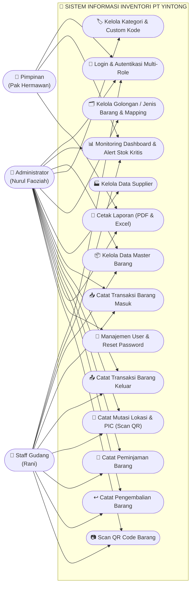

---

# 2. 🔄 5 ACTIVITY DIAGRAM (SISI USER / NON-TEKNIS)
> *Dirancang dengan bahasa bisnis yang mudah dipahami oleh dosen penguji, user awam, dan manajemen.*

---

### 🔹 Activity Diagram 1: Alur Autentikasi & Hak Akses (Login ke Sistem)
Menggambarkan tahapan saat pengguna mengakses sistem inventori sesuai peran masing-masing.

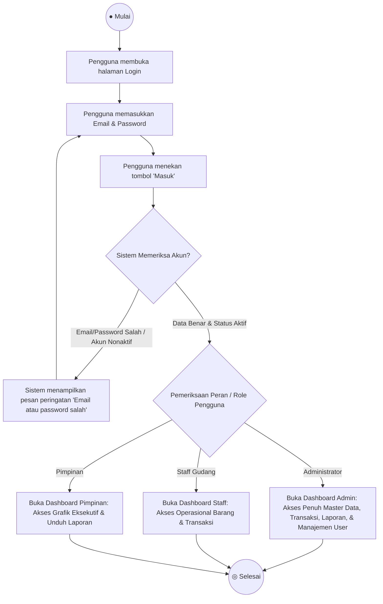

---

### 🔹 Activity Diagram 2: Alur Pendaftaran Barang Baru & Pemetaan Golongan
Menggambarkan proses user menambahkan barang baru hingga terbentuk kode unik dan QR Code otomatis.

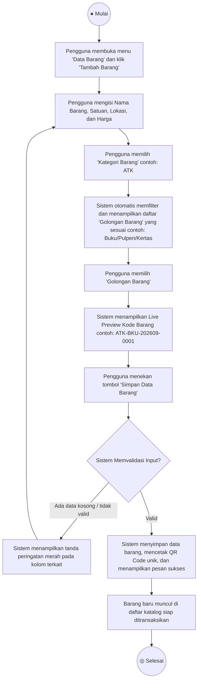

---

### 🔹 Activity Diagram 3: Alur Mutasi Lokasi & PIC Barang (Auto-fill & Scan QR)
Menggambarkan alur perpindahan barang dari satu ruangan/penanggung jawab ke tempat baru secara otomatis tanpa ketik ulang.

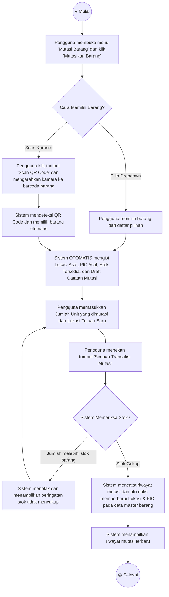

---

### 🔹 Activity Diagram 4: Alur Peminjaman & Pengembalian Barang Inventaris
Menggambarkan siklus peminjaman aset kantor oleh karyawan hingga barang dikembalikan.

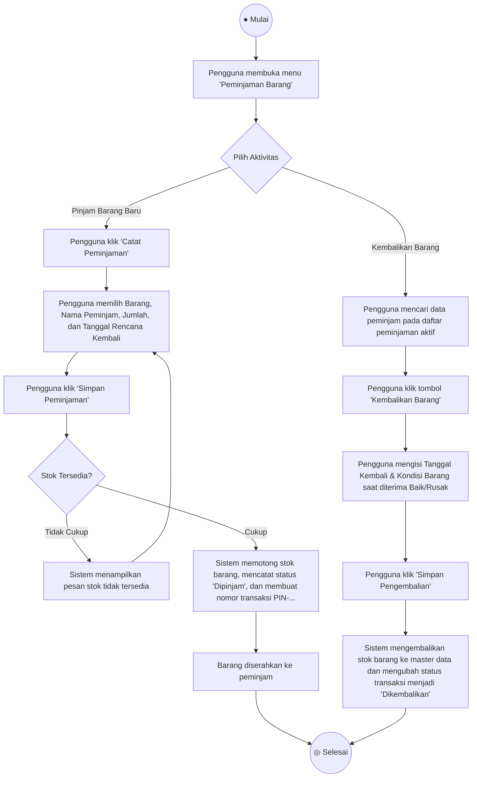

---

### 🔹 Activity Diagram 5: Alur Monitoring Stok & Cetak Laporan Inventori
Menggambarkan alur pimpinan atau administrator memantau status inventori dan mencetak laporan resmi.

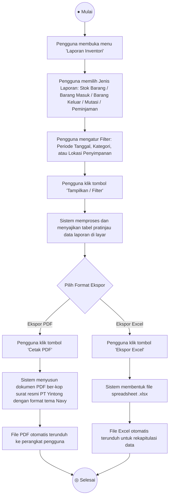

---

# 3. ⚙️ 5 SEQUENCE DIAGRAM (SISI TEKNIS & ARSITEKTUR)
> *Menggambarkan interaksi antar-lapisan kode: View (UI Blade), Form Request, Controller, Service Layer, Model/ORM Eloquent, dan Database.*

---

### 🔸 Sequence Diagram 1: Autentikasi Pengguna (Login Sequence)

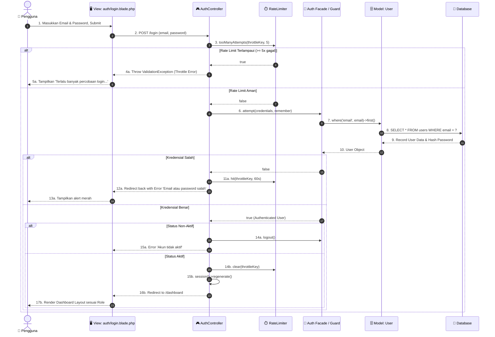

---

### 🔸 Sequence Diagram 2: Pendaftaran Barang Baru & Generate Barcode/QR (Store Barang)

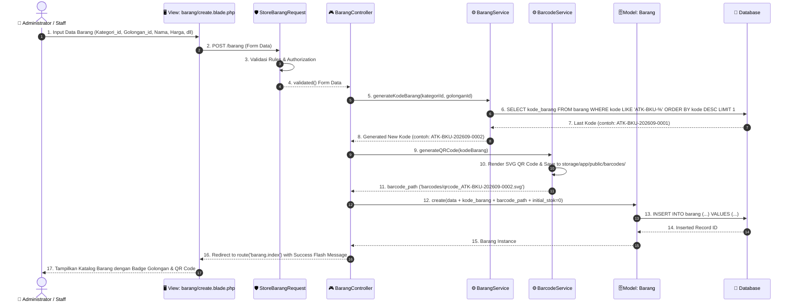

---

### 🔸 Sequence Diagram 3: Mutasi Lokasi & PIC Barang (Store Mutasi Sequence)

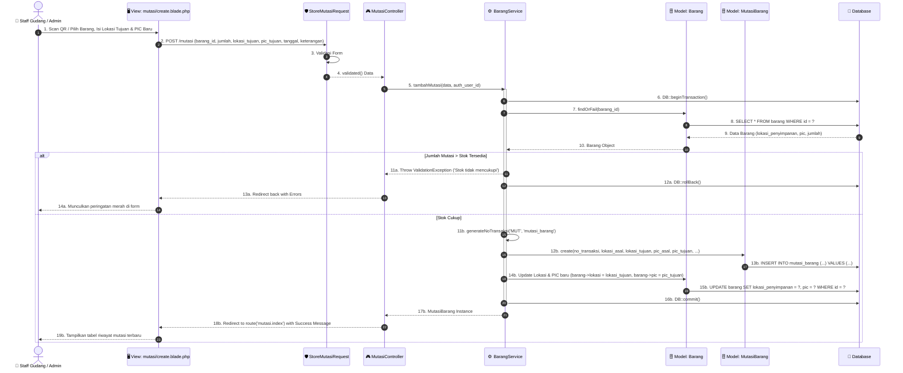

---

### 🔸 Sequence Diagram 4: Siklus Peminjaman & Pengembalian Barang

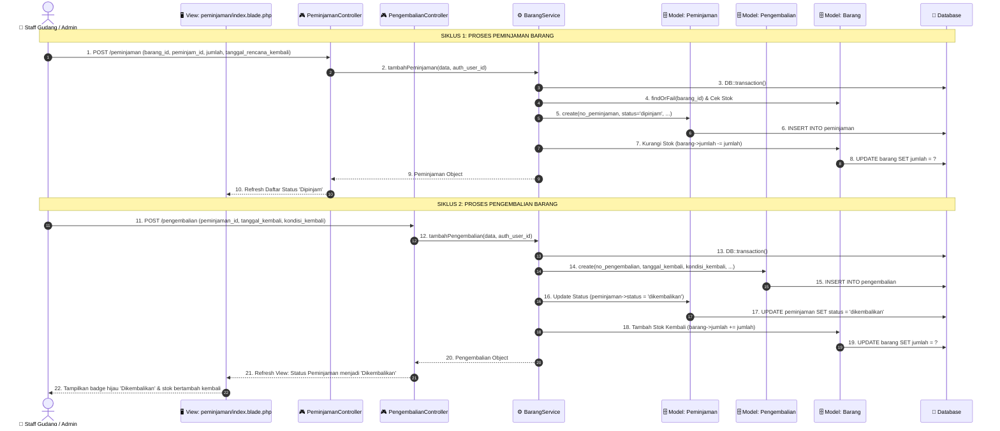

---

### 🔸 Sequence Diagram 5: Ekspor Laporan Inventori (PDF & Excel)

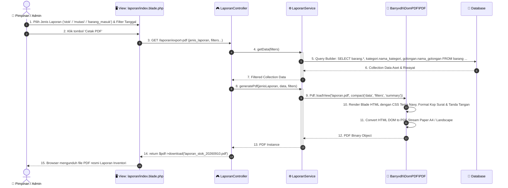

---

## 📌 Ringkasan Pemetaan Diagram

| No | Modul / Kasus Penggunaan (Use Case) | Activity Diagram (Sisi Bisnis / User) | Sequence Diagram (Sisi Teknis & Arsitektur) |
|---|---|---|---|
| **1** | Autentikasi & Hak Akses | Alur login 3 role (Admin, Staff, Pimpinan) | Validasi, Throttling RateLimit, Auth Guard, Session |
| **2** | Master Barang & Golongan | Pendaftaran barang baru, pemetaan golongan & live preview | StoreBarangRequest, BarangService, BarcodeService QR SVG, DB |
| **3** | Mutasi Lokasi & PIC | Auto-fill lokasi/PIC dan scan kamera QR code | DB Transaction, validasi stok, update lokasi master barang |
| **4** | Peminjaman & Pengembalian | Alur peminjaman aset kantor hingga barang dikembalikan | Siklus ganda Peminjaman & Pengembalian, potong/tambah stok |
| **5** | Monitoring & Laporan | Filter kriteria laporan dan unduh PDF/Excel | Query Builder, LaporanService, DomPDF render CSS Navy |

---
*Dokumen ini dibuat otomatis dan terintegrasi langsung dengan struktur kode sumber Sistem Informasi Inventori PT Yintong.*
