# DOKUMENTASI DIAGRAM UML SISTEM INFORMASI INVENTORI PT YINTONG
(Standard Skripsi & Tugas Akhir - Format Bersih Tanpa Ikon)

Dokumen ini berisi:
1. XML Draw.io Use Case Diagram (Siap di-copy-paste langsung ke draw.io / diagrams.net)
2. Use Case Diagram (Mermaid Standar)
3. 5 Activity Diagram (Sisi User / Alur Bisnis Non-Teknis)
4. 5 Sequence Diagram (Sisi Teknis & Arsitektur Sistem)

---

# 1. USE CASE DIAGRAM

## A. Kode XML Draw.io (Bisa langsung di-import di Draw.io)
```xml
<mxGraphModel dx="1422" dy="794" grid="1" gridSize="10" guides="1" tooltips="1" connect="1" arrows="1" fold="1" page="1" pageScale="1" pageWidth="1654" pageHeight="2336" math="0" shadow="0">
  <root>
    <mxCell id="0" />
    <mxCell id="1" parent="0" />
    
    <!-- Boundary Sistem Utama -->
    <mxCell id="system_box" value="" style="swimlane;startSize=0;fillColor=#FFFFFF;strokeColor=#333333;strokeWidth=2;rounded=1;" vertex="1" parent="1">
      <mxGeometry x="380" y="100" width="880" height="1520" as="geometry" />
    </mxCell>
    <mxCell id="system_title" value="Sistem Informasi Inventori PT Yintong" style="text;html=1;strokeColor=none;fillColor=none;align=center;verticalAlign=middle;whiteSpace=wrap;rounded=0;fontStyle=1;fontSize=16;fontFamily=Helvetica;" vertex="1" parent="system_box">
      <mxGeometry x="240" y="20" width="400" height="30" as="geometry" />
    </mxCell>

    <!-- Group 1: Otentikasi Akun -->
    <mxCell id="grp_auth" value="" style="swimlane;startSize=0;fillColor=#F8FAFC;strokeColor=#CBD5E1;rounded=1;" vertex="1" parent="system_box">
      <mxGeometry x="40" y="80" width="800" height="180" as="geometry" />
    </mxCell>
    <mxCell id="title_auth" value="Otentikasi Akun" style="text;html=1;strokeColor=none;fillColor=none;align=left;verticalAlign=middle;fontStyle=1;fontSize=13;fontFamily=Helvetica;" vertex="1" parent="grp_auth">
      <mxGeometry x="20" y="10" width="150" height="20" as="geometry" />
    </mxCell>
    <mxCell id="uc_login" value="Login" style="ellipse;whiteSpace=wrap;html=1;fillColor=#FFFFFF;strokeColor=#0F2942;strokeWidth=1.5;" vertex="1" parent="grp_auth">
      <mxGeometry x="220" y="50" width="140" height="70" as="geometry" />
    </mxCell>
    <mxCell id="uc_logout" value="Logout" style="ellipse;whiteSpace=wrap;html=1;fillColor=#FFFFFF;strokeColor=#0F2942;strokeWidth=1.5;" vertex="1" parent="grp_auth">
      <mxGeometry x="440" y="50" width="140" height="70" as="geometry" />
    </mxCell>

    <!-- Group 2: Data Master & Konfigurasi -->
    <mxCell id="grp_master" value="" style="swimlane;startSize=0;fillColor=#F8FAFC;strokeColor=#CBD5E1;rounded=1;" vertex="1" parent="system_box">
      <mxGeometry x="40" y="290" width="800" height="280" as="geometry" />
    </mxCell>
    <mxCell id="title_master" value="Data Master &amp; Konfigurasi" style="text;html=1;strokeColor=none;fillColor=none;align=left;verticalAlign=middle;fontStyle=1;fontSize=13;fontFamily=Helvetica;" vertex="1" parent="grp_master">
      <mxGeometry x="20" y="10" width="200" height="20" as="geometry" />
    </mxCell>
    <mxCell id="uc_barang" value="Kelola Data Barang" style="ellipse;whiteSpace=wrap;html=1;fillColor=#FFFFFF;strokeColor=#0F2942;strokeWidth=1.5;" vertex="1" parent="grp_master">
      <mxGeometry x="120" y="50" width="140" height="70" as="geometry" />
    </mxCell>
    <mxCell id="uc_kategori" value="Kelola Kategori Barang" style="ellipse;whiteSpace=wrap;html=1;fillColor=#FFFFFF;strokeColor=#0F2942;strokeWidth=1.5;" vertex="1" parent="grp_master">
      <mxGeometry x="330" y="50" width="140" height="70" as="geometry" />
    </mxCell>
    <mxCell id="uc_golongan" value="Kelola Golongan Barang" style="ellipse;whiteSpace=wrap;html=1;fillColor=#FFFFFF;strokeColor=#0F2942;strokeWidth=1.5;" vertex="1" parent="grp_master">
      <mxGeometry x="540" y="50" width="140" height="70" as="geometry" />
    </mxCell>
    <mxCell id="uc_supplier" value="Kelola Data Supplier" style="ellipse;whiteSpace=wrap;html=1;fillColor=#FFFFFF;strokeColor=#0F2942;strokeWidth=1.5;" vertex="1" parent="grp_master">
      <mxGeometry x="220" y="160" width="140" height="70" as="geometry" />
    </mxCell>
    <mxCell id="uc_stok_min" value="Setting Stok Minimum" style="ellipse;whiteSpace=wrap;html=1;fillColor=#FFFFFF;strokeColor=#0F2942;strokeWidth=1.5;" vertex="1" parent="grp_master">
      <mxGeometry x="440" y="160" width="140" height="70" as="geometry" />
    </mxCell>

    <!-- Group 3: Transaksi & Operasional -->
    <mxCell id="grp_trx" value="" style="swimlane;startSize=0;fillColor=#F8FAFC;strokeColor=#CBD5E1;rounded=1;" vertex="1" parent="system_box">
      <mxGeometry x="40" y="600" width="800" height="420" as="geometry" />
    </mxCell>
    <mxCell id="title_trx" value="Transaksi &amp; Operasional" style="text;html=1;strokeColor=none;fillColor=none;align=left;verticalAlign=middle;fontStyle=1;fontSize=13;fontFamily=Helvetica;" vertex="1" parent="grp_trx">
      <mxGeometry x="20" y="10" width="200" height="20" as="geometry" />
    </mxCell>
    <mxCell id="uc_in" value="Input Barang Masuk" style="ellipse;whiteSpace=wrap;html=1;fillColor=#FFFFFF;strokeColor=#0F2942;strokeWidth=1.5;" vertex="1" parent="grp_trx">
      <mxGeometry x="100" y="50" width="140" height="70" as="geometry" />
    </mxCell>
    <mxCell id="uc_out" value="Input Barang Keluar" style="ellipse;whiteSpace=wrap;html=1;fillColor=#FFFFFF;strokeColor=#0F2942;strokeWidth=1.5;" vertex="1" parent="grp_trx">
      <mxGeometry x="100" y="140" width="140" height="70" as="geometry" />
    </mxCell>
    <mxCell id="uc_mutasi" value="Mutasi Lokasi &amp; PIC" style="ellipse;whiteSpace=wrap;html=1;fillColor=#FFFFFF;strokeColor=#0F2942;strokeWidth=1.5;" vertex="1" parent="grp_trx">
      <mxGeometry x="100" y="230" width="140" height="70" as="geometry" />
    </mxCell>
    <mxCell id="uc_scan" value="Scan QR Code / Barcode" style="ellipse;whiteSpace=wrap;html=1;fillColor=#FFFFFF;strokeColor=#0F2942;strokeWidth=1.5;" vertex="1" parent="grp_trx">
      <mxGeometry x="540" y="140" width="150" height="70" as="geometry" />
    </mxCell>
    <mxCell id="uc_pinjam" value="Catat Peminjaman" style="ellipse;whiteSpace=wrap;html=1;fillColor=#FFFFFF;strokeColor=#0F2942;strokeWidth=1.5;" vertex="1" parent="grp_trx">
      <mxGeometry x="100" y="320" width="140" height="70" as="geometry" />
    </mxCell>
    <mxCell id="uc_kembali" value="Catat Pengembalian" style="ellipse;whiteSpace=wrap;html=1;fillColor=#FFFFFF;strokeColor=#0F2942;strokeWidth=1.5;" vertex="1" parent="grp_trx">
      <mxGeometry x="340" y="320" width="140" height="70" as="geometry" />
    </mxCell>

    <!-- Include Edges for Scan QR -->
    <mxCell id="inc_1" value="&amp;lt;&amp;lt;include&amp;gt;&amp;gt;" style="html=1;verticalAlign=bottom;labelBackgroundColor=none;endArrow=open;endFill=0;dashed=1;rounded=0;exitX=1;exitY=0.5;entryX=0;entryY=0.5;" edge="1" parent="grp_trx" source="uc_in" target="uc_scan">
      <mxGeometry relative="1" as="geometry" />
    </mxCell>
    <mxCell id="inc_2" value="&amp;lt;&amp;lt;include&amp;gt;&amp;gt;" style="html=1;verticalAlign=bottom;labelBackgroundColor=none;endArrow=open;endFill=0;dashed=1;rounded=0;exitX=1;exitY=0.5;entryX=0;entryY=0.5;" edge="1" parent="grp_trx" source="uc_out" target="uc_scan">
      <mxGeometry relative="1" as="geometry" />
    </mxCell>
    <mxCell id="inc_3" value="&amp;lt;&amp;lt;include&amp;gt;&amp;gt;" style="html=1;verticalAlign=bottom;labelBackgroundColor=none;endArrow=open;endFill=0;dashed=1;rounded=0;exitX=1;exitY=0.5;entryX=0;entryY=0.5;" edge="1" parent="grp_trx" source="uc_mutasi" target="uc_scan">
      <mxGeometry relative="1" as="geometry" />
    </mxCell>

    <!-- Group 4: Laporan & Monitoring -->
    <mxCell id="grp_report" value="" style="swimlane;startSize=0;fillColor=#F8FAFC;strokeColor=#CBD5E1;rounded=1;" vertex="1" parent="system_box">
      <mxGeometry x="40" y="1050" width="800" height="230" as="geometry" />
    </mxCell>
    <mxCell id="title_report" value="Laporan &amp; Monitoring" style="text;html=1;strokeColor=none;fillColor=none;align=left;verticalAlign=middle;fontStyle=1;fontSize=13;fontFamily=Helvetica;" vertex="1" parent="grp_report">
      <mxGeometry x="20" y="10" width="180" height="20" as="geometry" />
    </mxCell>
    <mxCell id="uc_dashboard" value="Lihat Dashboard &amp; Grafik" style="ellipse;whiteSpace=wrap;html=1;fillColor=#FFFFFF;strokeColor=#0F2942;strokeWidth=1.5;" vertex="1" parent="grp_report">
      <mxGeometry x="120" y="50" width="150" height="70" as="geometry" />
    </mxCell>
    <mxCell id="uc_notif" value="Monitoring Alert Stok" style="ellipse;whiteSpace=wrap;html=1;fillColor=#FFFFFF;strokeColor=#0F2942;strokeWidth=1.5;" vertex="1" parent="grp_report">
      <mxGeometry x="330" y="50" width="150" height="70" as="geometry" />
    </mxCell>
    <mxCell id="uc_laporan" value="Cetak Laporan (PDF/Excel)" style="ellipse;whiteSpace=wrap;html=1;fillColor=#FFFFFF;strokeColor=#0F2942;strokeWidth=1.5;" vertex="1" parent="grp_report">
      <mxGeometry x="540" y="50" width="150" height="70" as="geometry" />
    </mxCell>

    <!-- Group 5: Manajemen Pengguna -->
    <mxCell id="grp_user" value="" style="swimlane;startSize=0;fillColor=#F8FAFC;strokeColor=#CBD5E1;rounded=1;" vertex="1" parent="system_box">
      <mxGeometry x="40" y="1310" width="800" height="170" as="geometry" />
    </mxCell>
    <mxCell id="title_user" value="Manajemen Pengguna" style="text;html=1;strokeColor=none;fillColor=none;align=left;verticalAlign=middle;fontStyle=1;fontSize=13;fontFamily=Helvetica;" vertex="1" parent="grp_user">
      <mxGeometry x="20" y="10" width="180" height="20" as="geometry" />
    </mxCell>
    <mxCell id="uc_users" value="Kelola Data User &amp; Role" style="ellipse;whiteSpace=wrap;html=1;fillColor=#FFFFFF;strokeColor=#0F2942;strokeWidth=1.5;" vertex="1" parent="grp_user">
      <mxGeometry x="320" y="50" width="160" height="70" as="geometry" />
    </mxCell>

    <!-- Aktor 1: Administrator (Kiri Bawah) -->
    <mxCell id="act_admin" value="Administrator&#xa;(Nurul Faoziah)" style="shape=umlActor;verticalLabelPosition=bottom;verticalAlign=top;html=1;outlineConnect=0;" vertex="1" parent="1">
      <mxGeometry x="160" y="800" width="80" height="150" as="geometry" />
    </mxCell>

    <!-- Aktor 2: Staff Gudang (Kiri Atas) -->
    <mxCell id="act_staff" value="Staff Gudang&#xa;(Rani)" style="shape=umlActor;verticalLabelPosition=bottom;verticalAlign=top;html=1;outlineConnect=0;" vertex="1" parent="1">
      <mxGeometry x="160" y="320" width="80" height="150" as="geometry" />
    </mxCell>

    <!-- Aktor 3: Pimpinan (Kanan Tengah) -->
    <mxCell id="act_pimpinan" value="Pimpinan&#xa;(Pak Hermawan)" style="shape=umlActor;verticalLabelPosition=bottom;verticalAlign=top;html=1;outlineConnect=0;" vertex="1" parent="1">
      <mxGeometry x="1400" y="700" width="80" height="150" as="geometry" />
    </mxCell>

    <!-- Relasi Asosiasi Actor -> Use Case -->
    <!-- Staff Links -->
    <mxCell id="e_s1" style="endArrow=none;html=1;strokeWidth=1.5;entryX=0;entryY=0.5;" edge="1" parent="1" source="act_staff" target="uc_login"><mxGeometry relative="1" as="geometry" /></mxCell>
    <mxCell id="e_s2" style="endArrow=none;html=1;strokeWidth=1.5;entryX=0;entryY=0.5;" edge="1" parent="1" source="act_staff" target="uc_logout"><mxGeometry relative="1" as="geometry" /></mxCell>
    <mxCell id="e_s3" style="endArrow=none;html=1;strokeWidth=1.5;entryX=0;entryY=0.5;" edge="1" parent="1" source="act_staff" target="uc_barang"><mxGeometry relative="1" as="geometry" /></mxCell>
    <mxCell id="e_s4" style="endArrow=none;html=1;strokeWidth=1.5;entryX=0;entryY=0.5;" edge="1" parent="1" source="act_staff" target="uc_in"><mxGeometry relative="1" as="geometry" /></mxCell>
    <mxCell id="e_s5" style="endArrow=none;html=1;strokeWidth=1.5;entryX=0;entryY=0.5;" edge="1" parent="1" source="act_staff" target="uc_out"><mxGeometry relative="1" as="geometry" /></mxCell>
    <mxCell id="e_s6" style="endArrow=none;html=1;strokeWidth=1.5;entryX=0;entryY=0.5;" edge="1" parent="1" source="act_staff" target="uc_mutasi"><mxGeometry relative="1" as="geometry" /></mxCell>
    <mxCell id="e_s7" style="endArrow=none;html=1;strokeWidth=1.5;entryX=0;entryY=0.5;" edge="1" parent="1" source="act_staff" target="uc_pinjam"><mxGeometry relative="1" as="geometry" /></mxCell>
    <mxCell id="e_s8" style="endArrow=none;html=1;strokeWidth=1.5;entryX=0;entryY=0.5;" edge="1" parent="1" source="act_staff" target="uc_kembali"><mxGeometry relative="1" as="geometry" /></mxCell>

    <!-- Admin Links (All Master, Trx, Report, User) -->
    <mxCell id="e_a1" style="endArrow=none;html=1;strokeWidth=1.5;entryX=0;entryY=0.5;" edge="1" parent="1" source="act_admin" target="uc_login"><mxGeometry relative="1" as="geometry" /></mxCell>
    <mxCell id="e_a2" style="endArrow=none;html=1;strokeWidth=1.5;entryX=0;entryY=0.5;" edge="1" parent="1" source="act_admin" target="uc_logout"><mxGeometry relative="1" as="geometry" /></mxCell>
    <mxCell id="e_a3" style="endArrow=none;html=1;strokeWidth=1.5;entryX=0;entryY=0.5;" edge="1" parent="1" source="act_admin" target="uc_barang"><mxGeometry relative="1" as="geometry" /></mxCell>
    <mxCell id="e_a4" style="endArrow=none;html=1;strokeWidth=1.5;entryX=0;entryY=0.5;" edge="1" parent="1" source="act_admin" target="uc_kategori"><mxGeometry relative="1" as="geometry" /></mxCell>
    <mxCell id="e_a5" style="endArrow=none;html=1;strokeWidth=1.5;entryX=0;entryY=0.5;" edge="1" parent="1" source="act_admin" target="uc_golongan"><mxGeometry relative="1" as="geometry" /></mxCell>
    <mxCell id="e_a6" style="endArrow=none;html=1;strokeWidth=1.5;entryX=0;entryY=0.5;" edge="1" parent="1" source="act_admin" target="uc_supplier"><mxGeometry relative="1" as="geometry" /></mxCell>
    <mxCell id="e_a7" style="endArrow=none;html=1;strokeWidth=1.5;entryX=0;entryY=0.5;" edge="1" parent="1" source="act_admin" target="uc_stok_min"><mxGeometry relative="1" as="geometry" /></mxCell>
    <mxCell id="e_a8" style="endArrow=none;html=1;strokeWidth=1.5;entryX=0;entryY=0.5;" edge="1" parent="1" source="act_admin" target="uc_in"><mxGeometry relative="1" as="geometry" /></mxCell>
    <mxCell id="e_a9" style="endArrow=none;html=1;strokeWidth=1.5;entryX=0;entryY=0.5;" edge="1" parent="1" source="act_admin" target="uc_out"><mxGeometry relative="1" as="geometry" /></mxCell>
    <mxCell id="e_a10" style="endArrow=none;html=1;strokeWidth=1.5;entryX=0;entryY=0.5;" edge="1" parent="1" source="act_admin" target="uc_mutasi"><mxGeometry relative="1" as="geometry" /></mxCell>
    <mxCell id="e_a11" style="endArrow=none;html=1;strokeWidth=1.5;entryX=0;entryY=0.5;" edge="1" parent="1" source="act_admin" target="uc_pinjam"><mxGeometry relative="1" as="geometry" /></mxCell>
    <mxCell id="e_a12" style="endArrow=none;html=1;strokeWidth=1.5;entryX=0;entryY=0.5;" edge="1" parent="1" source="act_admin" target="uc_kembali"><mxGeometry relative="1" as="geometry" /></mxCell>
    <mxCell id="e_a13" style="endArrow=none;html=1;strokeWidth=1.5;entryX=0;entryY=0.5;" edge="1" parent="1" source="act_admin" target="uc_dashboard"><mxGeometry relative="1" as="geometry" /></mxCell>
    <mxCell id="e_a14" style="endArrow=none;html=1;strokeWidth=1.5;entryX=0;entryY=0.5;" edge="1" parent="1" source="act_admin" target="uc_notif"><mxGeometry relative="1" as="geometry" /></mxCell>
    <mxCell id="e_a15" style="endArrow=none;html=1;strokeWidth=1.5;entryX=0;entryY=0.5;" edge="1" parent="1" source="act_admin" target="uc_laporan"><mxGeometry relative="1" as="geometry" /></mxCell>
    <mxCell id="e_a16" style="endArrow=none;html=1;strokeWidth=1.5;entryX=0;entryY=0.5;" edge="1" parent="1" source="act_admin" target="uc_users"><mxGeometry relative="1" as="geometry" /></mxCell>

    <!-- Pimpinan Links -->
    <mxCell id="e_p1" style="endArrow=none;html=1;strokeWidth=1.5;entryX=1;entryY=0.5;" edge="1" parent="1" source="act_pimpinan" target="uc_login"><mxGeometry relative="1" as="geometry" /></mxCell>
    <mxCell id="e_p2" style="endArrow=none;html=1;strokeWidth=1.5;entryX=1;entryY=0.5;" edge="1" parent="1" source="act_pimpinan" target="uc_logout"><mxGeometry relative="1" as="geometry" /></mxCell>
    <mxCell id="e_p3" style="endArrow=none;html=1;strokeWidth=1.5;entryX=1;entryY=0.5;" edge="1" parent="1" source="act_pimpinan" target="uc_dashboard"><mxGeometry relative="1" as="geometry" /></mxCell>
    <mxCell id="e_p4" style="endArrow=none;html=1;strokeWidth=1.5;entryX=1;entryY=0.5;" edge="1" parent="1" source="act_pimpinan" target="uc_notif"><mxGeometry relative="1" as="geometry" /></mxCell>
    <mxCell id="e_p5" style="endArrow=none;html=1;strokeWidth=1.5;entryX=1;entryY=0.5;" edge="1" parent="1" source="act_pimpinan" target="uc_laporan"><mxGeometry relative="1" as="geometry" /></mxCell>

  </root>
</mxGraphModel>
```

## B. Use Case Diagram (Format Mermaid)
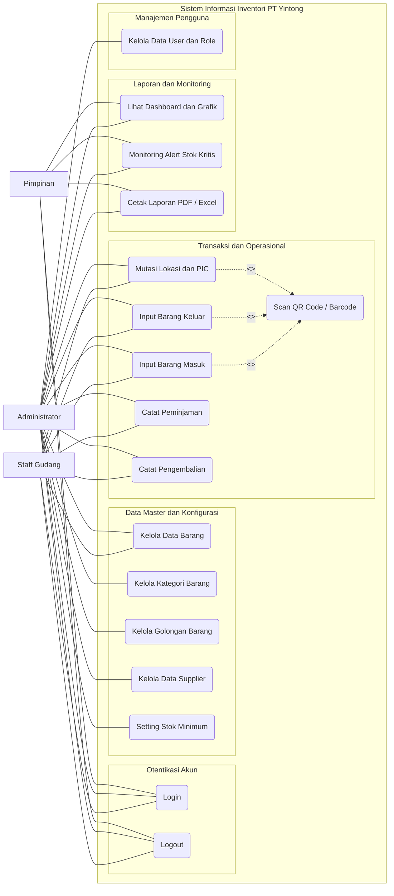

---

# 2. 5 ACTIVITY DIAGRAM (SISI USER / NON-TEKNIS)

### 1. Activity Diagram: Alur Login Pengguna
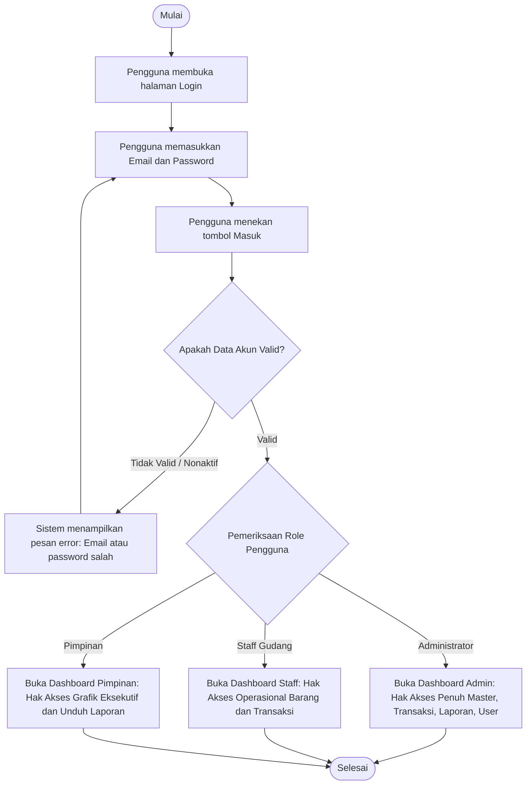

---

### 2. Activity Diagram: Pendaftaran Barang Baru dan Pemetaan Golongan
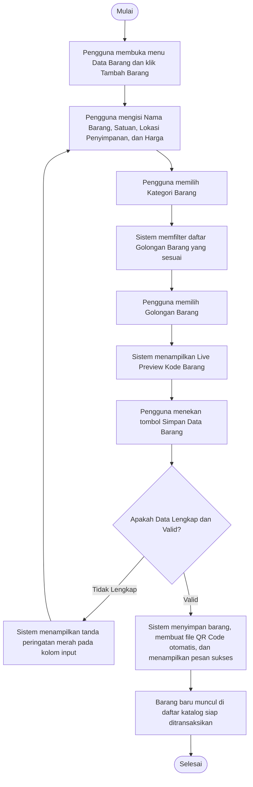

---

### 3. Activity Diagram: Mutasi Lokasi dan PIC Barang
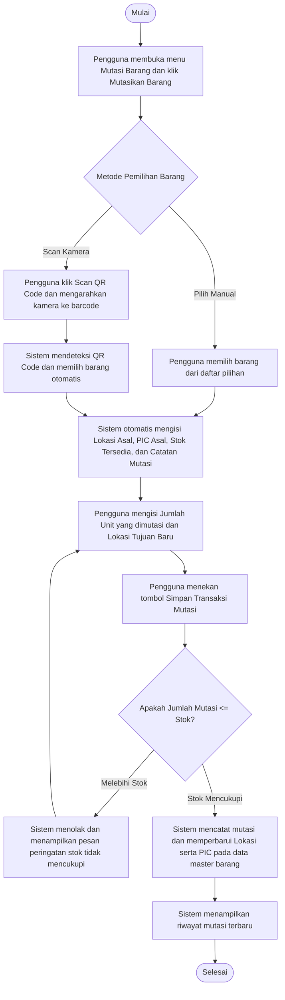

---

### 4. Activity Diagram: Peminjaman dan Pengembalian Barang Inventaris
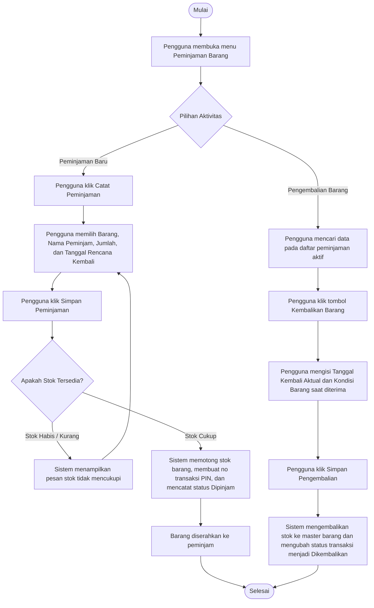

---

### 5. Activity Diagram: Monitoring Stok dan Cetak Laporan
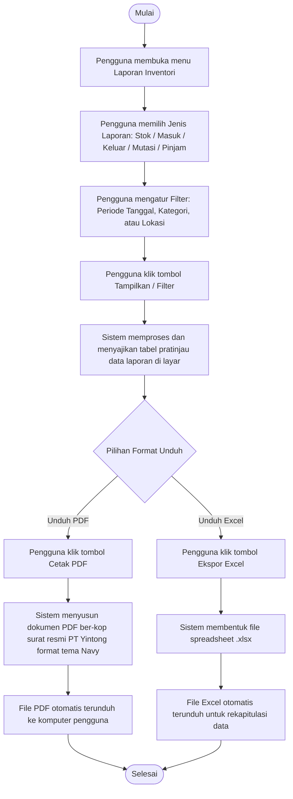

---

# 3. 5 SEQUENCE DIAGRAM (SISI TEKNIS & ARSITEKTUR)

### 1. Sequence Diagram: Autentikasi Pengguna (Login Sequence)
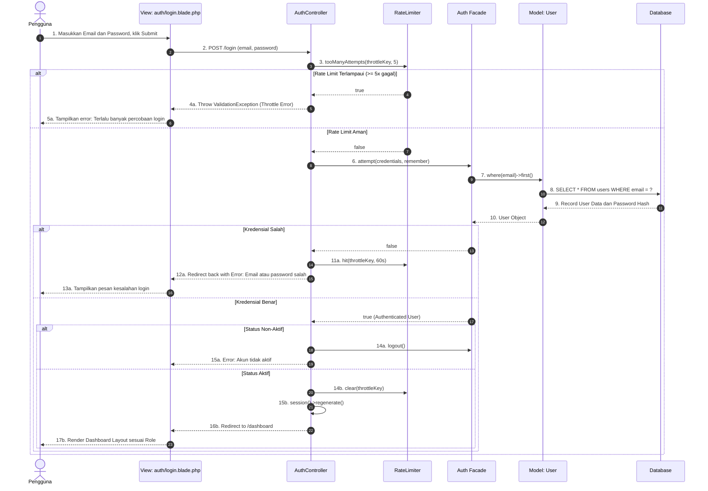

---

### 2. Sequence Diagram: Pendaftaran Barang Baru (Store Barang Sequence)
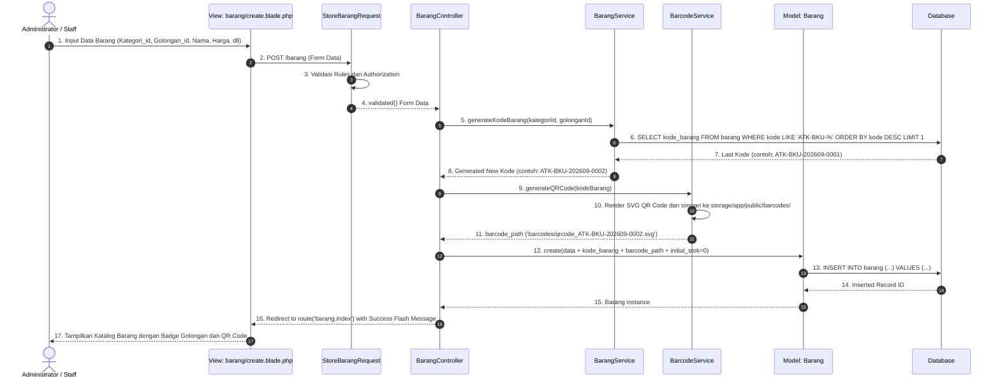

---

### 3. Sequence Diagram: Mutasi Lokasi dan PIC Barang (Store Mutasi Sequence)
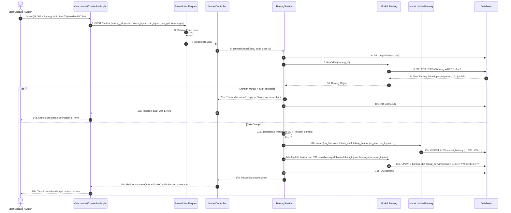

---

### 4. Sequence Diagram: Siklus Peminjaman dan Pengembalian Barang
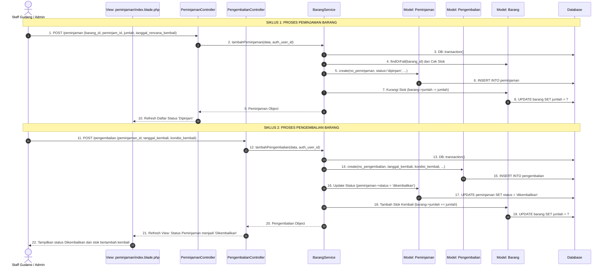

---

### 5. Sequence Diagram: Ekspor Laporan Inventori (PDF dan Excel)
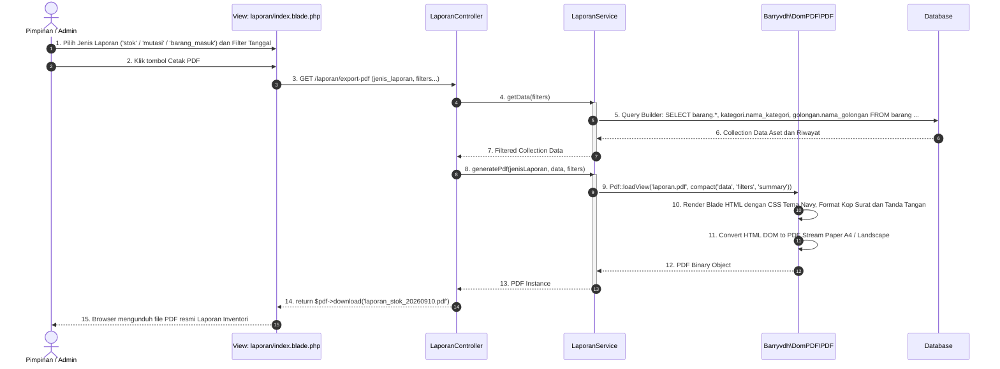
