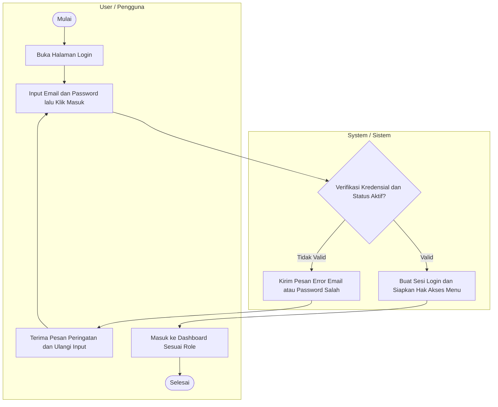
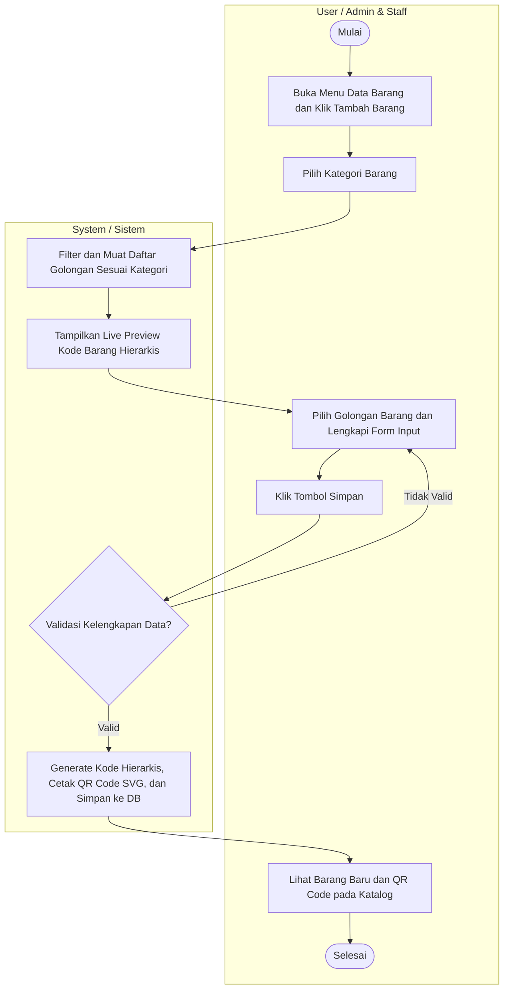
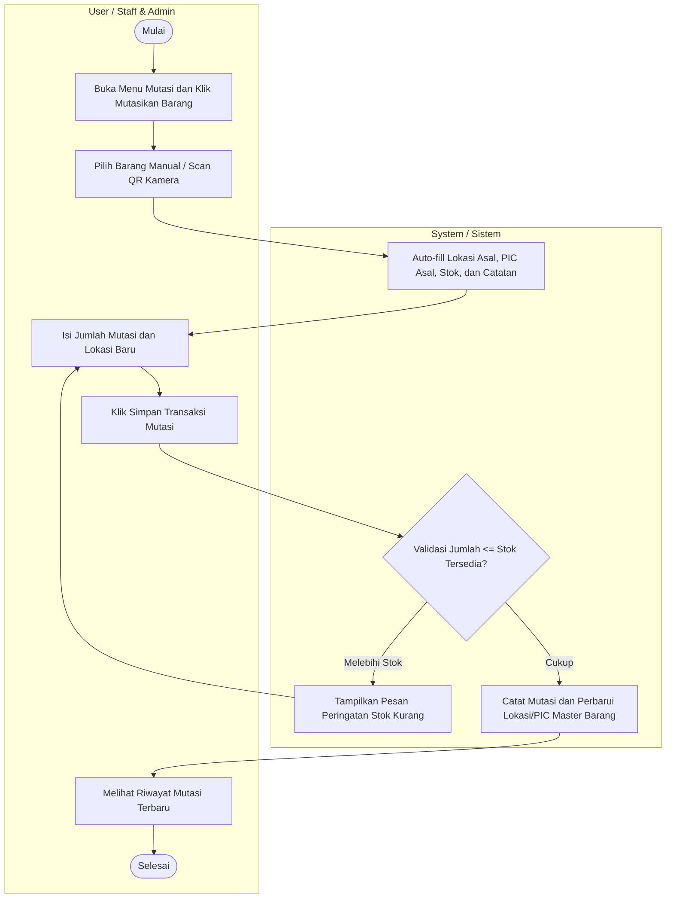
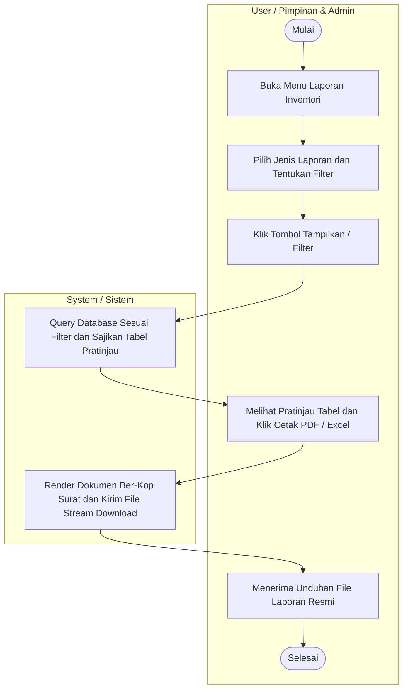
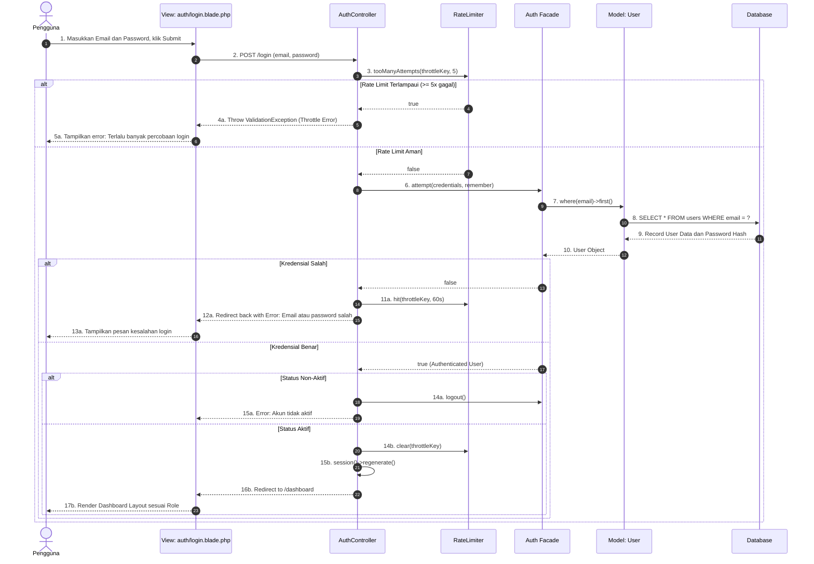
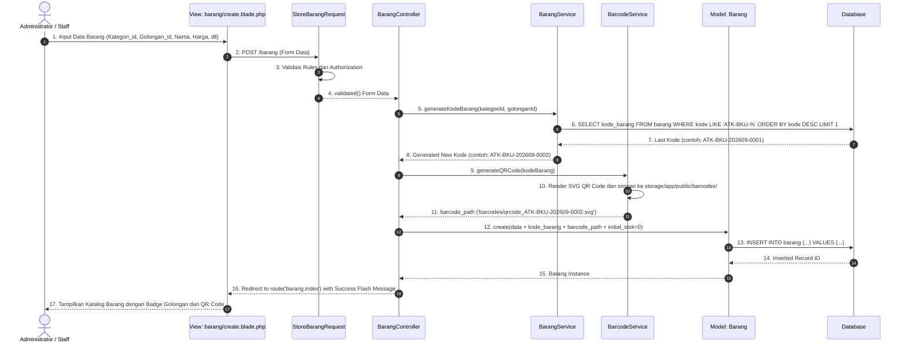
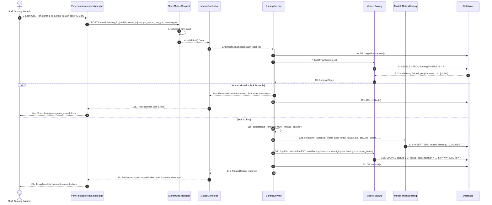
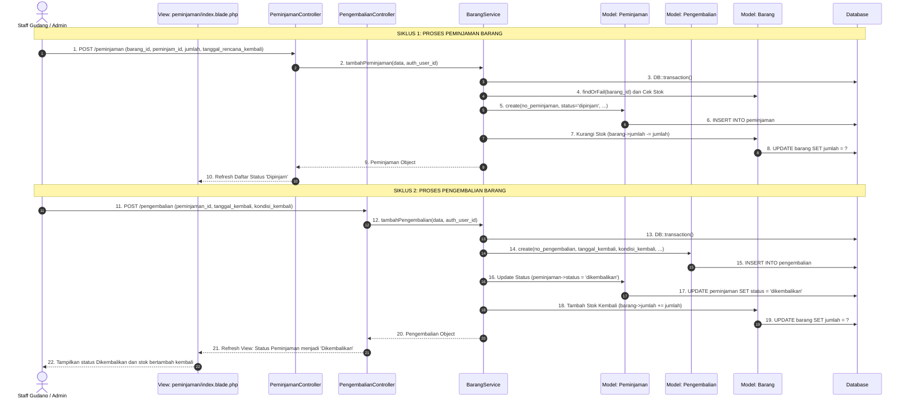
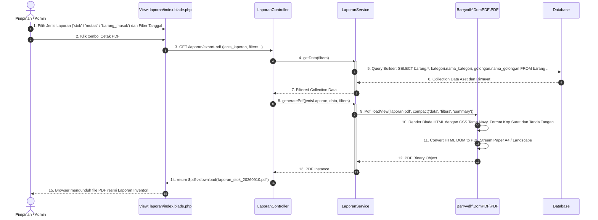

# DOKUMENTASI DIAGRAM UML SISTEM INFORMASI INVENTORI PT YINTONG
(Standard Skripsi & Tugas Akhir - Format Swimlane User vs System Tanpa Ikon)

Dokumen ini berisi:
1. Use Case Diagram (Lengkap dengan XML Draw.io)
2. 5 Activity Diagram Swimlane User vs System (Lengkap dengan XML Draw.io untuk masing-masing diagram)
3. 5 Sequence Diagram Arsitektur Teknis

---

# 1. USE CASE DIAGRAM

## XML Draw.io Use Case Diagram
```xml
<mxGraphModel dx="1422" dy="794" grid="1" gridSize="10" guides="1" tooltips="1" connect="1" arrows="1" fold="1" page="1" pageScale="1" pageWidth="1654" pageHeight="2336" math="0" shadow="0">
  <root>
    <mxCell id="0" />
    <mxCell id="1" parent="0" />
    <mxCell id="system_box" value="" style="swimlane;startSize=0;fillColor=#FFFFFF;strokeColor=#333333;strokeWidth=2;rounded=1;" vertex="1" parent="1">
      <mxGeometry x="380" y="100" width="880" height="1520" as="geometry" />
    </mxCell>
    <mxCell id="system_title" value="Sistem Informasi Inventori PT Yintong" style="text;html=1;strokeColor=none;fillColor=none;align=center;verticalAlign=middle;whiteSpace=wrap;rounded=0;fontStyle=1;fontSize=16;fontFamily=Helvetica;" vertex="1" parent="system_box">
      <mxGeometry x="240" y="20" width="400" height="30" as="geometry" />
    </mxCell>
    <!-- Group 1: Otentikasi -->
    <mxCell id="grp_auth" value="" style="swimlane;startSize=0;fillColor=#F8FAFC;strokeColor=#CBD5E1;rounded=1;" vertex="1" parent="system_box">
      <mxGeometry x="40" y="80" width="800" height="180" as="geometry" />
    </mxCell>
    <mxCell id="title_auth" value="Otentikasi Akun" style="text;html=1;strokeColor=none;fillColor=none;align=left;verticalAlign=middle;fontStyle=1;fontSize=13;fontFamily=Helvetica;" vertex="1" parent="grp_auth">
      <mxGeometry x="20" y="10" width="150" height="20" as="geometry" />
    </mxCell>
    <mxCell id="uc_login" value="Login" style="ellipse;whiteSpace=wrap;html=1;fillColor=#FFFFFF;strokeColor=#0F2942;strokeWidth=1.5;" vertex="1" parent="grp_auth">
      <mxGeometry x="220" y="50" width="140" height="70" as="geometry" />
    </mxCell>
    <mxCell id="uc_logout" value="Logout" style="ellipse;whiteSpace=wrap;html=1;fillColor=#FFFFFF;strokeColor=#0F2942;strokeWidth=1.5;" vertex="1" parent="grp_auth">
      <mxGeometry x="440" y="50" width="140" height="70" as="geometry" />
    </mxCell>
    <!-- Group 2: Master Data -->
    <mxCell id="grp_master" value="" style="swimlane;startSize=0;fillColor=#F8FAFC;strokeColor=#CBD5E1;rounded=1;" vertex="1" parent="system_box">
      <mxGeometry x="40" y="290" width="800" height="280" as="geometry" />
    </mxCell>
    <mxCell id="title_master" value="Data Master &amp; Konfigurasi" style="text;html=1;strokeColor=none;fillColor=none;align=left;verticalAlign=middle;fontStyle=1;fontSize=13;fontFamily=Helvetica;" vertex="1" parent="grp_master">
      <mxGeometry x="20" y="10" width="200" height="20" as="geometry" />
    </mxCell>
    <mxCell id="uc_barang" value="Kelola Data Barang" style="ellipse;whiteSpace=wrap;html=1;fillColor=#FFFFFF;strokeColor=#0F2942;strokeWidth=1.5;" vertex="1" parent="grp_master">
      <mxGeometry x="120" y="50" width="140" height="70" as="geometry" />
    </mxCell>
    <mxCell id="uc_kategori" value="Kelola Kategori Barang" style="ellipse;whiteSpace=wrap;html=1;fillColor=#FFFFFF;strokeColor=#0F2942;strokeWidth=1.5;" vertex="1" parent="grp_master">
      <mxGeometry x="330" y="50" width="140" height="70" as="geometry" />
    </mxCell>
    <mxCell id="uc_golongan" value="Kelola Golongan Barang" style="ellipse;whiteSpace=wrap;html=1;fillColor=#FFFFFF;strokeColor=#0F2942;strokeWidth=1.5;" vertex="1" parent="grp_master">
      <mxGeometry x="540" y="50" width="140" height="70" as="geometry" />
    </mxCell>
    <mxCell id="uc_supplier" value="Kelola Data Supplier" style="ellipse;whiteSpace=wrap;html=1;fillColor=#FFFFFF;strokeColor=#0F2942;strokeWidth=1.5;" vertex="1" parent="grp_master">
      <mxGeometry x="220" y="160" width="140" height="70" as="geometry" />
    </mxCell>
    <mxCell id="uc_stok_min" value="Setting Stok Minimum" style="ellipse;whiteSpace=wrap;html=1;fillColor=#FFFFFF;strokeColor=#0F2942;strokeWidth=1.5;" vertex="1" parent="grp_master">
      <mxGeometry x="440" y="160" width="140" height="70" as="geometry" />
    </mxCell>
    <!-- Group 3: Transaksi -->
    <mxCell id="grp_trx" value="" style="swimlane;startSize=0;fillColor=#F8FAFC;strokeColor=#CBD5E1;rounded=1;" vertex="1" parent="system_box">
      <mxGeometry x="40" y="600" width="800" height="420" as="geometry" />
    </mxCell>
    <mxCell id="title_trx" value="Transaksi &amp; Operasional" style="text;html=1;strokeColor=none;fillColor=none;align=left;verticalAlign=middle;fontStyle=1;fontSize=13;fontFamily=Helvetica;" vertex="1" parent="grp_trx">
      <mxGeometry x="20" y="10" width="200" height="20" as="geometry" />
    </mxCell>
    <mxCell id="uc_in" value="Input Barang Masuk" style="ellipse;whiteSpace=wrap;html=1;fillColor=#FFFFFF;strokeColor=#0F2942;strokeWidth=1.5;" vertex="1" parent="grp_trx">
      <mxGeometry x="100" y="50" width="140" height="70" as="geometry" />
    </mxCell>
    <mxCell id="uc_out" value="Input Barang Keluar" style="ellipse;whiteSpace=wrap;html=1;fillColor=#FFFFFF;strokeColor=#0F2942;strokeWidth=1.5;" vertex="1" parent="grp_trx">
      <mxGeometry x="100" y="140" width="140" height="70" as="geometry" />
    </mxCell>
    <mxCell id="uc_mutasi" value="Mutasi Lokasi &amp; PIC" style="ellipse;whiteSpace=wrap;html=1;fillColor=#FFFFFF;strokeColor=#0F2942;strokeWidth=1.5;" vertex="1" parent="grp_trx">
      <mxGeometry x="100" y="230" width="140" height="70" as="geometry" />
    </mxCell>
    <mxCell id="uc_scan" value="Scan QR Code / Barcode" style="ellipse;whiteSpace=wrap;html=1;fillColor=#FFFFFF;strokeColor=#0F2942;strokeWidth=1.5;" vertex="1" parent="grp_trx">
      <mxGeometry x="540" y="140" width="150" height="70" as="geometry" />
    </mxCell>
    <mxCell id="uc_pinjam" value="Catat Peminjaman" style="ellipse;whiteSpace=wrap;html=1;fillColor=#FFFFFF;strokeColor=#0F2942;strokeWidth=1.5;" vertex="1" parent="grp_trx">
      <mxGeometry x="100" y="320" width="140" height="70" as="geometry" />
    </mxCell>
    <mxCell id="uc_kembali" value="Catat Pengembalian" style="ellipse;whiteSpace=wrap;html=1;fillColor=#FFFFFF;strokeColor=#0F2942;strokeWidth=1.5;" vertex="1" parent="grp_trx">
      <mxGeometry x="340" y="320" width="140" height="70" as="geometry" />
    </mxCell>
    <mxCell id="inc_1" value="&amp;lt;&amp;lt;include&amp;gt;&amp;gt;" style="html=1;verticalAlign=bottom;labelBackgroundColor=none;endArrow=open;endFill=0;dashed=1;rounded=0;exitX=1;exitY=0.5;entryX=0;entryY=0.5;" edge="1" parent="grp_trx" source="uc_in" target="uc_scan"><mxGeometry relative="1" as="geometry" /></mxCell>
    <mxCell id="inc_2" value="&amp;lt;&amp;lt;include&amp;gt;&amp;gt;" style="html=1;verticalAlign=bottom;labelBackgroundColor=none;endArrow=open;endFill=0;dashed=1;rounded=0;exitX=1;exitY=0.5;entryX=0;entryY=0.5;" edge="1" parent="grp_trx" source="uc_out" target="uc_scan"><mxGeometry relative="1" as="geometry" /></mxCell>
    <mxCell id="inc_3" value="&amp;lt;&amp;lt;include&amp;gt;&amp;gt;" style="html=1;verticalAlign=bottom;labelBackgroundColor=none;endArrow=open;endFill=0;dashed=1;rounded=0;exitX=1;exitY=0.5;entryX=0;entryY=0.5;" edge="1" parent="grp_trx" source="uc_mutasi" target="uc_scan"><mxGeometry relative="1" as="geometry" /></mxCell>
    <!-- Group 4: Laporan -->
    <mxCell id="grp_report" value="" style="swimlane;startSize=0;fillColor=#F8FAFC;strokeColor=#CBD5E1;rounded=1;" vertex="1" parent="system_box">
      <mxGeometry x="40" y="1050" width="800" height="230" as="geometry" />
    </mxCell>
    <mxCell id="title_report" value="Laporan &amp; Monitoring" style="text;html=1;strokeColor=none;fillColor=none;align=left;verticalAlign=middle;fontStyle=1;fontSize=13;fontFamily=Helvetica;" vertex="1" parent="grp_report">
      <mxGeometry x="20" y="10" width="180" height="20" as="geometry" />
    </mxCell>
    <mxCell id="uc_dashboard" value="Lihat Dashboard &amp; Grafik" style="ellipse;whiteSpace=wrap;html=1;fillColor=#FFFFFF;strokeColor=#0F2942;strokeWidth=1.5;" vertex="1" parent="grp_report">
      <mxGeometry x="120" y="50" width="150" height="70" as="geometry" />
    </mxCell>
    <mxCell id="uc_notif" value="Monitoring Alert Stok" style="ellipse;whiteSpace=wrap;html=1;fillColor=#FFFFFF;strokeColor=#0F2942;strokeWidth=1.5;" vertex="1" parent="grp_report">
      <mxGeometry x="330" y="50" width="150" height="70" as="geometry" />
    </mxCell>
    <mxCell id="uc_laporan" value="Cetak Laporan (PDF/Excel)" style="ellipse;whiteSpace=wrap;html=1;fillColor=#FFFFFF;strokeColor=#0F2942;strokeWidth=1.5;" vertex="1" parent="grp_report">
      <mxGeometry x="540" y="50" width="150" height="70" as="geometry" />
    </mxCell>
    <!-- Group 5: User Management -->
    <mxCell id="grp_user" value="" style="swimlane;startSize=0;fillColor=#F8FAFC;strokeColor=#CBD5E1;rounded=1;" vertex="1" parent="system_box">
      <mxGeometry x="40" y="1310" width="800" height="170" as="geometry" />
    </mxCell>
    <mxCell id="title_user" value="Manajemen Pengguna" style="text;html=1;strokeColor=none;fillColor=none;align=left;verticalAlign=middle;fontStyle=1;fontSize=13;fontFamily=Helvetica;" vertex="1" parent="grp_user">
      <mxGeometry x="20" y="10" width="180" height="20" as="geometry" />
    </mxCell>
    <mxCell id="uc_users" value="Kelola Data User &amp; Role" style="ellipse;whiteSpace=wrap;html=1;fillColor=#FFFFFF;strokeColor=#0F2942;strokeWidth=1.5;" vertex="1" parent="grp_user">
      <mxGeometry x="320" y="50" width="160" height="70" as="geometry" />
    </mxCell>
    <!-- Actors -->
    <mxCell id="act_admin" value="Administrator&#xa;(Nurul Faoziah)" style="shape=umlActor;verticalLabelPosition=bottom;verticalAlign=top;html=1;outlineConnect=0;" vertex="1" parent="1">
      <mxGeometry x="160" y="800" width="80" height="150" as="geometry" />
    </mxCell>
    <mxCell id="act_staff" value="Staff Gudang&#xa;(Rani)" style="shape=umlActor;verticalLabelPosition=bottom;verticalAlign=top;html=1;outlineConnect=0;" vertex="1" parent="1">
      <mxGeometry x="160" y="320" width="80" height="150" as="geometry" />
    </mxCell>
    <mxCell id="act_pimpinan" value="Pimpinan&#xa;(Pak Hermawan)" style="shape=umlActor;verticalLabelPosition=bottom;verticalAlign=top;html=1;outlineConnect=0;" vertex="1" parent="1">
      <mxGeometry x="1400" y="700" width="80" height="150" as="geometry" />
    </mxCell>
    <!-- Associations Staff -->
    <mxCell id="e_s1" style="endArrow=none;html=1;strokeWidth=1.5;entryX=0;entryY=0.5;" edge="1" parent="1" source="act_staff" target="uc_login"><mxGeometry relative="1" as="geometry" /></mxCell>
    <mxCell id="e_s2" style="endArrow=none;html=1;strokeWidth=1.5;entryX=0;entryY=0.5;" edge="1" parent="1" source="act_staff" target="uc_logout"><mxGeometry relative="1" as="geometry" /></mxCell>
    <mxCell id="e_s3" style="endArrow=none;html=1;strokeWidth=1.5;entryX=0;entryY=0.5;" edge="1" parent="1" source="act_staff" target="uc_barang"><mxGeometry relative="1" as="geometry" /></mxCell>
    <mxCell id="e_s4" style="endArrow=none;html=1;strokeWidth=1.5;entryX=0;entryY=0.5;" edge="1" parent="1" source="act_staff" target="uc_in"><mxGeometry relative="1" as="geometry" /></mxCell>
    <mxCell id="e_s5" style="endArrow=none;html=1;strokeWidth=1.5;entryX=0;entryY=0.5;" edge="1" parent="1" source="act_staff" target="uc_out"><mxGeometry relative="1" as="geometry" /></mxCell>
    <mxCell id="e_s6" style="endArrow=none;html=1;strokeWidth=1.5;entryX=0;entryY=0.5;" edge="1" parent="1" source="act_staff" target="uc_mutasi"><mxGeometry relative="1" as="geometry" /></mxCell>
    <mxCell id="e_s7" style="endArrow=none;html=1;strokeWidth=1.5;entryX=0;entryY=0.5;" edge="1" parent="1" source="act_staff" target="uc_pinjam"><mxGeometry relative="1" as="geometry" /></mxCell>
    <mxCell id="e_s8" style="endArrow=none;html=1;strokeWidth=1.5;entryX=0;entryY=0.5;" edge="1" parent="1" source="act_staff" target="uc_kembali"><mxGeometry relative="1" as="geometry" /></mxCell>
    <!-- Associations Admin -->
    <mxCell id="e_a1" style="endArrow=none;html=1;strokeWidth=1.5;entryX=0;entryY=0.5;" edge="1" parent="1" source="act_admin" target="uc_login"><mxGeometry relative="1" as="geometry" /></mxCell>
    <mxCell id="e_a2" style="endArrow=none;html=1;strokeWidth=1.5;entryX=0;entryY=0.5;" edge="1" parent="1" source="act_admin" target="uc_logout"><mxGeometry relative="1" as="geometry" /></mxCell>
    <mxCell id="e_a3" style="endArrow=none;html=1;strokeWidth=1.5;entryX=0;entryY=0.5;" edge="1" parent="1" source="act_admin" target="uc_barang"><mxGeometry relative="1" as="geometry" /></mxCell>
    <mxCell id="e_a4" style="endArrow=none;html=1;strokeWidth=1.5;entryX=0;entryY=0.5;" edge="1" parent="1" source="act_admin" target="uc_kategori"><mxGeometry relative="1" as="geometry" /></mxCell>
    <mxCell id="e_a5" style="endArrow=none;html=1;strokeWidth=1.5;entryX=0;entryY=0.5;" edge="1" parent="1" source="act_admin" target="uc_golongan"><mxGeometry relative="1" as="geometry" /></mxCell>
    <mxCell id="e_a6" style="endArrow=none;html=1;strokeWidth=1.5;entryX=0;entryY=0.5;" edge="1" parent="1" source="act_admin" target="uc_supplier"><mxGeometry relative="1" as="geometry" /></mxCell>
    <mxCell id="e_a7" style="endArrow=none;html=1;strokeWidth=1.5;entryX=0;entryY=0.5;" edge="1" parent="1" source="act_admin" target="uc_stok_min"><mxGeometry relative="1" as="geometry" /></mxCell>
    <mxCell id="e_a8" style="endArrow=none;html=1;strokeWidth=1.5;entryX=0;entryY=0.5;" edge="1" parent="1" source="act_admin" target="uc_in"><mxGeometry relative="1" as="geometry" /></mxCell>
    <mxCell id="e_a9" style="endArrow=none;html=1;strokeWidth=1.5;entryX=0;entryY=0.5;" edge="1" parent="1" source="act_admin" target="uc_out"><mxGeometry relative="1" as="geometry" /></mxCell>
    <mxCell id="e_a10" style="endArrow=none;html=1;strokeWidth=1.5;entryX=0;entryY=0.5;" edge="1" parent="1" source="act_admin" target="uc_mutasi"><mxGeometry relative="1" as="geometry" /></mxCell>
    <mxCell id="e_a11" style="endArrow=none;html=1;strokeWidth=1.5;entryX=0;entryY=0.5;" edge="1" parent="1" source="act_admin" target="uc_pinjam"><mxGeometry relative="1" as="geometry" /></mxCell>
    <mxCell id="e_a12" style="endArrow=none;html=1;strokeWidth=1.5;entryX=0;entryY=0.5;" edge="1" parent="1" source="act_admin" target="uc_kembali"><mxGeometry relative="1" as="geometry" /></mxCell>
    <mxCell id="e_a13" style="endArrow=none;html=1;strokeWidth=1.5;entryX=0;entryY=0.5;" edge="1" parent="1" source="act_admin" target="uc_dashboard"><mxGeometry relative="1" as="geometry" /></mxCell>
    <mxCell id="e_a14" style="endArrow=none;html=1;strokeWidth=1.5;entryX=0;entryY=0.5;" edge="1" parent="1" source="act_admin" target="uc_notif"><mxGeometry relative="1" as="geometry" /></mxCell>
    <mxCell id="e_a15" style="endArrow=none;html=1;strokeWidth=1.5;entryX=0;entryY=0.5;" edge="1" parent="1" source="act_admin" target="uc_laporan"><mxGeometry relative="1" as="geometry" /></mxCell>
    <mxCell id="e_a16" style="endArrow=none;html=1;strokeWidth=1.5;entryX=0;entryY=0.5;" edge="1" parent="1" source="act_admin" target="uc_users"><mxGeometry relative="1" as="geometry" /></mxCell>
    <!-- Associations Pimpinan -->
    <mxCell id="e_p1" style="endArrow=none;html=1;strokeWidth=1.5;entryX=1;entryY=0.5;" edge="1" parent="1" source="act_pimpinan" target="uc_login"><mxGeometry relative="1" as="geometry" /></mxCell>
    <mxCell id="e_p2" style="endArrow=none;html=1;strokeWidth=1.5;entryX=1;entryY=0.5;" edge="1" parent="1" source="act_pimpinan" target="uc_logout"><mxGeometry relative="1" as="geometry" /></mxCell>
    <mxCell id="e_p3" style="endArrow=none;html=1;strokeWidth=1.5;entryX=1;entryY=0.5;" edge="1" parent="1" source="act_pimpinan" target="uc_dashboard"><mxGeometry relative="1" as="geometry" /></mxCell>
    <mxCell id="e_p4" style="endArrow=none;html=1;strokeWidth=1.5;entryX=1;entryY=0.5;" edge="1" parent="1" source="act_pimpinan" target="uc_notif"><mxGeometry relative="1" as="geometry" /></mxCell>
    <mxCell id="e_p5" style="endArrow=none;html=1;strokeWidth=1.5;entryX=1;entryY=0.5;" edge="1" parent="1" source="act_pimpinan" target="uc_laporan"><mxGeometry relative="1" as="geometry" /></mxCell>
  </root>
</mxGraphModel>
```

---

# 2. 5 ACTIVITY DIAGRAM (SWIMLANE USER VS SYSTEM)

---

### 1. Activity Diagram: Login & Autentikasi Pengguna

#### XML Draw.io Activity Diagram 1:
```xml
<mxGraphModel dx="1000" dy="700" grid="1" gridSize="10" guides="1" tooltips="1" connect="1" arrows="1" fold="1" page="1" pageScale="1" pageWidth="827" pageHeight="1169">
  <root>
    <mxCell id="0"/><mxCell id="1" parent="0"/>
    <mxCell id="frame" value="Activity Diagram: Login &amp; Autentikasi Pengguna" style="shape=umlFrame;whiteSpace=wrap;html=1;width=220;height=35;fontStyle=1;" vertex="1" parent="1"><mxGeometry x="40" y="40" width="620" height="540" as="geometry"/></mxCell>
    <!-- Swimlanes -->
    <mxCell id="lane_user" value="User (Pengguna)" style="swimlane;startSize=25;fontStyle=1;fillColor=#FFFFFF;" vertex="1" parent="frame"><mxGeometry x="20" y="45" width="270" height="470" as="geometry"/></mxCell>
    <mxCell id="lane_sys" value="System (Sistem Inventori)" style="swimlane;startSize=25;fontStyle=1;fillColor=#FFFFFF;" vertex="1" parent="frame"><mxGeometry x="290" y="45" width="290" height="470" as="geometry"/></mxCell>
    <!-- Nodes User -->
    <mxCell id="start1" value="" style="ellipse;fillColor=#000000;strokeColor=#000000;" vertex="1" parent="lane_user"><mxGeometry x="125" y="40" width="20" height="20" as="geometry"/></mxCell>
    <mxCell id="u_act1" value="Buka Halaman Login" style="rounded=1;whiteSpace=wrap;html=1;" vertex="1" parent="lane_user"><mxGeometry x="65" y="80" width="140" height="35" as="geometry"/></mxCell>
    <mxCell id="u_act2" value="Input Email &amp; Password&#xa;Klik Tombol Masuk" style="rounded=1;whiteSpace=wrap;html=1;" vertex="1" parent="lane_user"><mxGeometry x="65" y="145" width="140" height="45" as="geometry"/></mxCell>
    <mxCell id="u_act3" value="Terima Pesan Peringatan&#xa;Ulangi Pengisian Data" style="rounded=1;whiteSpace=wrap;html=1;" vertex="1" parent="lane_user"><mxGeometry x="65" y="270" width="140" height="45" as="geometry"/></mxCell>
    <mxCell id="u_act4" value="Masuk ke Dashboard&#xa;Sesuai Role (Admin/Staff/Pimpinan)" style="rounded=1;whiteSpace=wrap;html=1;" vertex="1" parent="lane_user"><mxGeometry x="50" y="370" width="170" height="45" as="geometry"/></mxCell>
    <mxCell id="end1" value="" style="ellipse;shape=endState;fillColor=#000000;strokeColor=#000000;" vertex="1" parent="lane_user"><mxGeometry x="123" y="435" width="24" height="24" as="geometry"/></mxCell>
    <!-- Nodes System -->
    <mxCell id="s_dec1" value="Verifikasi&#xa;Kredensial &amp; Status?" style="rhombus;whiteSpace=wrap;html=1;" vertex="1" parent="lane_sys"><mxGeometry x="85" y="195" width="120" height="65" as="geometry"/></mxCell>
    <mxCell id="s_act1" value="Kirim Pesan Error&#xa;'Email atau password salah'" style="rounded=1;whiteSpace=wrap;html=1;" vertex="1" parent="lane_sys"><mxGeometry x="70" y="270" width="150" height="45" as="geometry"/></mxCell>
    <mxCell id="s_act2" value="Buat Sesi Login Pengguna&#xa;&amp; Siapkan Hak Akses Menu" style="rounded=1;whiteSpace=wrap;html=1;" vertex="1" parent="lane_sys"><mxGeometry x="70" y="370" width="150" height="45" as="geometry"/></mxCell>
    <!-- Edges -->
    <mxCell id="e1" style="edgeStyle=orthogonalEdgeStyle;rounded=0;orthogonalLoop=1;jettySize=auto;html=1;" edge="1" parent="frame" source="start1" target="u_act1"><mxGeometry relative="1" as="geometry"/></mxCell>
    <mxCell id="e2" style="edgeStyle=orthogonalEdgeStyle;rounded=0;orthogonalLoop=1;jettySize=auto;html=1;" edge="1" parent="frame" source="u_act1" target="u_act2"><mxGeometry relative="1" as="geometry"/></mxCell>
    <mxCell id="e3" style="edgeStyle=orthogonalEdgeStyle;rounded=0;orthogonalLoop=1;jettySize=auto;html=1;" edge="1" parent="frame" source="u_act2" target="s_dec1"><mxGeometry relative="1" as="geometry"/></mxCell>
    <mxCell id="e4" value="Tidak Valid" style="edgeStyle=orthogonalEdgeStyle;rounded=0;orthogonalLoop=1;jettySize=auto;html=1;" edge="1" parent="frame" source="s_dec1" target="s_act1"><mxGeometry relative="1" as="geometry"/></mxCell>
    <mxCell id="e5" style="edgeStyle=orthogonalEdgeStyle;rounded=0;orthogonalLoop=1;jettySize=auto;html=1;" edge="1" parent="frame" source="s_act1" target="u_act3"><mxGeometry relative="1" as="geometry"/></mxCell>
    <mxCell id="e6" style="edgeStyle=orthogonalEdgeStyle;rounded=0;orthogonalLoop=1;jettySize=auto;html=1;" edge="1" parent="frame" source="u_act3" target="u_act2"><mxGeometry relative="1" as="geometry"><Array as="points"><mxPoint x="40" y="337"/><mxPoint x="40" y="212"/></Array></mxGeometry></mxCell>
    <mxCell id="e7" value="Valid" style="edgeStyle=orthogonalEdgeStyle;rounded=0;orthogonalLoop=1;jettySize=auto;html=1;" edge="1" parent="frame" source="s_dec1" target="s_act2"><mxGeometry relative="1" as="geometry"/></mxCell>
    <mxCell id="e8" style="edgeStyle=orthogonalEdgeStyle;rounded=0;orthogonalLoop=1;jettySize=auto;html=1;" edge="1" parent="frame" source="s_act2" target="u_act4"><mxGeometry relative="1" as="geometry"/></mxCell>
    <mxCell id="e9" style="edgeStyle=orthogonalEdgeStyle;rounded=0;orthogonalLoop=1;jettySize=auto;html=1;" edge="1" parent="frame" source="u_act4" target="end1"><mxGeometry relative="1" as="geometry"/></mxCell>
  </root>
</mxGraphModel>
```

#### Diagram Mermaid Activity 1:


---

### 2. Activity Diagram: Pendaftaran Barang Baru & Pemetaan Golongan

#### XML Draw.io Activity Diagram 2:
```xml
<mxGraphModel dx="1000" dy="700" grid="1" gridSize="10" guides="1" tooltips="1" connect="1" arrows="1" fold="1" page="1" pageScale="1" pageWidth="827" pageHeight="1169">
  <root>
    <mxCell id="0"/><mxCell id="1" parent="0"/>
    <mxCell id="frame2" value="Activity Diagram: Pendaftaran Barang Baru &amp; Pemetaan Golongan" style="shape=umlFrame;whiteSpace=wrap;html=1;width=280;height=35;fontStyle=1;" vertex="1" parent="1"><mxGeometry x="40" y="40" width="620" height="560" as="geometry"/></mxCell>
    <!-- Swimlanes -->
    <mxCell id="l_u2" value="User (Admin / Staff)" style="swimlane;startSize=25;fontStyle=1;fillColor=#FFFFFF;" vertex="1" parent="frame2"><mxGeometry x="20" y="45" width="270" height="490" as="geometry"/></mxCell>
    <mxCell id="l_s2" value="System (Sistem Inventori)" style="swimlane;startSize=25;fontStyle=1;fillColor=#FFFFFF;" vertex="1" parent="frame2"><mxGeometry x="290" y="45" width="290" height="490" as="geometry"/></mxCell>
    <!-- Nodes User -->
    <mxCell id="st2" value="" style="ellipse;fillColor=#000000;strokeColor=#000000;" vertex="1" parent="l_u2"><mxGeometry x="125" y="35" width="20" height="20" as="geometry"/></mxCell>
    <mxCell id="u2_1" value="Buka Menu Data Barang &amp;&#xa;Klik Tambah Barang" style="rounded=1;whiteSpace=wrap;html=1;" vertex="1" parent="l_u2"><mxGeometry x="60" y="70" width="150" height="40" as="geometry"/></mxCell>
    <mxCell id="u2_2" value="Pilih Kategori Barang&#xa;(Contoh: ATK)" style="rounded=1;whiteSpace=wrap;html=1;" vertex="1" parent="l_u2"><mxGeometry x="60" y="130" width="150" height="40" as="geometry"/></mxCell>
    <mxCell id="u2_3" value="Pilih Golongan Barang&#xa;&amp; Lengkapi Form Barang" style="rounded=1;whiteSpace=wrap;html=1;" vertex="1" parent="l_u2"><mxGeometry x="60" y="250" width="150" height="40" as="geometry"/></mxCell>
    <mxCell id="u2_4" value="Klik Tombol Simpan" style="rounded=1;whiteSpace=wrap;html=1;" vertex="1" parent="l_u2"><mxGeometry x="60" y="310" width="150" height="35" as="geometry"/></mxCell>
    <mxCell id="u2_5" value="Lihat Barang Baru &amp; QR Code&#xa;pada Katalog Master Barang" style="rounded=1;whiteSpace=wrap;html=1;" vertex="1" parent="l_u2"><mxGeometry x="50" y="405" width="170" height="40" as="geometry"/></mxCell>
    <mxCell id="end2" value="" style="ellipse;shape=endState;fillColor=#000000;strokeColor=#000000;" vertex="1" parent="l_u2"><mxGeometry x="123" y="455" width="24" height="24" as="geometry"/></mxCell>
    <!-- Nodes System -->
    <mxCell id="s2_1" value="Filter &amp; Muat Golongan Sesuai&#xa;Kategori Secara Dinamis" style="rounded=1;whiteSpace=wrap;html=1;" vertex="1" parent="l_s2"><mxGeometry x="65" y="130" width="160" height="40" as="geometry"/></mxCell>
    <mxCell id="s2_2" value="Tampilkan Live Preview&#xa;Kode Barang (Hierarkis)" style="rounded=1;whiteSpace=wrap;html=1;" vertex="1" parent="l_s2"><mxGeometry x="65" y="190" width="160" height="40" as="geometry"/></mxCell>
    <mxCell id="s2_dec" value="Validasi Form &amp;&#xa;Kelengkapan Input?" style="rhombus;whiteSpace=wrap;html=1;" vertex="1" parent="l_s2"><mxGeometry x="85" y="295" width="120" height="65" as="geometry"/></mxCell>
    <mxCell id="s2_3" value="Generate Kode Hierarkis,&#xa;Render SVG QR Code, &amp;&#xa;Simpan Record ke Database" style="rounded=1;whiteSpace=wrap;html=1;" vertex="1" parent="l_s2"><mxGeometry x="60" y="395" width="170" height="50" as="geometry"/></mxCell>
    <!-- Edges -->
    <mxCell id="e2_1" style="edgeStyle=orthogonalEdgeStyle;rounded=0;orthogonalLoop=1;jettySize=auto;html=1;" edge="1" parent="frame2" source="st2" target="u2_1"><mxGeometry relative="1" as="geometry"/></mxCell>
    <mxCell id="e2_2" style="edgeStyle=orthogonalEdgeStyle;rounded=0;orthogonalLoop=1;jettySize=auto;html=1;" edge="1" parent="frame2" source="u2_1" target="u2_2"><mxGeometry relative="1" as="geometry"/></mxCell>
    <mxCell id="e2_3" style="edgeStyle=orthogonalEdgeStyle;rounded=0;orthogonalLoop=1;jettySize=auto;html=1;" edge="1" parent="frame2" source="u2_2" target="s2_1"><mxGeometry relative="1" as="geometry"/></mxCell>
    <mxCell id="e2_4" style="edgeStyle=orthogonalEdgeStyle;rounded=0;orthogonalLoop=1;jettySize=auto;html=1;" edge="1" parent="frame2" source="s2_1" target="s2_2"><mxGeometry relative="1" as="geometry"/></mxCell>
    <mxCell id="e2_5" style="edgeStyle=orthogonalEdgeStyle;rounded=0;orthogonalLoop=1;jettySize=auto;html=1;" edge="1" parent="frame2" source="s2_2" target="u2_3"><mxGeometry relative="1" as="geometry"/></mxCell>
    <mxCell id="e2_6" style="edgeStyle=orthogonalEdgeStyle;rounded=0;orthogonalLoop=1;jettySize=auto;html=1;" edge="1" parent="frame2" source="u2_3" target="u2_4"><mxGeometry relative="1" as="geometry"/></mxCell>
    <mxCell id="e2_7" style="edgeStyle=orthogonalEdgeStyle;rounded=0;orthogonalLoop=1;jettySize=auto;html=1;" edge="1" parent="frame2" source="u2_4" target="s2_dec"><mxGeometry relative="1" as="geometry"/></mxCell>
    <mxCell id="e2_8" value="Tidak Valid" style="edgeStyle=orthogonalEdgeStyle;rounded=0;orthogonalLoop=1;jettySize=auto;html=1;" edge="1" parent="frame2" source="s2_dec" target="u2_3"><mxGeometry relative="1" as="geometry"><Array as="points"><mxPoint x="435" y="275"/></Array></mxGeometry></mxCell>
    <mxCell id="e2_9" value="Valid" style="edgeStyle=orthogonalEdgeStyle;rounded=0;orthogonalLoop=1;jettySize=auto;html=1;" edge="1" parent="frame2" source="s2_dec" target="s2_3"><mxGeometry relative="1" as="geometry"/></mxCell>
    <mxCell id="e2_10" style="edgeStyle=orthogonalEdgeStyle;rounded=0;orthogonalLoop=1;jettySize=auto;html=1;" edge="1" parent="frame2" source="s2_3" target="u2_5"><mxGeometry relative="1" as="geometry"/></mxCell>
    <mxCell id="e2_11" style="edgeStyle=orthogonalEdgeStyle;rounded=0;orthogonalLoop=1;jettySize=auto;html=1;" edge="1" parent="frame2" source="u2_5" target="end2"><mxGeometry relative="1" as="geometry"/></mxCell>
  </root>
</mxGraphModel>
```

#### Diagram Mermaid Activity 2:


---

### 3. Activity Diagram: Mutasi Lokasi & PIC Barang (Scan QR / Auto-fill)

#### XML Draw.io Activity Diagram 3:
```xml
<mxGraphModel dx="1000" dy="700" grid="1" gridSize="10" guides="1" tooltips="1" connect="1" arrows="1" fold="1" page="1" pageScale="1" pageWidth="827" pageHeight="1169">
  <root>
    <mxCell id="0"/><mxCell id="1" parent="0"/>
    <mxCell id="frame3" value="Activity Diagram: Mutasi Lokasi &amp; PIC Barang" style="shape=umlFrame;whiteSpace=wrap;html=1;width=250;height=35;fontStyle=1;" vertex="1" parent="1"><mxGeometry x="40" y="40" width="620" height="560" as="geometry"/></mxCell>
    <!-- Swimlanes -->
    <mxCell id="l_u3" value="User (Staff Gudang / Admin)" style="swimlane;startSize=25;fontStyle=1;fillColor=#FFFFFF;" vertex="1" parent="frame3"><mxGeometry x="20" y="45" width="270" height="490" as="geometry"/></mxCell>
    <mxCell id="l_s3" value="System (Sistem Inventori)" style="swimlane;startSize=25;fontStyle=1;fillColor=#FFFFFF;" vertex="1" parent="frame3"><mxGeometry x="290" y="45" width="290" height="490" as="geometry"/></mxCell>
    <!-- Nodes User -->
    <mxCell id="st3" value="" style="ellipse;fillColor=#000000;strokeColor=#000000;" vertex="1" parent="l_u3"><mxGeometry x="125" y="35" width="20" height="20" as="geometry"/></mxCell>
    <mxCell id="u3_1" value="Buka Menu Mutasi Barang &amp;&#xa;Klik Mutasikan Barang" style="rounded=1;whiteSpace=wrap;html=1;" vertex="1" parent="l_u3"><mxGeometry x="60" y="70" width="150" height="40" as="geometry"/></mxCell>
    <mxCell id="u3_2" value="Pilih Barang dari Dropdown /&#xa;Scan QR Kamera" style="rounded=1;whiteSpace=wrap;html=1;" vertex="1" parent="l_u3"><mxGeometry x="60" y="130" width="150" height="40" as="geometry"/></mxCell>
    <mxCell id="u3_3" value="Isi Jumlah Mutasi &amp;&#xa;Lokasi Penyimpanan Baru" style="rounded=1;whiteSpace=wrap;html=1;" vertex="1" parent="l_u3"><mxGeometry x="60" y="240" width="150" height="40" as="geometry"/></mxCell>
    <mxCell id="u3_4" value="Klik Simpan Transaksi Mutasi" style="rounded=1;whiteSpace=wrap;html=1;" vertex="1" parent="l_u3"><mxGeometry x="55" y="300" width="160" height="35" as="geometry"/></mxCell>
    <mxCell id="u3_5" value="Melihat Riwayat Mutasi&#xa;Terbaru pada Tabel" style="rounded=1;whiteSpace=wrap;html=1;" vertex="1" parent="l_u3"><mxGeometry x="60" y="405" width="150" height="40" as="geometry"/></mxCell>
    <mxCell id="end3" value="" style="ellipse;shape=endState;fillColor=#000000;strokeColor=#000000;" vertex="1" parent="l_u3"><mxGeometry x="123" y="455" width="24" height="24" as="geometry"/></mxCell>
    <!-- Nodes System -->
    <mxCell id="s3_1" value="Otomatis Mengisi Lokasi Asal,&#xa;PIC Asal, Stok, &amp; Catatan Mutasi" style="rounded=1;whiteSpace=wrap;html=1;" vertex="1" parent="l_s3"><mxGeometry x="60" y="130" width="170" height="40" as="geometry"/></mxCell>
    <mxCell id="s3_dec" value="Validasi Jumlah&#xa;&lt;= Stok Tersedia?" style="rhombus;whiteSpace=wrap;html=1;" vertex="1" parent="l_s3"><mxGeometry x="85" y="285" width="120" height="65" as="geometry"/></mxCell>
    <mxCell id="s3_2" value="Tampilkan Peringatan:&#xa;Jumlah Melebihi Stok" style="rounded=1;whiteSpace=wrap;html=1;" vertex="1" parent="l_s3"><mxGeometry x="70" y="225" width="150" height="40" as="geometry"/></mxCell>
    <mxCell id="s3_3" value="Catat Record Mutasi &amp;&#xa;Perbarui Lokasi/PIC pada Master" style="rounded=1;whiteSpace=wrap;html=1;" vertex="1" parent="l_s3"><mxGeometry x="60" y="400" width="170" height="45" as="geometry"/></mxCell>
    <!-- Edges -->
    <mxCell id="e3_1" style="edgeStyle=orthogonalEdgeStyle;rounded=0;orthogonalLoop=1;jettySize=auto;html=1;" edge="1" parent="frame3" source="st3" target="u3_1"><mxGeometry relative="1" as="geometry"/></mxCell>
    <mxCell id="e3_2" style="edgeStyle=orthogonalEdgeStyle;rounded=0;orthogonalLoop=1;jettySize=auto;html=1;" edge="1" parent="frame3" source="u3_1" target="u3_2"><mxGeometry relative="1" as="geometry"/></mxCell>
    <mxCell id="e3_3" style="edgeStyle=orthogonalEdgeStyle;rounded=0;orthogonalLoop=1;jettySize=auto;html=1;" edge="1" parent="frame3" source="u3_2" target="s3_1"><mxGeometry relative="1" as="geometry"/></mxCell>
    <mxCell id="e3_4" style="edgeStyle=orthogonalEdgeStyle;rounded=0;orthogonalLoop=1;jettySize=auto;html=1;" edge="1" parent="frame3" source="s3_1" target="u3_3"><mxGeometry relative="1" as="geometry"/></mxCell>
    <mxCell id="e3_5" style="edgeStyle=orthogonalEdgeStyle;rounded=0;orthogonalLoop=1;jettySize=auto;html=1;" edge="1" parent="frame3" source="u3_3" target="u3_4"><mxGeometry relative="1" as="geometry"/></mxCell>
    <mxCell id="e3_6" style="edgeStyle=orthogonalEdgeStyle;rounded=0;orthogonalLoop=1;jettySize=auto;html=1;" edge="1" parent="frame3" source="u3_4" target="s3_dec"><mxGeometry relative="1" as="geometry"/></mxCell>
    <mxCell id="e3_7" value="Tidak Cukup" style="edgeStyle=orthogonalEdgeStyle;rounded=0;orthogonalLoop=1;jettySize=auto;html=1;" edge="1" parent="frame3" source="s3_dec" target="s3_2"><mxGeometry relative="1" as="geometry"/></mxCell>
    <mxCell id="e3_8" style="edgeStyle=orthogonalEdgeStyle;rounded=0;orthogonalLoop=1;jettySize=auto;html=1;" edge="1" parent="frame3" source="s3_2" target="u3_3"><mxGeometry relative="1" as="geometry"/></mxCell>
    <mxCell id="e3_9" value="Cukup" style="edgeStyle=orthogonalEdgeStyle;rounded=0;orthogonalLoop=1;jettySize=auto;html=1;" edge="1" parent="frame3" source="s3_dec" target="s3_3"><mxGeometry relative="1" as="geometry"/></mxCell>
    <mxCell id="e3_10" style="edgeStyle=orthogonalEdgeStyle;rounded=0;orthogonalLoop=1;jettySize=auto;html=1;" edge="1" parent="frame3" source="s3_3" target="u3_5"><mxGeometry relative="1" as="geometry"/></mxCell>
    <mxCell id="e3_11" style="edgeStyle=orthogonalEdgeStyle;rounded=0;orthogonalLoop=1;jettySize=auto;html=1;" edge="1" parent="frame3" source="u3_5" target="end3"><mxGeometry relative="1" as="geometry"/></mxCell>
  </root>
</mxGraphModel>
```

#### Diagram Mermaid Activity 3:


---

### 4. Activity Diagram: Peminjaman & Pengembalian Barang Inventaris

#### XML Draw.io Activity Diagram 4:
```xml
<mxGraphModel dx="1000" dy="700" grid="1" gridSize="10" guides="1" tooltips="1" connect="1" arrows="1" fold="1" page="1" pageScale="1" pageWidth="827" pageHeight="1169">
  <root>
    <mxCell id="0"/><mxCell id="1" parent="0"/>
    <mxCell id="frame4" value="Activity Diagram: Peminjaman &amp; Pengembalian Barang" style="shape=umlFrame;whiteSpace=wrap;html=1;width=270;height=35;fontStyle=1;" vertex="1" parent="1"><mxGeometry x="40" y="40" width="620" height="580" as="geometry"/></mxCell>
    <!-- Swimlanes -->
    <mxCell id="l_u4" value="User (Staff / Admin)" style="swimlane;startSize=25;fontStyle=1;fillColor=#FFFFFF;" vertex="1" parent="frame4"><mxGeometry x="20" y="45" width="270" height="510" as="geometry"/></mxCell>
    <mxCell id="l_s4" value="System (Sistem Inventori)" style="swimlane;startSize=25;fontStyle=1;fillColor=#FFFFFF;" vertex="1" parent="frame4"><mxGeometry x="290" y="45" width="290" height="510" as="geometry"/></mxCell>
    <!-- Nodes User -->
    <mxCell id="st4" value="" style="ellipse;fillColor=#000000;strokeColor=#000000;" vertex="1" parent="l_u4"><mxGeometry x="125" y="30" width="20" height="20" as="geometry"/></mxCell>
    <mxCell id="u4_dec" value="Pilih Transaksi?" style="rhombus;whiteSpace=wrap;html=1;" vertex="1" parent="l_u4"><mxGeometry x="85" y="65" width="100" height="50" as="geometry"/></mxCell>
    <mxCell id="u4_p1" value="Input Data Peminjaman&#xa;(Barang, Peminjam, Tgl Kembali)" style="rounded=1;whiteSpace=wrap;html=1;" vertex="1" parent="l_u4"><mxGeometry x="20" y="140" width="150" height="45" as="geometry"/></mxCell>
    <mxCell id="u4_p2" value="Klik Simpan Pinjam" style="rounded=1;whiteSpace=wrap;html=1;" vertex="1" parent="l_u4"><mxGeometry x="35" y="205" width="120" height="35" as="geometry"/></mxCell>
    <mxCell id="u4_k1" value="Pilih Transaksi Aktif &amp;&#xa;Klik Kembalikan Barang" style="rounded=1;whiteSpace=wrap;html=1;" vertex="1" parent="l_u4"><mxGeometry x="100" y="330" width="150" height="40" as="geometry"/></mxCell>
    <mxCell id="u4_k2" value="Input Tgl Kembali &amp; Kondisi&#xa;Klik Simpan Pengembalian" style="rounded=1;whiteSpace=wrap;html=1;" vertex="1" parent="l_u4"><mxGeometry x="100" y="390" width="150" height="40" as="geometry"/></mxCell>
    <mxCell id="end4" value="" style="ellipse;shape=endState;fillColor=#000000;strokeColor=#000000;" vertex="1" parent="l_u4"><mxGeometry x="123" y="465" width="24" height="24" as="geometry"/></mxCell>
    <!-- Nodes System -->
    <mxCell id="s4_dec" value="Cek Ketersediaan&#xa;Stok Barang?" style="rhombus;whiteSpace=wrap;html=1;" vertex="1" parent="l_s4"><mxGeometry x="85" y="190" width="120" height="65" as="geometry"/></mxCell>
    <mxCell id="s4_p1" value="Catat Peminjaman (PIN-...),&#xa;Status 'Dipinjam', &amp;&#xa;Kurangi Stok Barang" style="rounded=1;whiteSpace=wrap;html=1;" vertex="1" parent="l_s4"><mxGeometry x="60" y="275" width="170" height="45" as="geometry"/></mxCell>
    <mxCell id="s4_k1" value="Catat Pengembalian (RET-...),&#xa;Ubah Status 'Dikembalikan', &amp;&#xa;Tambah Stok Kembali" style="rounded=1;whiteSpace=wrap;html=1;" vertex="1" parent="l_s4"><mxGeometry x="60" y="390" width="170" height="50" as="geometry"/></mxCell>
    <!-- Edges -->
    <mxCell id="e4_1" style="edgeStyle=orthogonalEdgeStyle;rounded=0;orthogonalLoop=1;jettySize=auto;html=1;" edge="1" parent="frame4" source="st4" target="u4_dec"><mxGeometry relative="1" as="geometry"/></mxCell>
    <mxCell id="e4_2" value="Pinjam" style="edgeStyle=orthogonalEdgeStyle;rounded=0;orthogonalLoop=1;jettySize=auto;html=1;" edge="1" parent="frame4" source="u4_dec" target="u4_p1"><mxGeometry relative="1" as="geometry"/></mxCell>
    <mxCell id="e4_3" style="edgeStyle=orthogonalEdgeStyle;rounded=0;orthogonalLoop=1;jettySize=auto;html=1;" edge="1" parent="frame4" source="u4_p1" target="u4_p2"><mxGeometry relative="1" as="geometry"/></mxCell>
    <mxCell id="e4_4" style="edgeStyle=orthogonalEdgeStyle;rounded=0;orthogonalLoop=1;jettySize=auto;html=1;" edge="1" parent="frame4" source="u4_p2" target="s4_dec"><mxGeometry relative="1" as="geometry"/></mxCell>
    <mxCell id="e4_5" value="Kurang" style="edgeStyle=orthogonalEdgeStyle;rounded=0;orthogonalLoop=1;jettySize=auto;html=1;" edge="1" parent="frame4" source="s4_dec" target="u4_p1"><mxGeometry relative="1" as="geometry"><Array as="points"><mxPoint x="435" y="162"/></Array></mxGeometry></mxCell>
    <mxCell id="e4_6" value="Cukup" style="edgeStyle=orthogonalEdgeStyle;rounded=0;orthogonalLoop=1;jettySize=auto;html=1;" edge="1" parent="frame4" source="s4_dec" target="s4_p1"><mxGeometry relative="1" as="geometry"/></mxCell>
    <mxCell id="e4_7" style="edgeStyle=orthogonalEdgeStyle;rounded=0;orthogonalLoop=1;jettySize=auto;html=1;" edge="1" parent="frame4" source="s4_p1" target="end4"><mxGeometry relative="1" as="geometry"/></mxCell>
    <mxCell id="e4_8" value="Kembali" style="edgeStyle=orthogonalEdgeStyle;rounded=0;orthogonalLoop=1;jettySize=auto;html=1;" edge="1" parent="frame4" source="u4_dec" target="u4_k1"><mxGeometry relative="1" as="geometry"/></mxCell>
    <mxCell id="e4_9" style="edgeStyle=orthogonalEdgeStyle;rounded=0;orthogonalLoop=1;jettySize=auto;html=1;" edge="1" parent="frame4" source="u4_k1" target="u4_k2"><mxGeometry relative="1" as="geometry"/></mxCell>
    <mxCell id="e4_10" style="edgeStyle=orthogonalEdgeStyle;rounded=0;orthogonalLoop=1;jettySize=auto;html=1;" edge="1" parent="frame4" source="u4_k2" target="s4_k1"><mxGeometry relative="1" as="geometry"/></mxCell>
    <mxCell id="e4_11" style="edgeStyle=orthogonalEdgeStyle;rounded=0;orthogonalLoop=1;jettySize=auto;html=1;" edge="1" parent="frame4" source="s4_k1" target="end4"><mxGeometry relative="1" as="geometry"/></mxCell>
  </root>
</mxGraphModel>
```

#### Diagram Mermaid Activity 4:


---

### 5. Activity Diagram: Monitoring Stok & Cetak Laporan (PDF / Excel)

#### XML Draw.io Activity Diagram 5:
```xml
<mxGraphModel dx="1000" dy="700" grid="1" gridSize="10" guides="1" tooltips="1" connect="1" arrows="1" fold="1" page="1" pageScale="1" pageWidth="827" pageHeight="1169">
  <root>
    <mxCell id="0"/><mxCell id="1" parent="0"/>
    <mxCell id="frame5" value="Activity Diagram: Monitoring Stok &amp; Cetak Laporan" style="shape=umlFrame;whiteSpace=wrap;html=1;width=250;height=35;fontStyle=1;" vertex="1" parent="1"><mxGeometry x="40" y="40" width="620" height="520" as="geometry"/></mxCell>
    <!-- Swimlanes -->
    <mxCell id="l_u5" value="User (Pimpinan / Admin)" style="swimlane;startSize=25;fontStyle=1;fillColor=#FFFFFF;" vertex="1" parent="frame5"><mxGeometry x="20" y="45" width="270" height="450" as="geometry"/></mxCell>
    <mxCell id="l_s5" value="System (Sistem Inventori)" style="swimlane;startSize=25;fontStyle=1;fillColor=#FFFFFF;" vertex="1" parent="frame5"><mxGeometry x="290" y="45" width="290" height="450" as="geometry"/></mxCell>
    <!-- Nodes User -->
    <mxCell id="st5" value="" style="ellipse;fillColor=#000000;strokeColor=#000000;" vertex="1" parent="l_u5"><mxGeometry x="125" y="30" width="20" height="20" as="geometry"/></mxCell>
    <mxCell id="u5_1" value="Buka Menu Laporan Inventori" style="rounded=1;whiteSpace=wrap;html=1;" vertex="1" parent="l_u5"><mxGeometry x="60" y="65" width="150" height="35" as="geometry"/></mxCell>
    <mxCell id="u5_2" value="Pilih Jenis Laporan &amp;&#xa;Tentukan Filter (Periode/Kategori)" style="rounded=1;whiteSpace=wrap;html=1;" vertex="1" parent="l_u5"><mxGeometry x="50" y="120" width="170" height="40" as="geometry"/></mxCell>
    <mxCell id="u5_3" value="Klik Tombol Tampilkan / Filter" style="rounded=1;whiteSpace=wrap;html=1;" vertex="1" parent="l_u5"><mxGeometry x="55" y="180" width="160" height="35" as="geometry"/></mxCell>
    <mxCell id="u5_4" value="Melihat Pratinjau Tabel &amp;&#xa;Pilih Ekspor (PDF / Excel)" style="rounded=1;whiteSpace=wrap;html=1;" vertex="1" parent="l_u5"><mxGeometry x="55" y="270" width="160" height="40" as="geometry"/></mxCell>
    <mxCell id="u5_5" value="Menerima Unduhan File Dokumen&#xa;(Laporan_Inventori.pdf / .xlsx)" style="rounded=1;whiteSpace=wrap;html=1;" vertex="1" parent="l_u5"><mxGeometry x="50" y="375" width="170" height="40" as="geometry"/></mxCell>
    <mxCell id="end5" value="" style="ellipse;shape=endState;fillColor=#000000;strokeColor=#000000;" vertex="1" parent="l_u5"><mxGeometry x="123" y="420" width="20" height="20" as="geometry"/></mxCell>
    <!-- Nodes System -->
    <mxCell id="s5_1" value="Query Database Sesuai Filter &amp;&#xa;Sajikan Tabel Pratinjau" style="rounded=1;whiteSpace=wrap;html=1;" vertex="1" parent="l_s5"><mxGeometry x="60" y="175" width="170" height="45" as="geometry"/></mxCell>
    <mxCell id="s5_2" value="Render Dokumen Ber-Kop Surat&#xa;(PDF DomPDF / Sheet Excel) &amp;&#xa;Kirim File Download Stream" style="rounded=1;whiteSpace=wrap;html=1;" vertex="1" parent="l_s5"><mxGeometry x="55" y="265" width="180" height="50" as="geometry"/></mxCell>
    <!-- Edges -->
    <mxCell id="e5_1" style="edgeStyle=orthogonalEdgeStyle;rounded=0;orthogonalLoop=1;jettySize=auto;html=1;" edge="1" parent="frame5" source="st5" target="u5_1"><mxGeometry relative="1" as="geometry"/></mxCell>
    <mxCell id="e5_2" style="edgeStyle=orthogonalEdgeStyle;rounded=0;orthogonalLoop=1;jettySize=auto;html=1;" edge="1" parent="frame5" source="u5_1" target="u5_2"><mxGeometry relative="1" as="geometry"/></mxCell>
    <mxCell id="e5_3" style="edgeStyle=orthogonalEdgeStyle;rounded=0;orthogonalLoop=1;jettySize=auto;html=1;" edge="1" parent="frame5" source="u5_2" target="u5_3"><mxGeometry relative="1" as="geometry"/></mxCell>
    <mxCell id="e5_4" style="edgeStyle=orthogonalEdgeStyle;rounded=0;orthogonalLoop=1;jettySize=auto;html=1;" edge="1" parent="frame5" source="u5_3" target="s5_1"><mxGeometry relative="1" as="geometry"/></mxCell>
    <mxCell id="e5_5" style="edgeStyle=orthogonalEdgeStyle;rounded=0;orthogonalLoop=1;jettySize=auto;html=1;" edge="1" parent="frame5" source="s5_1" target="u5_4"><mxGeometry relative="1" as="geometry"/></mxCell>
    <mxCell id="e5_6" style="edgeStyle=orthogonalEdgeStyle;rounded=0;orthogonalLoop=1;jettySize=auto;html=1;" edge="1" parent="frame5" source="u5_4" target="s5_2"><mxGeometry relative="1" as="geometry"/></mxCell>
    <mxCell id="e5_7" style="edgeStyle=orthogonalEdgeStyle;rounded=0;orthogonalLoop=1;jettySize=auto;html=1;" edge="1" parent="frame5" source="s5_2" target="u5_5"><mxGeometry relative="1" as="geometry"/></mxCell>
    <mxCell id="e5_8" style="edgeStyle=orthogonalEdgeStyle;rounded=0;orthogonalLoop=1;jettySize=auto;html=1;" edge="1" parent="frame5" source="u5_5" target="end5"><mxGeometry relative="1" as="geometry"/></mxCell>
  </root>
</mxGraphModel>
```

#### Diagram Mermaid Activity 5:


---

# 3. 5 SEQUENCE DIAGRAM (SISI TEKNIS & ARSITEKTUR)

### 1. Sequence Diagram: Autentikasi Pengguna (Login Sequence)


---

### 2. Sequence Diagram: Pendaftaran Barang Baru (Store Barang Sequence)


---

### 3. Sequence Diagram: Mutasi Lokasi dan PIC Barang (Store Mutasi Sequence)


---

### 4. Sequence Diagram: Siklus Peminjaman dan Pengembalian Barang


---

### 5. Sequence Diagram: Ekspor Laporan Inventori (PDF dan Excel)

