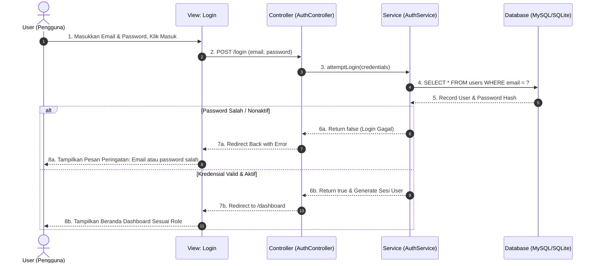
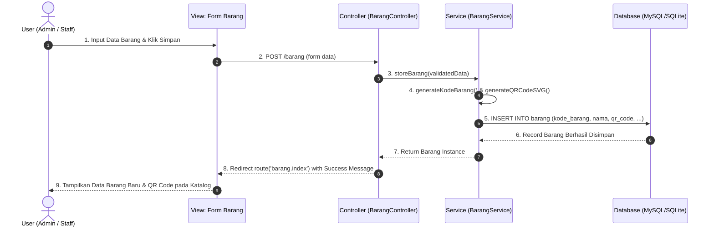
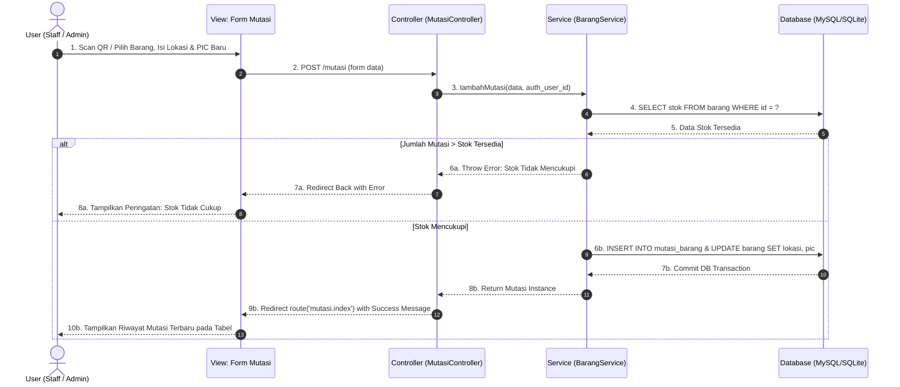
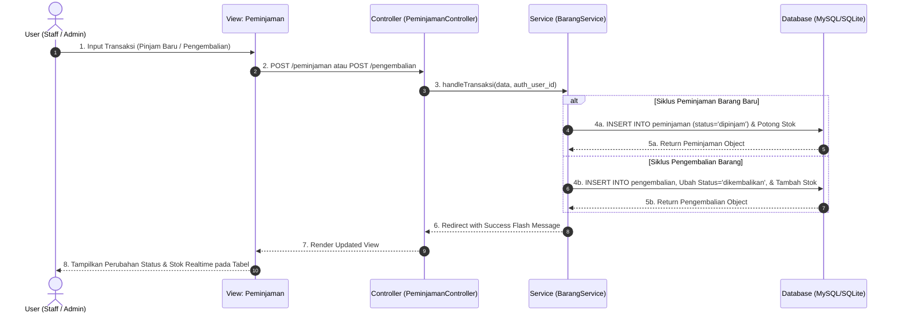
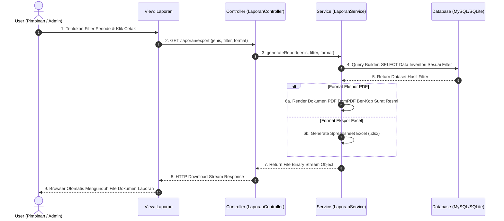

# DOKUMENTASI LENGKAP 5 SEQUENCE DIAGRAM
## SISTEM INFORMASI INVENTORI & ASET PT YINTONG
(Format Standar: Tepat 5 Batas / Partisipan per Diagram, Bersih Tanpa Ikon)

Setiap Sequence Diagram memiliki **5 Partisipan / Lifeline**:
1. **User (Pengguna / Aktor)**
2. **View (Antarmuka UI Blade)**
3. **Controller (HTTP Request Handler)**
4. **Service (Lapisan Logika Bisnis)**
5. **Database (Model ORM & Basis Data)**

---

# 1. SEQUENCE DIAGRAM: LOGIN & AUTENTIKASI PENGGUNA

### 📋 Kode XML Draw.io:
```xml
<mxGraphModel dx="1200" dy="800" grid="1" gridSize="10" guides="1" tooltips="1" connect="1" arrows="1" fold="1" page="1" pageScale="1" pageWidth="1169" pageHeight="827" math="0" shadow="0">
  <root>
    <mxCell id="0" />
    <mxCell id="1" parent="0" />
    <mxCell id="frame_seq1" value="Sequence Diagram: Login &amp; Autentikasi Pengguna" style="shape=umlFrame;whiteSpace=wrap;html=1;pointerEvents=0;width=240;height=40;fontStyle=1;fontSize=13;" vertex="1" parent="1">
      <mxGeometry x="60" y="40" width="860" height="660" as="geometry" />
    </mxCell>
    <!-- 5 PARTICIPANTS -->
    <mxCell id="p1_user" value="User&#xa;(Pengguna)" style="shape=umlLifeline;participant=umlActor;perimeter=lifelinePerimeter;whiteSpace=wrap;html=1;container=1;collapsible=0;recursiveResize=0;verticalAlign=top;spacingTop=36;outlineConnect=0;" vertex="1" parent="1">
      <mxGeometry x="100" y="100" width="60" height="560" as="geometry" />
    </mxCell>
    <mxCell id="p1_view" value="View: Login&#xa;(auth/login.blade.php)" style="shape=umlLifeline;perimeter=lifelinePerimeter;whiteSpace=wrap;html=1;container=1;collapsible=0;recursiveResize=0;verticalAlign=top;spacingTop=10;" vertex="1" parent="1">
      <mxGeometry x="250" y="100" width="130" height="560" as="geometry" />
    </mxCell>
    <mxCell id="p1_ctrl" value="Controller&#xa;(AuthController)" style="shape=umlLifeline;perimeter=lifelinePerimeter;whiteSpace=wrap;html=1;container=1;collapsible=0;recursiveResize=0;verticalAlign=top;spacingTop=10;" vertex="1" parent="1">
      <mxGeometry x="450" y="100" width="120" height="560" as="geometry" />
    </mxCell>
    <mxCell id="p1_svc" value="Service&#xa;(AuthService)" style="shape=umlLifeline;perimeter=lifelinePerimeter;whiteSpace=wrap;html=1;container=1;collapsible=0;recursiveResize=0;verticalAlign=top;spacingTop=10;" vertex="1" parent="1">
      <mxGeometry x="630" y="100" width="120" height="560" as="geometry" />
    </mxCell>
    <mxCell id="p1_db" value="Database&#xa;(MySQL / SQLite)" style="shape=umlLifeline;perimeter=lifelinePerimeter;whiteSpace=wrap;html=1;container=1;collapsible=0;recursiveResize=0;verticalAlign=top;spacingTop=10;" vertex="1" parent="1">
      <mxGeometry x="800" y="100" width="110" height="560" as="geometry" />
    </mxCell>
    <!-- MESSAGES -->
    <mxCell id="m1_1" value="1. Input Email &amp; Password, Klik Masuk" style="html=1;verticalAlign=bottom;endArrow=block;rounded=0;" edge="1" parent="1" source="p1_user" target="p1_view">
      <mxGeometry relative="1" as="geometry"><mxPoint y="200" as="offset" /><Array as="points"><mxPoint x="200" y="190" /></Array></mxGeometry>
    </mxCell>
    <mxCell id="m1_2" value="2. POST /login (email, password)" style="html=1;verticalAlign=bottom;endArrow=block;rounded=0;" edge="1" parent="1" source="p1_view" target="p1_ctrl">
      <mxGeometry relative="1" as="geometry"><Array as="points"><mxPoint x="400" y="220" /></Array></mxGeometry>
    </mxCell>
    <mxCell id="m1_3" value="3. attemptLogin(credentials)" style="html=1;verticalAlign=bottom;endArrow=block;rounded=0;" edge="1" parent="1" source="p1_ctrl" target="p1_svc">
      <mxGeometry relative="1" as="geometry"><Array as="points"><mxPoint x="580" y="250" /></Array></mxGeometry>
    </mxCell>
    <mxCell id="m1_4" value="4. SELECT * FROM users WHERE email = ?" style="html=1;verticalAlign=bottom;endArrow=block;rounded=0;" edge="1" parent="1" source="p1_svc" target="p1_db">
      <mxGeometry relative="1" as="geometry"><Array as="points"><mxPoint x="750" y="280" /></Array></mxGeometry>
    </mxCell>
    <mxCell id="m1_5" value="5. Data User &amp; Hash Password" style="html=1;verticalAlign=bottom;endArrow=open;dashed=1;endSize=8;rounded=0;" edge="1" parent="1" source="p1_db" target="p1_svc">
      <mxGeometry relative="1" as="geometry"><Array as="points"><mxPoint x="750" y="320" /></Array></mxGeometry>
    </mxCell>
    <!-- ALT BOX -->
    <mxCell id="alt_box1" value="alt&#xa;[Password Salah / Nonaktif]&#xa;&#xa;&#xa;&#xa;&#xa;[Kredensial Valid &amp; Aktif]" style="shape=umlFrame;whiteSpace=wrap;html=1;width=160;height=25;fillColor=none;strokeColor=#475569;" vertex="1" parent="1">
      <mxGeometry x="80" y="350" width="820" height="270" as="geometry" />
    </mxCell>
    <mxCell id="m1_6a" value="6a. Return false (Login Gagal)" style="html=1;verticalAlign=bottom;endArrow=open;dashed=1;endSize=8;rounded=0;" edge="1" parent="1" source="p1_svc" target="p1_ctrl">
      <mxGeometry relative="1" as="geometry"><Array as="points"><mxPoint x="580" y="390" /></Array></mxGeometry>
    </mxCell>
    <mxCell id="m1_7a" value="7a. Redirect Back with Error Message" style="html=1;verticalAlign=bottom;endArrow=open;dashed=1;endSize=8;rounded=0;" edge="1" parent="1" source="p1_ctrl" target="p1_view">
      <mxGeometry relative="1" as="geometry"><Array as="points"><mxPoint x="400" y="420" /></Array></mxGeometry>
    </mxCell>
    <mxCell id="m1_8a" value="8a. Tampilkan Peringatan: Email/Password Salah" style="html=1;verticalAlign=bottom;endArrow=open;dashed=1;endSize=8;rounded=0;" edge="1" parent="1" source="p1_view" target="p1_user">
      <mxGeometry relative="1" as="geometry"><Array as="points"><mxPoint x="200" y="440" /></Array></mxGeometry>
    </mxCell>
    <mxCell id="m1_6b" value="6b. Return true &amp; Generate Sesi User" style="html=1;verticalAlign=bottom;endArrow=open;dashed=1;endSize=8;rounded=0;" edge="1" parent="1" source="p1_svc" target="p1_ctrl">
      <mxGeometry relative="1" as="geometry"><Array as="points"><mxPoint x="580" y="520" /></Array></mxGeometry>
    </mxCell>
    <mxCell id="m1_7b" value="7b. Redirect to /dashboard" style="html=1;verticalAlign=bottom;endArrow=block;rounded=0;" edge="1" parent="1" source="p1_ctrl" target="p1_view">
      <mxGeometry relative="1" as="geometry"><Array as="points"><mxPoint x="400" y="560" /></Array></mxGeometry>
    </mxCell>
    <mxCell id="m1_8b" value="8b. Tampilkan Beranda Dashboard Sesuai Role" style="html=1;verticalAlign=bottom;endArrow=open;dashed=1;endSize=8;rounded=0;" edge="1" parent="1" source="p1_view" target="p1_user">
      <mxGeometry relative="1" as="geometry"><Array as="points"><mxPoint x="200" y="590" /></Array></mxGeometry>
    </mxCell>
  </root>
</mxGraphModel>
```

### 📊 Diagram Tampilan Mermaid:


---

# 2. SEQUENCE DIAGRAM: PENDAFTARAN MASTER BARANG BARU & QR CODE

### 📋 Kode XML Draw.io:
```xml
<mxGraphModel dx="1200" dy="800" grid="1" gridSize="10" guides="1" tooltips="1" connect="1" arrows="1" fold="1" page="1" pageScale="1" pageWidth="1169" pageHeight="827" math="0" shadow="0">
  <root>
    <mxCell id="0" />
    <mxCell id="1" parent="0" />
    <mxCell id="frame_seq2" value="Sequence Diagram: Pendaftaran Master Barang Baru" style="shape=umlFrame;whiteSpace=wrap;html=1;pointerEvents=0;width=250;height=40;fontStyle=1;fontSize=13;" vertex="1" parent="1">
      <mxGeometry x="60" y="40" width="860" height="660" as="geometry" />
    </mxCell>
    <!-- 5 PARTICIPANTS -->
    <mxCell id="p2_user" value="User&#xa;(Admin / Staff)" style="shape=umlLifeline;participant=umlActor;perimeter=lifelinePerimeter;whiteSpace=wrap;html=1;container=1;collapsible=0;recursiveResize=0;verticalAlign=top;spacingTop=36;outlineConnect=0;" vertex="1" parent="1">
      <mxGeometry x="100" y="100" width="60" height="560" as="geometry" />
    </mxCell>
    <mxCell id="p2_view" value="View: Form Barang&#xa;(barang/create.blade.php)" style="shape=umlLifeline;perimeter=lifelinePerimeter;whiteSpace=wrap;html=1;container=1;collapsible=0;recursiveResize=0;verticalAlign=top;spacingTop=10;" vertex="1" parent="1">
      <mxGeometry x="240" y="100" width="150" height="560" as="geometry" />
    </mxCell>
    <mxCell id="p2_ctrl" value="Controller&#xa;(BarangController)" style="shape=umlLifeline;perimeter=lifelinePerimeter;whiteSpace=wrap;html=1;container=1;collapsible=0;recursiveResize=0;verticalAlign=top;spacingTop=10;" vertex="1" parent="1">
      <mxGeometry x="450" y="100" width="130" height="560" as="geometry" />
    </mxCell>
    <mxCell id="p2_svc" value="Service&#xa;(BarangService)" style="shape=umlLifeline;perimeter=lifelinePerimeter;whiteSpace=wrap;html=1;container=1;collapsible=0;recursiveResize=0;verticalAlign=top;spacingTop=10;" vertex="1" parent="1">
      <mxGeometry x="630" y="100" width="130" height="560" as="geometry" />
    </mxCell>
    <mxCell id="p2_db" value="Database&#xa;(MySQL / SQLite)" style="shape=umlLifeline;perimeter=lifelinePerimeter;whiteSpace=wrap;html=1;container=1;collapsible=0;recursiveResize=0;verticalAlign=top;spacingTop=10;" vertex="1" parent="1">
      <mxGeometry x="800" y="100" width="110" height="560" as="geometry" />
    </mxCell>
    <!-- MESSAGES -->
    <mxCell id="m2_1" value="1. Input Data Barang &amp; Klik Simpan" style="html=1;verticalAlign=bottom;endArrow=block;rounded=0;" edge="1" parent="1" source="p2_user" target="p2_view">
      <mxGeometry relative="1" as="geometry"><Array as="points"><mxPoint x="200" y="190" /></Array></mxGeometry>
    </mxCell>
    <mxCell id="m2_2" value="2. POST /barang (form data)" style="html=1;verticalAlign=bottom;endArrow=block;rounded=0;" edge="1" parent="1" source="p2_view" target="p2_ctrl">
      <mxGeometry relative="1" as="geometry"><Array as="points"><mxPoint x="400" y="220" /></Array></mxGeometry>
    </mxCell>
    <mxCell id="m2_3" value="3. storeBarang(validatedData)" style="html=1;verticalAlign=bottom;endArrow=block;rounded=0;" edge="1" parent="1" source="p2_ctrl" target="p2_svc">
      <mxGeometry relative="1" as="geometry"><Array as="points"><mxPoint x="580" y="250" /></Array></mxGeometry>
    </mxCell>
    <mxCell id="m2_4" value="4. generateKodeBarang() &amp; generateQR()" style="html=1;verticalAlign=bottom;endArrow=block;rounded=0;" edge="1" parent="1" source="p2_svc" target="p2_svc">
      <mxGeometry relative="1" as="geometry"><Array as="points"><mxPoint x="720" y="280" /><mxPoint x="720" y="310" /><mxPoint x="695" y="310" /></Array></mxGeometry>
    </mxCell>
    <mxCell id="m2_5" value="5. INSERT INTO barang (kode, nama, qr_code, ...)" style="html=1;verticalAlign=bottom;endArrow=block;rounded=0;" edge="1" parent="1" source="p2_svc" target="p2_db">
      <mxGeometry relative="1" as="geometry"><Array as="points"><mxPoint x="750" y="340" /></Array></mxGeometry>
    </mxCell>
    <mxCell id="m2_6" value="6. Record Barang Berhasil Disimpan" style="html=1;verticalAlign=bottom;endArrow=open;dashed=1;endSize=8;rounded=0;" edge="1" parent="1" source="p2_db" target="p2_svc">
      <mxGeometry relative="1" as="geometry"><Array as="points"><mxPoint x="750" y="390" /></Array></mxGeometry>
    </mxCell>
    <mxCell id="m2_7" value="7. Return Barang Instance" style="html=1;verticalAlign=bottom;endArrow=open;dashed=1;endSize=8;rounded=0;" edge="1" parent="1" source="p2_svc" target="p2_ctrl">
      <mxGeometry relative="1" as="geometry"><Array as="points"><mxPoint x="580" y="440" /></Array></mxGeometry>
    </mxCell>
    <mxCell id="m2_8" value="8. Redirect route('barang.index') with Success" style="html=1;verticalAlign=bottom;endArrow=block;rounded=0;" edge="1" parent="1" source="p2_ctrl" target="p2_view">
      <mxGeometry relative="1" as="geometry"><Array as="points"><mxPoint x="400" y="490" /></Array></mxGeometry>
    </mxCell>
    <mxCell id="m2_9" value="9. Tampilkan Barang Baru &amp; QR Code pada Katalog" style="html=1;verticalAlign=bottom;endArrow=open;dashed=1;endSize=8;rounded=0;" edge="1" parent="1" source="p2_view" target="p2_user">
      <mxGeometry relative="1" as="geometry"><Array as="points"><mxPoint x="200" y="540" /></Array></mxGeometry>
    </mxCell>
  </root>
</mxGraphModel>
```

### 📊 Diagram Tampilan Mermaid:


---

# 3. SEQUENCE DIAGRAM: MUTASI LOKASI & PIC BARANG (SCAN QR / AUTO-FILL)

### 📋 Kode XML Draw.io:
```xml
<mxGraphModel dx="1200" dy="800" grid="1" gridSize="10" guides="1" tooltips="1" connect="1" arrows="1" fold="1" page="1" pageScale="1" pageWidth="1169" pageHeight="827" math="0" shadow="0">
  <root>
    <mxCell id="0" />
    <mxCell id="1" parent="0" />
    <mxCell id="frame_seq3" value="Sequence Diagram: Mutasi Lokasi &amp; PIC Barang" style="shape=umlFrame;whiteSpace=wrap;html=1;pointerEvents=0;width=240;height=40;fontStyle=1;fontSize=13;" vertex="1" parent="1">
      <mxGeometry x="60" y="40" width="860" height="660" as="geometry" />
    </mxCell>
    <!-- 5 PARTICIPANTS -->
    <mxCell id="p3_user" value="User&#xa;(Staff / Admin)" style="shape=umlLifeline;participant=umlActor;perimeter=lifelinePerimeter;whiteSpace=wrap;html=1;container=1;collapsible=0;recursiveResize=0;verticalAlign=top;spacingTop=36;outlineConnect=0;" vertex="1" parent="1">
      <mxGeometry x="100" y="100" width="60" height="560" as="geometry" />
    </mxCell>
    <mxCell id="p3_view" value="View: Form Mutasi&#xa;(mutasi/create.blade.php)" style="shape=umlLifeline;perimeter=lifelinePerimeter;whiteSpace=wrap;html=1;container=1;collapsible=0;recursiveResize=0;verticalAlign=top;spacingTop=10;" vertex="1" parent="1">
      <mxGeometry x="240" y="100" width="150" height="560" as="geometry" />
    </mxCell>
    <mxCell id="p3_ctrl" value="Controller&#xa;(MutasiController)" style="shape=umlLifeline;perimeter=lifelinePerimeter;whiteSpace=wrap;html=1;container=1;collapsible=0;recursiveResize=0;verticalAlign=top;spacingTop=10;" vertex="1" parent="1">
      <mxGeometry x="450" y="100" width="130" height="560" as="geometry" />
    </mxCell>
    <mxCell id="p3_svc" value="Service&#xa;(BarangService)" style="shape=umlLifeline;perimeter=lifelinePerimeter;whiteSpace=wrap;html=1;container=1;collapsible=0;recursiveResize=0;verticalAlign=top;spacingTop=10;" vertex="1" parent="1">
      <mxGeometry x="630" y="100" width="130" height="560" as="geometry" />
    </mxCell>
    <mxCell id="p3_db" value="Database&#xa;(MySQL / SQLite)" style="shape=umlLifeline;perimeter=lifelinePerimeter;whiteSpace=wrap;html=1;container=1;collapsible=0;recursiveResize=0;verticalAlign=top;spacingTop=10;" vertex="1" parent="1">
      <mxGeometry x="800" y="100" width="110" height="560" as="geometry" />
    </mxCell>
    <!-- MESSAGES -->
    <mxCell id="m3_1" value="1. Scan QR / Pilih Barang, Isi Lokasi &amp; PIC Baru" style="html=1;verticalAlign=bottom;endArrow=block;rounded=0;" edge="1" parent="1" source="p3_user" target="p3_view">
      <mxGeometry relative="1" as="geometry"><Array as="points"><mxPoint x="200" y="190" /></Array></mxGeometry>
    </mxCell>
    <mxCell id="m3_2" value="2. POST /mutasi (barang_id, jumlah, lokasi_tujuan, pic)" style="html=1;verticalAlign=bottom;endArrow=block;rounded=0;" edge="1" parent="1" source="p3_view" target="p3_ctrl">
      <mxGeometry relative="1" as="geometry"><Array as="points"><mxPoint x="400" y="220" /></Array></mxGeometry>
    </mxCell>
    <mxCell id="m3_3" value="3. tambahMutasi(data, auth_user_id)" style="html=1;verticalAlign=bottom;endArrow=block;rounded=0;" edge="1" parent="1" source="p3_ctrl" target="p3_svc">
      <mxGeometry relative="1" as="geometry"><Array as="points"><mxPoint x="580" y="250" /></Array></mxGeometry>
    </mxCell>
    <mxCell id="m3_4" value="4. SELECT stok FROM barang WHERE id = ?" style="html=1;verticalAlign=bottom;endArrow=block;rounded=0;" edge="1" parent="1" source="p3_svc" target="p3_db">
      <mxGeometry relative="1" as="geometry"><Array as="points"><mxPoint x="750" y="280" /></Array></mxGeometry>
    </mxCell>
    <mxCell id="m3_5" value="5. Data Stok Tersedia" style="html=1;verticalAlign=bottom;endArrow=open;dashed=1;endSize=8;rounded=0;" edge="1" parent="1" source="p3_db" target="p3_svc">
      <mxGeometry relative="1" as="geometry"><Array as="points"><mxPoint x="750" y="310" /></Array></mxGeometry>
    </mxCell>
    <!-- ALT BOX -->
    <mxCell id="alt_box3" value="alt&#xa;[Jumlah Mutasi &gt; Stok]&#xa;&#xa;&#xa;&#xa;[Stok Mencukupi]" style="shape=umlFrame;whiteSpace=wrap;html=1;width=160;height=25;fillColor=none;strokeColor=#475569;" vertex="1" parent="1">
      <mxGeometry x="80" y="340" width="820" height="280" as="geometry" />
    </mxCell>
    <mxCell id="m3_6a" value="6a. Throw Error: Stok Tidak Mencukupi" style="html=1;verticalAlign=bottom;endArrow=open;dashed=1;endSize=8;rounded=0;" edge="1" parent="1" source="p3_svc" target="p3_ctrl">
      <mxGeometry relative="1" as="geometry"><Array as="points"><mxPoint x="580" y="380" /></Array></mxGeometry>
    </mxCell>
    <mxCell id="m3_7a" value="7a. Redirect Back with Error" style="html=1;verticalAlign=bottom;endArrow=open;dashed=1;endSize=8;rounded=0;" edge="1" parent="1" source="p3_ctrl" target="p3_view">
      <mxGeometry relative="1" as="geometry"><Array as="points"><mxPoint x="400" y="410" /></Array></mxGeometry>
    </mxCell>
    <mxCell id="m3_8a" value="8a. Tampilkan Peringatan: Stok Tidak Cukup" style="html=1;verticalAlign=bottom;endArrow=open;dashed=1;endSize=8;rounded=0;" edge="1" parent="1" source="p3_view" target="p3_user">
      <mxGeometry relative="1" as="geometry"><Array as="points"><mxPoint x="200" y="430" /></Array></mxGeometry>
    </mxCell>
    <mxCell id="m3_6b" value="6b. INSERT INTO mutasi_barang &amp; UPDATE barang SET lokasi, pic" style="html=1;verticalAlign=bottom;endArrow=block;rounded=0;" edge="1" parent="1" source="p3_svc" target="p3_db">
      <mxGeometry relative="1" as="geometry"><Array as="points"><mxPoint x="750" y="490" /></Array></mxGeometry>
    </mxCell>
    <mxCell id="m3_7b" value="7b. Return Mutasi Instance" style="html=1;verticalAlign=bottom;endArrow=open;dashed=1;endSize=8;rounded=0;" edge="1" parent="1" source="p3_svc" target="p3_ctrl">
      <mxGeometry relative="1" as="geometry"><Array as="points"><mxPoint x="580" y="530" /></Array></mxGeometry>
    </mxCell>
    <mxCell id="m3_8b" value="8b. Redirect route('mutasi.index') with Success" style="html=1;verticalAlign=bottom;endArrow=block;rounded=0;" edge="1" parent="1" source="p3_ctrl" target="p3_view">
      <mxGeometry relative="1" as="geometry"><Array as="points"><mxPoint x="400" y="560" /></Array></mxGeometry>
    </mxCell>
    <mxCell id="m3_9b" value="9b. Tampilkan Riwayat Mutasi Terbaru" style="html=1;verticalAlign=bottom;endArrow=open;dashed=1;endSize=8;rounded=0;" edge="1" parent="1" source="p3_view" target="p3_user">
      <mxGeometry relative="1" as="geometry"><Array as="points"><mxPoint x="200" y="590" /></Array></mxGeometry>
    </mxCell>
  </root>
</mxGraphModel>
```

### 📊 Diagram Tampilan Mermaid:


---

# 4. SEQUENCE DIAGRAM: PEMINJAMAN & PENGEMBALIAN BARANG INVENTARIS

### 📋 Kode XML Draw.io:
```xml
<mxGraphModel dx="1200" dy="800" grid="1" gridSize="10" guides="1" tooltips="1" connect="1" arrows="1" fold="1" page="1" pageScale="1" pageWidth="1169" pageHeight="827" math="0" shadow="0">
  <root>
    <mxCell id="0" />
    <mxCell id="1" parent="0" />
    <mxCell id="frame_seq4" value="Sequence Diagram: Peminjaman &amp; Pengembalian Barang" style="shape=umlFrame;whiteSpace=wrap;html=1;pointerEvents=0;width=260;height=40;fontStyle=1;fontSize=13;" vertex="1" parent="1">
      <mxGeometry x="60" y="40" width="860" height="660" as="geometry" />
    </mxCell>
    <!-- 5 PARTICIPANTS -->
    <mxCell id="p4_user" value="User&#xa;(Staff / Admin)" style="shape=umlLifeline;participant=umlActor;perimeter=lifelinePerimeter;whiteSpace=wrap;html=1;container=1;collapsible=0;recursiveResize=0;verticalAlign=top;spacingTop=36;outlineConnect=0;" vertex="1" parent="1">
      <mxGeometry x="100" y="100" width="60" height="560" as="geometry" />
    </mxCell>
    <mxCell id="p4_view" value="View: Peminjaman&#xa;(peminjaman/index.blade.php)" style="shape=umlLifeline;perimeter=lifelinePerimeter;whiteSpace=wrap;html=1;container=1;collapsible=0;recursiveResize=0;verticalAlign=top;spacingTop=10;" vertex="1" parent="1">
      <mxGeometry x="240" y="100" width="160" height="560" as="geometry" />
    </mxCell>
    <mxCell id="p4_ctrl" value="Controller&#xa;(PeminjamanController)" style="shape=umlLifeline;perimeter=lifelinePerimeter;whiteSpace=wrap;html=1;container=1;collapsible=0;recursiveResize=0;verticalAlign=top;spacingTop=10;" vertex="1" parent="1">
      <mxGeometry x="450" y="100" width="140" height="560" as="geometry" />
    </mxCell>
    <mxCell id="p4_svc" value="Service&#xa;(BarangService)" style="shape=umlLifeline;perimeter=lifelinePerimeter;whiteSpace=wrap;html=1;container=1;collapsible=0;recursiveResize=0;verticalAlign=top;spacingTop=10;" vertex="1" parent="1">
      <mxGeometry x="630" y="100" width="130" height="560" as="geometry" />
    </mxCell>
    <mxCell id="p4_db" value="Database&#xa;(MySQL / SQLite)" style="shape=umlLifeline;perimeter=lifelinePerimeter;whiteSpace=wrap;html=1;container=1;collapsible=0;recursiveResize=0;verticalAlign=top;spacingTop=10;" vertex="1" parent="1">
      <mxGeometry x="800" y="100" width="110" height="560" as="geometry" />
    </mxCell>
    <!-- MESSAGES -->
    <mxCell id="m4_1" value="1. Input Transaksi (Pinjam Baru / Pengembalian)" style="html=1;verticalAlign=bottom;endArrow=block;rounded=0;" edge="1" parent="1" source="p4_user" target="p4_view">
      <mxGeometry relative="1" as="geometry"><Array as="points"><mxPoint x="200" y="190" /></Array></mxGeometry>
    </mxCell>
    <mxCell id="m4_2" value="2. POST /peminjaman atau POST /pengembalian" style="html=1;verticalAlign=bottom;endArrow=block;rounded=0;" edge="1" parent="1" source="p4_view" target="p4_ctrl">
      <mxGeometry relative="1" as="geometry"><Array as="points"><mxPoint x="400" y="220" /></Array></mxGeometry>
    </mxCell>
    <mxCell id="m4_3" value="3. handleTransaksi(data, auth_user_id)" style="html=1;verticalAlign=bottom;endArrow=block;rounded=0;" edge="1" parent="1" source="p4_ctrl" target="p4_svc">
      <mxGeometry relative="1" as="geometry"><Array as="points"><mxPoint x="580" y="250" /></Array></mxGeometry>
    </mxCell>
    <!-- ALT BOX -->
    <mxCell id="alt_box4" value="alt&#xa;[Proses Peminjaman Baru]&#xa;&#xa;&#xa;&#xa;[Proses Pengembalian Barang]" style="shape=umlFrame;whiteSpace=wrap;html=1;width=180;height=25;fillColor=none;strokeColor=#475569;" vertex="1" parent="1">
      <mxGeometry x="80" y="280" width="820" height="300" as="geometry" />
    </mxCell>
    <mxCell id="m4_4a" value="4a. INSERT INTO peminjaman &amp; UPDATE barang SET stok = stok - jml" style="html=1;verticalAlign=bottom;endArrow=block;rounded=0;" edge="1" parent="1" source="p4_svc" target="p4_db">
      <mxGeometry relative="1" as="geometry"><Array as="points"><mxPoint x="750" y="340" /></Array></mxGeometry>
    </mxCell>
    <mxCell id="m4_5a" value="5a. Return Peminjaman Object (Status: Dipinjam)" style="html=1;verticalAlign=bottom;endArrow=open;dashed=1;endSize=8;rounded=0;" edge="1" parent="1" source="p4_db" target="p4_svc">
      <mxGeometry relative="1" as="geometry"><Array as="points"><mxPoint x="750" y="380" /></Array></mxGeometry>
    </mxCell>
    <mxCell id="m4_4b" value="4b. INSERT INTO pengembalian &amp; UPDATE barang SET stok = stok + jml" style="html=1;verticalAlign=bottom;endArrow=block;rounded=0;" edge="1" parent="1" source="p4_svc" target="p4_db">
      <mxGeometry relative="1" as="geometry"><Array as="points"><mxPoint x="750" y="470" /></Array></mxGeometry>
    </mxCell>
    <mxCell id="m4_5b" value="5b. Return Pengembalian Object (Status: Dikembalikan)" style="html=1;verticalAlign=bottom;endArrow=open;dashed=1;endSize=8;rounded=0;" edge="1" parent="1" source="p4_db" target="p4_svc">
      <mxGeometry relative="1" as="geometry"><Array as="points"><mxPoint x="750" y="510" /></Array></mxGeometry>
    </mxCell>
    <mxCell id="m4_6" value="6. Redirect with Success Message" style="html=1;verticalAlign=bottom;endArrow=block;rounded=0;" edge="1" parent="1" source="p4_svc" target="p4_ctrl">
      <mxGeometry relative="1" as="geometry"><Array as="points"><mxPoint x="580" y="600" /></Array></mxGeometry>
    </mxCell>
    <mxCell id="m4_7" value="7. Refresh View Status Transaksi &amp; Stok Barang" style="html=1;verticalAlign=bottom;endArrow=open;dashed=1;endSize=8;rounded=0;" edge="1" parent="1" source="p4_ctrl" target="p4_user">
      <mxGeometry relative="1" as="geometry"><Array as="points"><mxPoint x="300" y="620" /></Array></mxGeometry>
    </mxCell>
  </root>
</mxGraphModel>
```

### 📊 Diagram Tampilan Mermaid:


---

# 5. SEQUENCE DIAGRAM: MONITORING STOK & CETAK LAPORAN (PDF & EXCEL)

### 📋 Kode XML Draw.io:
```xml
<mxGraphModel dx="1200" dy="800" grid="1" gridSize="10" guides="1" tooltips="1" connect="1" arrows="1" fold="1" page="1" pageScale="1" pageWidth="1169" pageHeight="827" math="0" shadow="0">
  <root>
    <mxCell id="0" />
    <mxCell id="1" parent="0" />
    <mxCell id="frame_seq5" value="Sequence Diagram: Monitoring Stok &amp; Cetak Laporan" style="shape=umlFrame;whiteSpace=wrap;html=1;pointerEvents=0;width=250;height=40;fontStyle=1;fontSize=13;" vertex="1" parent="1">
      <mxGeometry x="60" y="40" width="860" height="660" as="geometry" />
    </mxCell>
    <!-- 5 PARTICIPANTS -->
    <mxCell id="p5_user" value="User&#xa;(Pimpinan / Admin)" style="shape=umlLifeline;participant=umlActor;perimeter=lifelinePerimeter;whiteSpace=wrap;html=1;container=1;collapsible=0;recursiveResize=0;verticalAlign=top;spacingTop=36;outlineConnect=0;" vertex="1" parent="1">
      <mxGeometry x="100" y="100" width="60" height="560" as="geometry" />
    </mxCell>
    <mxCell id="p5_view" value="View: Laporan&#xa;(laporan/index.blade.php)" style="shape=umlLifeline;perimeter=lifelinePerimeter;whiteSpace=wrap;html=1;container=1;collapsible=0;recursiveResize=0;verticalAlign=top;spacingTop=10;" vertex="1" parent="1">
      <mxGeometry x="240" y="100" width="150" height="560" as="geometry" />
    </mxCell>
    <mxCell id="p5_ctrl" value="Controller&#xa;(LaporanController)" style="shape=umlLifeline;perimeter=lifelinePerimeter;whiteSpace=wrap;html=1;container=1;collapsible=0;recursiveResize=0;verticalAlign=top;spacingTop=10;" vertex="1" parent="1">
      <mxGeometry x="450" y="100" width="130" height="560" as="geometry" />
    </mxCell>
    <mxCell id="p5_svc" value="Service&#xa;(LaporanService)" style="shape=umlLifeline;perimeter=lifelinePerimeter;whiteSpace=wrap;html=1;container=1;collapsible=0;recursiveResize=0;verticalAlign=top;spacingTop=10;" vertex="1" parent="1">
      <mxGeometry x="630" y="100" width="130" height="560" as="geometry" />
    </mxCell>
    <mxCell id="p5_db" value="Database&#xa;(MySQL / SQLite)" style="shape=umlLifeline;perimeter=lifelinePerimeter;whiteSpace=wrap;html=1;container=1;collapsible=0;recursiveResize=0;verticalAlign=top;spacingTop=10;" vertex="1" parent="1">
      <mxGeometry x="800" y="100" width="110" height="560" as="geometry" />
    </mxCell>
    <!-- MESSAGES -->
    <mxCell id="m5_1" value="1. Tentukan Filter &amp; Klik Cetak PDF / Excel" style="html=1;verticalAlign=bottom;endArrow=block;rounded=0;" edge="1" parent="1" source="p5_user" target="p5_view">
      <mxGeometry relative="1" as="geometry"><Array as="points"><mxPoint x="200" y="190" /></Array></mxGeometry>
    </mxCell>
    <mxCell id="m5_2" value="2. GET /laporan/export (jenis, filter, format)" style="html=1;verticalAlign=bottom;endArrow=block;rounded=0;" edge="1" parent="1" source="p5_view" target="p5_ctrl">
      <mxGeometry relative="1" as="geometry"><Array as="points"><mxPoint x="400" y="220" /></Array></mxGeometry>
    </mxCell>
    <mxCell id="m5_3" value="3. generateReport(jenis, filter, format)" style="html=1;verticalAlign=bottom;endArrow=block;rounded=0;" edge="1" parent="1" source="p5_ctrl" target="p5_svc">
      <mxGeometry relative="1" as="geometry"><Array as="points"><mxPoint x="580" y="250" /></Array></mxGeometry>
    </mxCell>
    <mxCell id="m5_4" value="4. Query Builder: SELECT Data Inventori Sesuai Filter" style="html=1;verticalAlign=bottom;endArrow=block;rounded=0;" edge="1" parent="1" source="p5_svc" target="p5_db">
      <mxGeometry relative="1" as="geometry"><Array as="points"><mxPoint x="750" y="280" /></Array></mxGeometry>
    </mxCell>
    <mxCell id="m5_5" value="5. Return Dataset Hasil Filter" style="html=1;verticalAlign=bottom;endArrow=open;dashed=1;endSize=8;rounded=0;" edge="1" parent="1" source="p5_db" target="p5_svc">
      <mxGeometry relative="1" as="geometry"><Array as="points"><mxPoint x="750" y="320" /></Array></mxGeometry>
    </mxCell>
    <!-- ALT BOX -->
    <mxCell id="alt_box5" value="alt&#xa;[Format Ekspor PDF]&#xa;&#xa;&#xa;[Format Ekspor Excel]" style="shape=umlFrame;whiteSpace=wrap;html=1;width=160;height=25;fillColor=none;strokeColor=#475569;" vertex="1" parent="1">
      <mxGeometry x="80" y="350" width="820" height="190" as="geometry" />
    </mxCell>
    <mxCell id="m5_6a" value="6a. Render PDF DomPDF Ber-Kop Surat Resmi" style="html=1;verticalAlign=bottom;endArrow=block;rounded=0;" edge="1" parent="1" source="p5_svc" target="p5_svc">
      <mxGeometry relative="1" as="geometry"><Array as="points"><mxPoint x="720" y="380" /><mxPoint x="720" y="410" /><mxPoint x="695" y="410" /></Array></mxGeometry>
    </mxCell>
    <mxCell id="m5_6b" value="6b. Generate Spreadsheet Excel (.xlsx)" style="html=1;verticalAlign=bottom;endArrow=block;rounded=0;" edge="1" parent="1" source="p5_svc" target="p5_svc">
      <mxGeometry relative="1" as="geometry"><Array as="points"><mxPoint x="720" y="470" /><mxPoint x="720" y="500" /><mxPoint x="695" y="500" /></Array></mxGeometry>
    </mxCell>
    <mxCell id="m5_7" value="7. Return File Binary Stream Object" style="html=1;verticalAlign=bottom;endArrow=open;dashed=1;endSize=8;rounded=0;" edge="1" parent="1" source="p5_svc" target="p5_ctrl">
      <mxGeometry relative="1" as="geometry"><Array as="points"><mxPoint x="580" y="560" /></Array></mxGeometry>
    </mxCell>
    <mxCell id="m5_8" value="8. HTTP Download Stream Response" style="html=1;verticalAlign=bottom;endArrow=open;dashed=1;endSize=8;rounded=0;" edge="1" parent="1" source="p5_ctrl" target="p5_view">
      <mxGeometry relative="1" as="geometry"><Array as="points"><mxPoint x="400" y="590" /></Array></mxGeometry>
    </mxCell>
    <mxCell id="m5_9" value="9. Browser Otomatis Mengunduh File Dokumen Laporan" style="html=1;verticalAlign=bottom;endArrow=open;dashed=1;endSize=8;rounded=0;" edge="1" parent="1" source="p5_view" target="p5_user">
      <mxGeometry relative="1" as="geometry"><Array as="points"><mxPoint x="200" y="620" /></Array></mxGeometry>
    </mxCell>
  </root>
</mxGraphModel>
```

### 📊 Diagram Tampilan Mermaid:

