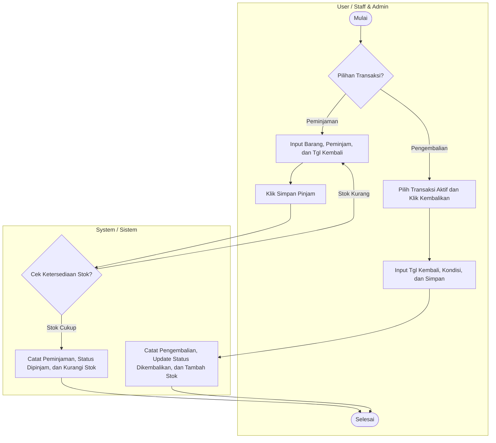
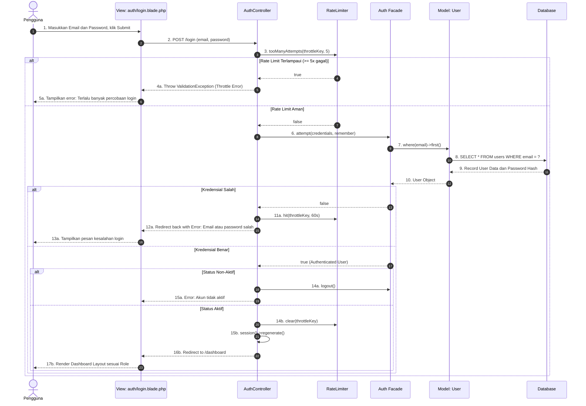
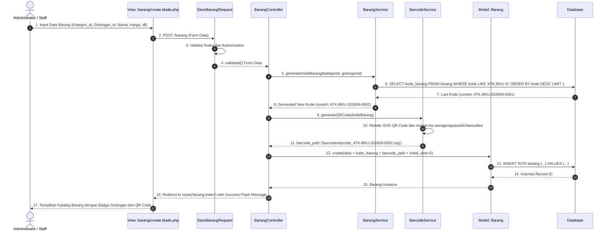
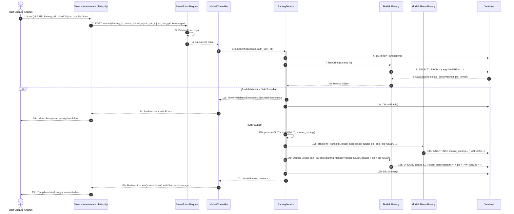
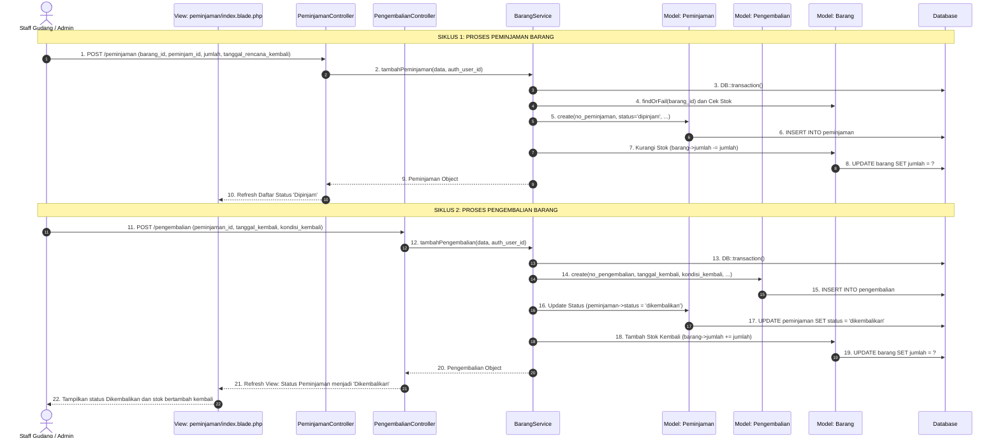
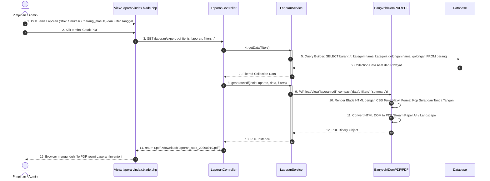

# DOKUMENTASI LENGKAP DIAGRAM UML SISTEM INFORMASI INVENTORI PT YINTONG
(Standard Skripsi & Tugas Akhir - Format Terpisah per Card / Sub-Swimlane Tanpa Ikon)

---

# 1. USE CASE DIAGRAM (DIBAGI PER CARD / GROUP)

## A. Kode XML Draw.io (Bisa langsung di-import di draw.io / diagrams.net)
*(Buka draw.io ➔ Menu **Arrange** ➔ **Insert** ➔ **Advanced** ➔ **XML** ➔ Paste kode berikut)*:

```xml
<mxGraphModel dx="1600" dy="1000" grid="1" gridSize="10" guides="1" tooltips="1" connect="1" arrows="1" fold="1" page="1" pageScale="1" pageWidth="1654" pageHeight="2336" math="0" shadow="0">
  <root>
    <mxCell id="0" />
    <mxCell id="1" parent="0" />

    <!-- 1. BOUNDARY UTAMA SISTEM -->
    <mxCell id="boundary_sistem" value="" style="swimlane;startSize=0;swimlaneFillColor=default;fillColor=#FFFFFF;strokeColor=#1E293B;strokeWidth=2;rounded=1;" vertex="1" parent="1">
      <mxGeometry x="380" y="100" width="860" height="1980" as="geometry" />
    </mxCell>
    <mxCell id="title_sistem" value="Sistem Informasi Inventori PT Yintong" style="text;html=1;strokeColor=none;fillColor=none;align=center;verticalAlign=middle;rounded=0;fontStyle=1;fontFamily=Helvetica;fontSize=16;fontColor=#0F2942;" vertex="1" parent="boundary_sistem">
      <mxGeometry x="250" y="20" width="360" height="30" as="geometry" />
    </mxCell>

    <!-- CARD 1: OTENTIKASI AKUN -->
    <mxCell id="card_auth" value="" style="swimlane;startSize=0;fillColor=#F8FAFC;strokeColor=#94A3B8;strokeWidth=1.5;rounded=1;" vertex="1" parent="1">
      <mxGeometry x="460" y="180" width="700" height="180" as="geometry" />
    </mxCell>
    <mxCell id="title_auth" value="Otentikasi Akun" style="text;html=1;strokeColor=none;fillColor=none;align=center;verticalAlign=middle;fontStyle=1;fontSize=13;fontFamily=Helvetica;fontColor=#0F2942;" vertex="1" parent="1">
      <mxGeometry x="720" y="190" width="180" height="25" as="geometry" />
    </mxCell>
    <mxCell id="uc_login" value="Login" style="ellipse;whiteSpace=wrap;html=1;fillColor=#FFFFFF;strokeColor=#0F2942;strokeWidth=1.5;fontStyle=1;fontSize=12;" vertex="1" parent="1">
      <mxGeometry x="540" y="240" width="150" height="65" as="geometry" />
    </mxCell>
    <mxCell id="uc_logout" value="Logout" style="ellipse;whiteSpace=wrap;html=1;fillColor=#FFFFFF;strokeColor=#0F2942;strokeWidth=1.5;fontStyle=1;fontSize=12;" vertex="1" parent="1">
      <mxGeometry x="930" y="240" width="150" height="65" as="geometry" />
    </mxCell>

    <!-- CARD 2: DATA MASTER & KONFIGURASI -->
    <mxCell id="card_master" value="" style="swimlane;startSize=0;fillColor=#F8FAFC;strokeColor=#94A3B8;strokeWidth=1.5;rounded=1;" vertex="1" parent="1">
      <mxGeometry x="460" y="400" width="700" height="360" as="geometry" />
    </mxCell>
    <mxCell id="title_master" value="Data Master &amp; Konfigurasi" style="text;html=1;strokeColor=none;fillColor=none;align=center;verticalAlign=middle;fontStyle=1;fontSize=13;fontFamily=Helvetica;fontColor=#0F2942;" vertex="1" parent="1">
      <mxGeometry x="700" y="410" width="220" height="25" as="geometry" />
    </mxCell>
    <mxCell id="uc_barang" value="Kelola Data Barang" style="ellipse;whiteSpace=wrap;html=1;fillColor=#FFFFFF;strokeColor=#0F2942;strokeWidth=1.5;fontStyle=1;fontSize=12;" vertex="1" parent="1">
      <mxGeometry x="500" y="460" width="160" height="65" as="geometry" />
    </mxCell>
    <mxCell id="uc_kategori" value="Kelola Kategori Barang" style="ellipse;whiteSpace=wrap;html=1;fillColor=#FFFFFF;strokeColor=#0F2942;strokeWidth=1.5;fontStyle=1;fontSize=12;" vertex="1" parent="1">
      <mxGeometry x="730" y="460" width="160" height="65" as="geometry" />
    </mxCell>
    <mxCell id="uc_golongan" value="Kelola Golongan Barang" style="ellipse;whiteSpace=wrap;html=1;fillColor=#FFFFFF;strokeColor=#0F2942;strokeWidth=1.5;fontStyle=1;fontSize=12;" vertex="1" parent="1">
      <mxGeometry x="950" y="460" width="160" height="65" as="geometry" />
    </mxCell>
    <mxCell id="uc_supplier" value="Kelola Data Supplier" style="ellipse;whiteSpace=wrap;html=1;fillColor=#FFFFFF;strokeColor=#0F2942;strokeWidth=1.5;fontStyle=1;fontSize=12;" vertex="1" parent="1">
      <mxGeometry x="610" y="560" width="160" height="65" as="geometry" />
    </mxCell>
    <mxCell id="uc_stok_min" value="Setting Stok Minimum" style="ellipse;whiteSpace=wrap;html=1;fillColor=#FFFFFF;strokeColor=#0F2942;strokeWidth=1.5;fontStyle=1;fontSize=12;" vertex="1" parent="1">
      <mxGeometry x="850" y="560" width="160" height="65" as="geometry" />
    </mxCell>

    <!-- CARD 3: TRANSAKSI & OPERASIONAL -->
    <mxCell id="card_trx" value="" style="swimlane;startSize=0;fillColor=#F8FAFC;strokeColor=#94A3B8;strokeWidth=1.5;rounded=1;" vertex="1" parent="1">
      <mxGeometry x="460" y="800" width="700" height="490" as="geometry" />
    </mxCell>
    <mxCell id="title_trx" value="Transaksi &amp; Operasional" style="text;html=1;strokeColor=none;fillColor=none;align=center;verticalAlign=middle;fontStyle=1;fontSize=13;fontFamily=Helvetica;fontColor=#0F2942;" vertex="1" parent="1">
      <mxGeometry x="705" y="810" width="210" height="25" as="geometry" />
    </mxCell>
    <mxCell id="uc_in" value="Input Barang Masuk" style="ellipse;whiteSpace=wrap;html=1;fillColor=#FFFFFF;strokeColor=#0F2942;strokeWidth=1.5;fontStyle=1;fontSize=12;" vertex="1" parent="1">
      <mxGeometry x="500" y="860" width="160" height="65" as="geometry" />
    </mxCell>
    <mxCell id="uc_out" value="Input Barang Keluar" style="ellipse;whiteSpace=wrap;html=1;fillColor=#FFFFFF;strokeColor=#0F2942;strokeWidth=1.5;fontStyle=1;fontSize=12;" vertex="1" parent="1">
      <mxGeometry x="500" y="945" width="160" height="65" as="geometry" />
    </mxCell>
    <mxCell id="uc_mutasi" value="Mutasi Lokasi &amp; PIC" style="ellipse;whiteSpace=wrap;html=1;fillColor=#FFFFFF;strokeColor=#0F2942;strokeWidth=1.5;fontStyle=1;fontSize=12;" vertex="1" parent="1">
      <mxGeometry x="500" y="1030" width="160" height="65" as="geometry" />
    </mxCell>
    <mxCell id="uc_scan" value="Scan QR Code / Barcode" style="ellipse;whiteSpace=wrap;html=1;fillColor=#FFFFFF;strokeColor=#0F2942;strokeWidth=1.5;fontStyle=1;fontSize=12;" vertex="1" parent="1">
      <mxGeometry x="940" y="945" width="170" height="65" as="geometry" />
    </mxCell>
    <mxCell id="uc_pinjam" value="Catat Peminjaman" style="ellipse;whiteSpace=wrap;html=1;fillColor=#FFFFFF;strokeColor=#0F2942;strokeWidth=1.5;fontStyle=1;fontSize=12;" vertex="1" parent="1">
      <mxGeometry x="500" y="1120" width="160" height="65" as="geometry" />
    </mxCell>
    <mxCell id="uc_kembali" value="Catat Pengembalian" style="ellipse;whiteSpace=wrap;html=1;fillColor=#FFFFFF;strokeColor=#0F2942;strokeWidth=1.5;fontStyle=1;fontSize=12;" vertex="1" parent="1">
      <mxGeometry x="720" y="1120" width="160" height="65" as="geometry" />
    </mxCell>

    <!-- Include Edges for Scan QR -->
    <mxCell id="inc_1" value="&amp;lt;&amp;lt;include&amp;gt;&amp;gt;" style="html=1;verticalAlign=bottom;labelBackgroundColor=none;endArrow=open;endFill=0;dashed=1;rounded=0;exitX=1;exitY=0.5;entryX=0;entryY=0.5;" edge="1" parent="1" source="uc_in" target="uc_scan"><mxGeometry relative="1" as="geometry" /></mxCell>
    <mxCell id="inc_2" value="&amp;lt;&amp;lt;include&amp;gt;&amp;gt;" style="html=1;verticalAlign=bottom;labelBackgroundColor=none;endArrow=open;endFill=0;dashed=1;rounded=0;exitX=1;exitY=0.5;entryX=0;entryY=0.5;" edge="1" parent="1" source="uc_out" target="uc_scan"><mxGeometry relative="1" as="geometry" /></mxCell>
    <mxCell id="inc_3" value="&amp;lt;&amp;lt;include&amp;gt;&amp;gt;" style="html=1;verticalAlign=bottom;labelBackgroundColor=none;endArrow=open;endFill=0;dashed=1;rounded=0;exitX=1;exitY=0.5;entryX=0;entryY=0.5;" edge="1" parent="1" source="uc_mutasi" target="uc_scan"><mxGeometry relative="1" as="geometry" /></mxCell>

    <!-- CARD 4: LAPORAN & MONITORING -->
    <mxCell id="card_report" value="" style="swimlane;startSize=0;fillColor=#F8FAFC;strokeColor=#94A3B8;strokeWidth=1.5;rounded=1;" vertex="1" parent="1">
      <mxGeometry x="460" y="1330" width="700" height="280" as="geometry" />
    </mxCell>
    <mxCell id="title_report" value="Laporan &amp; Monitoring" style="text;html=1;strokeColor=none;fillColor=none;align=center;verticalAlign=middle;fontStyle=1;fontSize=13;fontFamily=Helvetica;fontColor=#0F2942;" vertex="1" parent="1">
      <mxGeometry x="715" y="1340" width="190" height="25" as="geometry" />
    </mxCell>
    <mxCell id="uc_dashboard" value="Lihat Dashboard &amp; Grafik" style="ellipse;whiteSpace=wrap;html=1;fillColor=#FFFFFF;strokeColor=#0F2942;strokeWidth=1.5;fontStyle=1;fontSize=12;" vertex="1" parent="1">
      <mxGeometry x="500" y="1400" width="170" height="65" as="geometry" />
    </mxCell>
    <mxCell id="uc_notif" value="Monitoring Alert Stok" style="ellipse;whiteSpace=wrap;html=1;fillColor=#FFFFFF;strokeColor=#0F2942;strokeWidth=1.5;fontStyle=1;fontSize=12;" vertex="1" parent="1">
      <mxGeometry x="730" y="1400" width="170" height="65" as="geometry" />
    </mxCell>
    <mxCell id="uc_laporan" value="Cetak Laporan (PDF/Excel)" style="ellipse;whiteSpace=wrap;html=1;fillColor=#FFFFFF;strokeColor=#0F2942;strokeWidth=1.5;fontStyle=1;fontSize=12;" vertex="1" parent="1">
      <mxGeometry x="950" y="1400" width="170" height="65" as="geometry" />
    </mxCell>

    <!-- CARD 5: MANAJEMEN PENGGUNA -->
    <mxCell id="card_user" value="" style="swimlane;startSize=0;fillColor=#F8FAFC;strokeColor=#94A3B8;strokeWidth=1.5;rounded=1;" vertex="1" parent="1">
      <mxGeometry x="460" y="1650" width="700" height="180" as="geometry" />
    </mxCell>
    <mxCell id="title_user" value="Manajemen Pengguna" style="text;html=1;strokeColor=none;fillColor=none;align=center;verticalAlign=middle;fontStyle=1;fontSize=13;fontFamily=Helvetica;fontColor=#0F2942;" vertex="1" parent="1">
      <mxGeometry x="715" y="1660" width="190" height="25" as="geometry" />
    </mxCell>
    <mxCell id="uc_users" value="Kelola Data User &amp; Role" style="ellipse;whiteSpace=wrap;html=1;fillColor=#FFFFFF;strokeColor=#0F2942;strokeWidth=1.5;fontStyle=1;fontSize=12;" vertex="1" parent="1">
      <mxGeometry x="720" y="1710" width="180" height="65" as="geometry" />
    </mxCell>

    <!-- ACTORS -->
    <mxCell id="act_staff" value="Staff Gudang&#xa;(Rani)" style="shape=umlActor;verticalLabelPosition=bottom;verticalAlign=top;html=1;outlineConnect=0;fontStyle=1;fontSize=13;" vertex="1" parent="1">
      <mxGeometry x="150" y="480" width="80" height="150" as="geometry" />
    </mxCell>
    <mxCell id="act_admin" value="Administrator&#xa;(Nurul Faoziah)" style="shape=umlActor;verticalLabelPosition=bottom;verticalAlign=top;html=1;outlineConnect=0;fontStyle=1;fontSize=13;" vertex="1" parent="1">
      <mxGeometry x="150" y="1150" width="80" height="150" as="geometry" />
    </mxCell>
    <mxCell id="act_pimpinan" value="Pimpinan&#xa;(Pak Hermawan)" style="shape=umlActor;verticalLabelPosition=bottom;verticalAlign=top;html=1;outlineConnect=0;fontStyle=1;fontSize=13;" vertex="1" parent="1">
      <mxGeometry x="1390" y="900" width="80" height="150" as="geometry" />
    </mxCell>

    <!-- ASOSIASI STAFF GUDANG -->
    <mxCell id="e_s1" style="endArrow=none;html=1;strokeWidth=2;entryX=0;entryY=0.5;" edge="1" parent="1" source="act_staff" target="uc_login"><mxGeometry relative="1" as="geometry" /></mxCell>
    <mxCell id="e_s2" style="endArrow=none;html=1;strokeWidth=2;entryX=0;entryY=0.5;" edge="1" parent="1" source="act_staff" target="uc_logout"><mxGeometry relative="1" as="geometry" /></mxCell>
    <mxCell id="e_s3" style="endArrow=none;html=1;strokeWidth=2;entryX=0;entryY=0.5;" edge="1" parent="1" source="act_staff" target="uc_barang"><mxGeometry relative="1" as="geometry" /></mxCell>
    <mxCell id="e_s4" style="endArrow=none;html=1;strokeWidth=2;entryX=0;entryY=0.5;" edge="1" parent="1" source="act_staff" target="uc_in"><mxGeometry relative="1" as="geometry" /></mxCell>
    <mxCell id="e_s5" style="endArrow=none;html=1;strokeWidth=2;entryX=0;entryY=0.5;" edge="1" parent="1" source="act_staff" target="uc_out"><mxGeometry relative="1" as="geometry" /></mxCell>
    <mxCell id="e_s6" style="endArrow=none;html=1;strokeWidth=2;entryX=0;entryY=0.5;" edge="1" parent="1" source="act_staff" target="uc_mutasi"><mxGeometry relative="1" as="geometry" /></mxCell>
    <mxCell id="e_s7" style="endArrow=none;html=1;strokeWidth=2;entryX=0;entryY=0.5;" edge="1" parent="1" source="act_staff" target="uc_pinjam"><mxGeometry relative="1" as="geometry" /></mxCell>
    <mxCell id="e_s8" style="endArrow=none;html=1;strokeWidth=2;entryX=0;entryY=0.5;" edge="1" parent="1" source="act_staff" target="uc_kembali"><mxGeometry relative="1" as="geometry" /></mxCell>

    <!-- ASOSIASI ADMINISTRATOR -->
    <mxCell id="e_a1" style="endArrow=none;html=1;strokeWidth=2;entryX=0;entryY=0.5;" edge="1" parent="1" source="act_admin" target="uc_login"><mxGeometry relative="1" as="geometry" /></mxCell>
    <mxCell id="e_a2" style="endArrow=none;html=1;strokeWidth=2;entryX=0;entryY=0.5;" edge="1" parent="1" source="act_admin" target="uc_logout"><mxGeometry relative="1" as="geometry" /></mxCell>
    <mxCell id="e_a3" style="endArrow=none;html=1;strokeWidth=2;entryX=0;entryY=0.5;" edge="1" parent="1" source="act_admin" target="uc_barang"><mxGeometry relative="1" as="geometry" /></mxCell>
    <mxCell id="e_a4" style="endArrow=none;html=1;strokeWidth=2;entryX=0;entryY=0.5;" edge="1" parent="1" source="act_admin" target="uc_kategori"><mxGeometry relative="1" as="geometry" /></mxCell>
    <mxCell id="e_a5" style="endArrow=none;html=1;strokeWidth=2;entryX=0;entryY=0.5;" edge="1" parent="1" source="act_admin" target="uc_golongan"><mxGeometry relative="1" as="geometry" /></mxCell>
    <mxCell id="e_a6" style="endArrow=none;html=1;strokeWidth=2;entryX=0;entryY=0.5;" edge="1" parent="1" source="act_admin" target="uc_supplier"><mxGeometry relative="1" as="geometry" /></mxCell>
    <mxCell id="e_a7" style="endArrow=none;html=1;strokeWidth=2;entryX=0;entryY=0.5;" edge="1" parent="1" source="act_admin" target="uc_stok_min"><mxGeometry relative="1" as="geometry" /></mxCell>
    <mxCell id="e_a8" style="endArrow=none;html=1;strokeWidth=2;entryX=0;entryY=0.5;" edge="1" parent="1" source="act_admin" target="uc_in"><mxGeometry relative="1" as="geometry" /></mxCell>
    <mxCell id="e_a9" style="endArrow=none;html=1;strokeWidth=2;entryX=0;entryY=0.5;" edge="1" parent="1" source="act_admin" target="uc_out"><mxGeometry relative="1" as="geometry" /></mxCell>
    <mxCell id="e_a10" style="endArrow=none;html=1;strokeWidth=2;entryX=0;entryY=0.5;" edge="1" parent="1" source="act_admin" target="uc_mutasi"><mxGeometry relative="1" as="geometry" /></mxCell>
    <mxCell id="e_a11" style="endArrow=none;html=1;strokeWidth=2;entryX=0;entryY=0.5;" edge="1" parent="1" source="act_admin" target="uc_pinjam"><mxGeometry relative="1" as="geometry" /></mxCell>
    <mxCell id="e_a12" style="endArrow=none;html=1;strokeWidth=2;entryX=0;entryY=0.5;" edge="1" parent="1" source="act_admin" target="uc_kembali"><mxGeometry relative="1" as="geometry" /></mxCell>
    <mxCell id="e_a13" style="endArrow=none;html=1;strokeWidth=2;entryX=0;entryY=0.5;" edge="1" parent="1" source="act_admin" target="uc_dashboard"><mxGeometry relative="1" as="geometry" /></mxCell>
    <mxCell id="e_a14" style="endArrow=none;html=1;strokeWidth=2;entryX=0;entryY=0.5;" edge="1" parent="1" source="act_admin" target="uc_notif"><mxGeometry relative="1" as="geometry" /></mxCell>
    <mxCell id="e_a15" style="endArrow=none;html=1;strokeWidth=2;entryX=0;entryY=0.5;" edge="1" parent="1" source="act_admin" target="uc_laporan"><mxGeometry relative="1" as="geometry" /></mxCell>
    <mxCell id="e_a16" style="endArrow=none;html=1;strokeWidth=2;entryX=0;entryY=0.5;" edge="1" parent="1" source="act_admin" target="uc_users"><mxGeometry relative="1" as="geometry" /></mxCell>

    <!-- ASOSIASI PIMPINAN -->
    <mxCell id="e_p1" style="endArrow=none;html=1;strokeWidth=2;entryX=1;entryY=0.5;" edge="1" parent="1" source="act_pimpinan" target="uc_login"><mxGeometry relative="1" as="geometry" /></mxCell>
    <mxCell id="e_p2" style="endArrow=none;html=1;strokeWidth=2;entryX=1;entryY=0.5;" edge="1" parent="1" source="act_pimpinan" target="uc_logout"><mxGeometry relative="1" as="geometry" /></mxCell>
    <mxCell id="e_p3" style="endArrow=none;html=1;strokeWidth=2;entryX=1;entryY=0.5;" edge="1" parent="1" source="act_pimpinan" target="uc_dashboard"><mxGeometry relative="1" as="geometry" /></mxCell>
    <mxCell id="e_p4" style="endArrow=none;html=1;strokeWidth=2;entryX=1;entryY=0.5;" edge="1" parent="1" source="act_pimpinan" target="uc_notif"><mxGeometry relative="1" as="geometry" /></mxCell>
    <mxCell id="e_p5" style="endArrow=none;html=1;strokeWidth=2;entryX=1;entryY=0.5;" edge="1" parent="1" source="act_pimpinan" target="uc_laporan"><mxGeometry relative="1" as="geometry" /></mxCell>
  </root>
</mxGraphModel>
```

---

## B. Use Case Diagram (Format Mermaid dengan Subgraph Card)


---

# 2. 5 ACTIVITY DIAGRAM (SWIMLANE USER VS SYSTEM)

### 1. Activity Diagram: Login & Autentikasi Pengguna


---

### 2. Activity Diagram: Pendaftaran Barang Baru & Pemetaan Golongan


---

### 3. Activity Diagram: Mutasi Lokasi & PIC Barang (Scan QR / Auto-fill)


---

### 4. Activity Diagram: Peminjaman & Pengembalian Barang Inventaris


---

### 5. Activity Diagram: Monitoring Stok & Cetak Laporan (PDF / Excel)


---

# 3. 5 SEQUENCE DIAGRAM (SISI TEKNIS & ARSITEKTUR)

### 1. Sequence Diagram: Autentikasi Pengguna (Login Sequence)


---

### 2. Sequence Diagram: Pendaftaran Barang Baru (Store Barang Sequence)


---

### 3. Sequence Diagram: Mutasi Lokasi dan PIC Barang (Store Mutasi Sequence)


---

### 4. Sequence Diagram: Siklus Peminjaman dan Pengembalian Barang


---

### 5. Sequence Diagram: Ekspor Laporan Inventori (PDF dan Excel)

