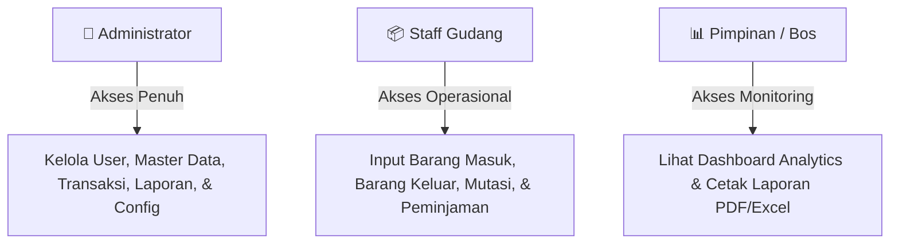

# 📗 DOKUMENTASI LENGKAP PROJEK YINTONG INVENTORY (UNTUK ORANG AWAM)

Dokumentasi ini ditulis dengan **bahasa yang sangat sederhana, tanpa istilah teknis yang rumit**, agar dapat dipahami oleh siapa saja — mulai dari pimpinan, staff kantor, dosen penguji, hingga pengguna awam yang belum pernah memegang kodingan sebelumnya.

---

## 📌 BAB 1: APA SIH SISTEM INI?

### 🏬 Gambaran Umum
**Yintong Inventory System** adalah sebuah **Aplikasi Pembukuan & Pengelolaan Inventori Barang Kantor Berbasis Digital**.

Bayangkan jika sebuah kantor memiliki ratusan aset seperti **Laptop, AC, Sepeda Motor Operasional, Kertas ATK, hingga Peralatan Kerja**. Jika semuanya dicatat di kertas atau buku buku manual:
- ❌ Kertas sering terselip atau hilang.
- ❌ Jumlah stok sering salah hitung.
- ❌ Barang yang dipinjam karyawan sering lupa dikembalikan.
- ❌ Pimpinan kesulitan mengetahui berapa total nilai rupiah dari seluruh aset kantor.

Aplikasi ini hadir sebagai **"Buku Catatan Digital Otomatis"** yang menyelesaikan seluruh masalah di atas.

---

## ⚙️ BAB 2: CARA KERJA APLIKASI (ANALOGI SEDERHANA)

Agar mudah dibayangkan, cara kerja aplikasi ini mirip seperti **Manajemen Restoran / Toko Modern**:

```text
┌────────────────┐      ┌─────────────────────────┐      ┌────────────────────────┐
│ 👤 Pengguna    │ ───► │ 🖥️ Layar Aplikasi       │ ───► │ 🧠 Otak Aplikasi       │
│ (User/Kasir)   │      │ (Frontend / Blade)      │      │ (Backend / Laravel)    │
└────────────────┘      └─────────────────────────┘      └───────────┬────────────┘
                                                                     │
                                                                     ▼
                                                         ┌────────────────────────┐
                                                         │ 🗄️ Gudang Penyimpanan  │
                                                         │ Data (Database MySQL)  │
                                                         └────────────────────────┘
```

1. **Layar Aplikasi (Frontend / Blade UI)**: 
   Wajah aplikasi yang Anda lihat di layar komputer (tombol, tabel, warna, gambar).
2. **Otak Aplikasi (Backend / Laravel)**: 
   Petugas pintar yang bekerja di belakang layar. Ketika Anda menginput barang baru, *otak* ini yang menghitung otomatis berapa total nilai rupiahnya, mengecek apakah stoknya cukup, dan memberikan peringatan jika stok sudah mau habis.
3. **Gudang Penyimpanan Data (Database MySQL)**: 
   Lemari arsip raksasa tempat menyimpan seluruh catatan barang, riwayat peminjaman, dan akun pengguna secara aman.

---

## 👥 BAB 3: SIAPA SAJA PENGGUNANYA & APA AKSESNYA? (HAK AKSES / ROLE)

Sistem ini membagi penggunanya menjadi **3 Tingkatan Hak Akses** agar aman dan tidak semua orang bisa sembarangan mengubah data penting:



### 1️⃣ 👑 Administrator (Super User)
- **Siapa mereka?**: Tim IT atau Manajer Utama.
- **Tugasnya**: Memiliki akses penuh 100%. Bisa menambah akun karyawan baru, menghapus data yang salah, mengubah harga barang, dan mengatur sistem.

### 2️⃣ 📦 Staff Gudang (Petugas Operasional)
- **Siapa mereka?**: Petugas gudang atau admin operasional harian.
- **Tugasnya**: Mencatat transaksi harian seperti:
  - Mencatat barang yang baru dibeli dari supplier (*Barang Masuk*).
  - Mencatat barang yang dikeluarkan untuk pemakaian kantor (*Barang Keluar*).
  - Mencatat barang yang dipindah ke ruangan lain (*Mutasi*).
  - Mencatat karyawan yang meminjam barang (*Peminjaman*).

### 3️⃣ 📊 Pimpinan / Bos (Pengawas)
- **Siapa mereka?**: Direktur, Kepala Cabang, atau Pemilik Perusahaan.
- **Tugasnya**: Hanya memantau (*Read-Only*). Bisa melihat grafik perkembangan aset di Dashboard dan mencetak laporan PDF/Excel untuk bahan rapat tanpa khawatir tidak sengaja merusak data.

---

## 🧩 BAB 4: BEDAH FITUR UTAMA APLIKASI

Berikut adalah penjelasan fitur-fitur yang ada di dalam aplikasi dengan bahasa sehari-hari:

| Nama Modul | Fungsi Utama (Apa yang Bisa Dilakukan?) | Analogi Dunia Nyata |
| :--- | :--- | :--- |
| 📊 **Dashboard** | Pusat informasi utama. Menampilkan grafik total barang, peringatan stok kritis (warna merah), dan tren transaksi bulan ini. | Papan indikator di spedometer mobil. |
| 📦 **Data Barang** | Katalog lengkap seluruh aset kantor. Berisi nama barang, kode QR/barcode, harga, jumlah stok, dan nilai rupiah aset. | Buku induk inventaris kantor. |
| 🏷️ **Kategori Barang** | Mengelompokkan jenis barang (misal: ATK, Elektronik, Kendaraan, Alat Kerja). | Rak-rak berlabel di dalam minimarket. |
| 🚚 **Data Supplier** | Daftar alamat, nomor telepon, dan nama PT/toko tempat kantor membeli barang. | Buku telepon daftar vendor langganan. |
| 📥 **Barang Masuk** | Mencatat pembelian barang dari supplier. Jumlah stok barang di gudang akan **otomatis bertambah**. | Kuitansi belanjaan baru masuk rumah. |
| 📤 **Barang Keluar** | Mencatat pengambilan barang untuk pemakaian rutin. Stok barang di gudang akan **otomatis berkurang**. | Catatan pengeluaran barang belanjaan. |
| 🔄 **Mutasi Lokasi** | Mencatat pemindahan barang dari satu ruangan ke ruangan lain (misal: Laptop dipindah dari *Gudang* ke *Ruang IT*). | Surat jalan pindah barang antar kamar. |
| 🤝 **Peminjaman Barang** | Mencatat barang kantor yang dipinjam sementara (seperti Laptop atau Motor). Sistem akan memberi peringatan jika pengembaliannya **terlambat**. | Buku peminjaman buku di perpustakaan. |
| 👥 **Manajemen User** | Fitur khusus Admin untuk menambah karyawan baru, mengganti password, atau menonaktifkan akun karyawan yang resign. | Kartu tanda pengenal pegawai. |
| 📄 **Laporan & Export** | Menghasilkan laporan resmi yang siap **dicetak ke PDF (1 halaman landscape)** atau **di-download ke Excel**. | Laporan keuangan bulanan untuk Bos. |

---

## 🚀 BAB 5: CARA MENJALANKAN APLIKASI (PANDUAN PRAKTIS 3-STEPS)

Anda tidak perlu paham kodingan sama sekali untuk menjalankan aplikasi ini! Cukup ikuti 3 langkah berikut:

```text
[Langkah 1]                [Langkah 2]                 [Langkah 3]
Buka Laragon/XAMPP  ───►  Klik setup.bat        ───►  Klik start.bat
(Klik 'Start All')        (Hanya saat setup awal)     (Untuk membuka aplikasi)
```

1. **Langkah 1**: Buka aplikasi **Laragon** atau **XAMPP** di komputer Anda, lalu klik **Start All**.
2. **Langkah 2 (Hanya 1x saat pertama kali)**: Klik dua kali file **`setup.bat`** di folder aplikasi. Biarkan proses otomatisnya berjalan hingga selesai.
3. **Langkah 3 (Setiap kali mau pakai)**: Klik dua kali file **`start.bat`**. Aplikasi akan **otomatis terbuka di browser** Anda!

---

## 🔐 AKUN UNTUK COBA LOGIN:

Gunakan salah satu akun di bawah ini saat halaman login terbuka:

- **Login sebagai Administrator (Nurul Faoziah)**:
  - Email: `admin@admin.com` atau `nurul@admin.com`
  - Password: `admin123`
- **Login sebagai Staff Gudang (Staff Rani)**:
  - Email: `staff@staff.com`
  - Password: `staff123`
- **Login sebagai Pimpinan (Pak Hermawan)**:
  - Email: `pimpinan@pimpinan.com`
  - Password: `pimpinan123`

---

## ❓ BAB 6: PERTANYAAN YANG SERING DITANYAKAN (FAQ)

#### Q: Apakah aplikasi ini membutuhkan koneksi internet?
> **Jawab**: **Tidak**. Aplikasi ini berjalan 100% secara lokal (*offline*) di komputer/laptop Anda.

#### Q: Bagaimana jika saya salah menginput jumlah barang?
> **Jawab**: Pengguna ber-role **Administrator** atau **Staff Gudang** dapat menekan tombol **Ubah (Edit)** atau **Hapus** pada tabel barang untuk memperbaiki data.

#### Q: Apakah laporan di aplikasi ini bisa dicetak ke printer atau di-download?
> **Jawab**: **Bisa!** Di menu *Laporan*, Anda bisa memilih tombol **Cetak PDF** (otomatis rapi 1 halaman A4 Landscape) atau **Export Excel** untuk diolah lebih lanjut di Microsoft Excel.

#### Q: Bagaimana jika ada barang yang dipinjam tapi lupa dikembalikan?
> **Jawab**: Di modul *Peminjaman Barang*, sistem akan otomatis mengubah warna statusnya menjadi **Merah (Terlambat)** jika tanggal hari ini sudah melewati tanggal janji kembali.

---

*Dokumentasi ini dibuat untuk memudahkan siapa saja memahami dan mengoperasikan **Yintong Inventory System** dengan mudah!*
